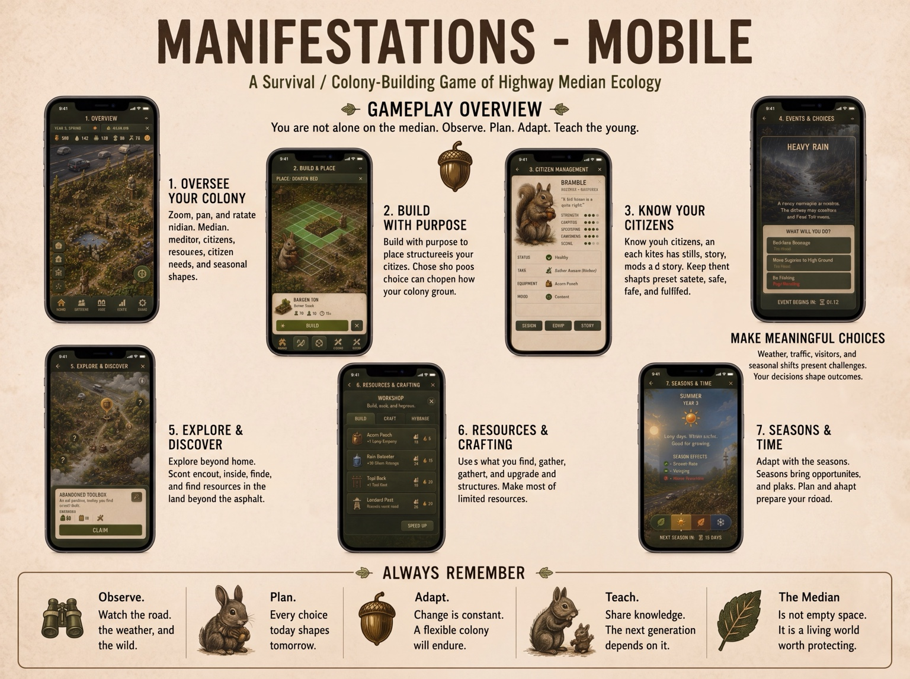

<!--@0¶1-->
**MEDIAN**

<!--@0¶2-->
**v0.5.0 FOUR-FORM MANIFESTATION FRAMEWORK**

<!--@0¶3-->
*Four Forms of the Median*

<!--@0¶4-->
<table>
<tbody>
<tr class="odd">
<td>
<strong>TRANSLATION DOCTRINE</strong>

<em>Do not reproduce the desktop game’s interface. Reproduce its rhythm of sanctuary, exposure, consequence, and return.</em>
</td>
</tr>
</tbody>
</table>

<!--@0¶5-->
**PURPOSE**

<!--@0¶6-->
> A companion architecture document for MEDIAN v0.5.0. It defines four canonical manifestations—desktop/console, tabletop roleplaying, cooperative fixed-content card game, and standalone mobile—and identifies what each form must preserve, what it may translate, and what its native medium should contribute.

<!--@0¶7-->
Document Version 1.0 • Target Revision: MEDIAN 0.5.0 • Status: Companion Specification

<!--@1-->
# **0. Revision Summary**

<!--@1¶1-->
What this document adds to the v0.5.0 architecture

<!--@1¶2-->
  - Establishes four canonical manifestations of MEDIAN, each treated as a translation of the same dramatic and ethical core rather than as a port of one rules interface.

<!--@1¶3-->
  - Confirms the desktop/console computer game as the primary and full-spectrum manifestation developed throughout the Concept Sourcebook.

<!--@1¶4-->
  - Roughs in a colony-centered tabletop roleplaying game sufficiently concrete to prototype directly from the book, then deliberately sets it aside for later return.

<!--@1¶5-->
  - Defines a cooperative, fixed-content campaign card game that is explicitly not a collectible, trading, booster-driven, rarity-driven, or adversarial product.

<!--@1¶6-->
  - Reconceives mobile as a standalone single-player interpretation with a native portrait-scale rhythm, compact Dwell decisions, short expedition sequences, tactile EMBODY experiences, and no coercive free-to-play machinery.

<!--@1¶7-->
  - Maps the canonical Home/Away cycle, named Citizen continuity, species spatial grammar, MEET, EMBODY, Exposure, Tharn, and Campaign Memory across media without requiring identical control paradigms.

<!--@1.1-->
## **Contents**

<!--@1.1¶1-->
  - 1\. Executive Summary and Canonical Definition

<!--@1.1¶2-->
  - 2\. Cross-Manifestation Canon

<!--@1.1¶3-->
  - 3\. Manifestation I — Desktop / Console Computer Game

<!--@1.1¶4-->
  - 4\. Manifestation II — Tabletop Roleplaying Game

<!--@1.1¶5-->
  - 5\. Manifestation III — Cooperative Fixed-Content Card Game

<!--@1.1¶6-->
  - 6\. Manifestation IV — Standalone Mobile Game

<!--@1.1¶7-->
  - 7\. Comparative Architecture

<!--@1.1¶8-->
  - 8\. Anti-Consumerist and Ethical Product Doctrine

<!--@1.1¶9-->
  - 9\. Handoff, Acceptance Criteria, and Future Work

<!--@2-->
# **1. Executive Summary and Canonical Definition**

<!--@2¶1-->
MEDIAN is not one interface expressed on four devices. It is a world and dramatic rhythm capable of taking four materially different forms. The desktop/console game remains the canonical full-spectrum expression and the principal subject of the Concept Sourcebook. The other manifestations are independent works: each must preserve MEDIAN’s soul while allowing its medium to choose the appropriate scale, pace, embodiment, and degree of abstraction.

<!--@2¶2-->
<table>
<tbody>
<tr class="odd">
<td>
<strong>CANONICAL PRINCIPLE</strong>

<em>A manifestation is successful when a player recognizes the same sanctuary, the same exposure, and the same particular friends—even if almost none of the controls are shared.</em>
</td>
</tr>
</tbody>
</table>

<!--@2.1-->
## **1.1 The four canonical manifestations**

<!--@2.1¶1-->
| **Manifestation**                       | **Canonical role**                     | **Native strength**                                                               | **Development priority**                      |
| --------------------------------------- | -------------------------------------- | --------------------------------------------------------------------------------- | --------------------------------------------- |
| **Desktop / Console**                   | Primary full-spectrum expression       | Integrated spatial simulation across all five Registers                           | Main focus of the Concept Sourcebook          |
| **Tabletop Roleplaying Game**           | Playable colony-centered campaign form | Shared authorship, relationships, folklore, and consequential speech              | Rough prototype pass now; return later        |
| **Cooperative Fixed-Content Card Game** | Physical systems and campaign tableau  | Legible corridor geography, scarcity, traffic, persistent cards, shared Chronicle | Architectural definition now; later prototype |
| **Standalone Mobile**                   | Single-player pocket translation       | Brief stewardship, tactile Crossing and EMBODY, intimate Citizen attention        | Architectural definition now; later prototype |

<!--@2.2-->
## **1.2 Hierarchy without inferiority**

<!--@2.2¶1-->
The desktop/console game is primary because it contains the complete spatial and systemic ambition of MEDIAN: colony construction, Away traversal, highway Crossings, situational MEET, and the Home-only EMBODIMENT Register. This primacy does not make the other forms ancillary. The TTRPG, card game, and mobile game should each reveal qualities that the computer game cannot express as directly.

<!--@2.2¶2-->
  - The TTRPG can make contradictory folklore, voice, loyalty, grief, and civic succession genuinely authored by the players.

<!--@2.2¶3-->
  - The card game can make the corridor’s cross-section, lanes, Margins, Reaches, and persistent histories physically legible on the table.

<!--@2.2¶4-->
  - The mobile game can make small acts of stewardship and embodied animal motion intimate, tactile, and available in deliberately short sessions.

<!--@2.3-->
## **1.3 Status of this specification**

<!--@2.3¶1-->
This is a hybrid philosophical and architectural specification. It states medium-independent doctrine, then gives each non-desktop form enough concrete structure to guide a later prototype. The tabletop roleplaying section goes furthest because a simple playable form could plausibly emerge directly from the sourcebook. The card and mobile sections intentionally stop short of production GDD detail.

<!--@2.3¶2-->
*Source basis: the earlier Manifestations discussion supplied the colony-centered TTRPG premise, shared Approach and personal Exposure split, special Crossing ritual, corridor-shaped card tableau, persistent Citizen and Chronicle cards, and the warning that collectible rarity logic conflicts with singular named Citizens. This specification preserves and expands those propositions.*

<!--@3-->
# **2. Cross-Manifestation Canon**

<!--@3.1-->
## **2.1 Foundational invariants**

<!--@3.1¶1-->
Every manifestation should preserve the following qualities as far as its medium permits. A form may compress or recombine them, but it should not casually discard them.

<!--@3.1¶2-->
  - Colony continuity exceeds individual hero permanence. Citizens may die, retire, teach, migrate, or change duties while the community persists.

<!--@3.1¶3-->
  - Home and Away are structurally distinct. Home grows the Colony; Away grows and hazards Citizens.

<!--@3.1¶4-->
  - Sanctuary is mechanically achieved. Warmth and attachment rest on a credible base level of food, shelter, readiness, and competent stewardship.

<!--@3.1¶5-->
  - Good Home play creates successful stillness rather than a perpetual fight against arbitrary entropy.

<!--@3.1¶6-->
  - Named Citizens accumulate particular histories, bonds, wounds, Distinctions, Keepsakes, After-names, and remembered Places.

<!--@3.1¶7-->
  - Exposure widens possibility toward both distinction and catastrophe. Tharn is an acute break, not merely a high damage value.

<!--@3.1¶8-->
  - Mouse JOIN, Rabbit GATHER, and Squirrel CONNECT remain spatial and bodily identities, not cosmetic skins.

<!--@3.1¶9-->
  - The highway is barrier, climate, resource edge, and ecological organizer—not background scenery.

<!--@3.1¶10-->
  - MEET is the bounded grammar of consequential situations at Home or Away.

<!--@3.1¶11-->
  - Campaign Memory or Chronicle preserves what happened without requiring every remembered event to grant a statistical benefit.

<!--@3.1¶12-->
  - Care must not collapse into a buff economy. Players should sometimes attend to a Citizen because that life matters, not because attention is the optimal resource engine.

<!--@3.2-->
## **2.2 What may change by medium**

<!--@3.2¶1-->
| **May change**                                                    | **Must remain recognizable**                                                         |
| ----------------------------------------------------------------- | ------------------------------------------------------------------------------------ |
| Camera, board, cards, spoken description, portrait UI             | The distinction between collective colony posture and individual Citizen consequence |
| Real-time, turn-based, scene-based, or short-session pacing       | The cycle of preparation, departure, risk, return, and domestic consequence          |
| Exact number of Registers represented as separate modes           | The dramatic functions Dwell, Travel, Risk, Meet, and Embody perform                 |
| Dice, cards, timing gestures, touch input, or simulation formulas | The temptation to accept greater Exposure for meaningful action                      |
| Degree of construction detail                                     | Species-specific spatial relationships and the feeling of inhabiting a median        |
| Campaign length and persistence method                            | The accumulation of shared history around singular named Citizens                    |

<!--@3.3-->
## **2.3 Register translation doctrine**

<!--@3.3¶1-->
The five Registers are canonical player relationships, not mandatory interface modules. Each manifestation should serve its own experience. It may merge Registers, represent them through different procedures, or omit a separate control layer where the dramatic function is still present.

<!--@3.3¶2-->
| **Register** | **Canonical verb** | **Dramatic function**                          | **Translation freedom**                                                                   |
| ------------ | ------------------ | ---------------------------------------------- | ----------------------------------------------------------------------------------------- |
| Colony       | DWELL              | Sustain and shape collective life              | May be a simulation view, colony sheet, shared tableau, or compact mobile posture screen  |
| Field        | TRAVEL             | Carry Citizens through extended territory      | May be a map, narrated journey, card chain, or swipe-route sequence                       |
| Crossing     | RISK               | Act inside immediate spatial danger            | Should remain brief, committed, and qualitatively unlike ordinary movement                |
| Encounter    | MEET               | Answer a bounded circumstance                  | Cross-modal; may be a choice screen, table scene, card, or dialogue procedure             |
| Embodiment   | EMBODY             | Experience life freed from immediate necessity | Home-only; may be direct control, guided scene, tactile vignette, or quiet tabletop scene |

<!--@3.4-->
## **2.4 The universal cycle**

<!--@3.4¶1-->
**1.** The Colony establishes a credible material and social posture.

<!--@3.4¶2-->
**2.** A need, ambition, season, or external pressure makes departure or response necessary.

<!--@3.4¶3-->
**3.** Citizens Travel, Risk, and Meet circumstances beyond or within Home.

<!--@3.4¶4-->
**4.** Exposure and individual consequence accumulate around particular Citizens.

<!--@3.4¶5-->
**5.** Return transfers salvage, knowledge, wounds, absence, and memory back into the Colony.

<!--@3.4¶6-->
**6.** Competent Dwell restores Quiet Equilibrium.

<!--@3.4¶7-->
**7.** EMBODY or its medium-specific analogue lets players experience what that safety means.

<!--@3.4¶8-->
**8.** The Chronicle preserves selected events as the history of this particular community.

<!--@4-->
# **3. Manifestation I — Desktop / Console Computer Game**

<!--@4¶1-->
The desktop/console computer game is the primary manifestation of MEDIAN and the principal focus of the Concept Sourcebook. Its complete system is defined elsewhere in the v0.5.0 revision and companion specifications; this document does not restate that design.

<!--@4¶2-->
<table>
<tbody>
<tr class="odd">
<td>
<strong>CANONICAL ROLE</strong>

<em>The computer game is the full-spectrum spatial expression against which other manifestations define what they preserve, compress, or reinterpret.</em>
</td>
</tr>
</tbody>
</table>

<!--@4.1-->
## **3.1 What only the primary manifestation is expected to hold together**

<!--@4.1¶1-->
  - A persistent, visible colony whose Places, Practices, Roles, citizens, terrain, and species spatial grammar coexist in one operating environment.

<!--@4.1¶2-->
  - Distinct interactive Registers for Dwell, Travel, Risk, Meet, and Embody, each supported by its appropriate camera and control paradigm.

<!--@4.1¶3-->
  - Dynamic environmental topology, traffic, weather, seasons, Home Readiness, Away Exposure, and long-form colony growth.

<!--@4.1¶4-->
  - The most complete realization of the median as a living corridor rather than as a sequence of abstract scenarios.

<!--@4.2-->
## **3.2 Relationship to the other forms**

<!--@4.2¶1-->
The desktop game supplies the canonical world architecture, terminology, ecological logic, visual language, and dramatic cycle. It does not dictate the literal mechanics of the other manifestations. The tabletop forms should not imitate menus; mobile should not miniaturize every desktop subsystem. Each translation is judged by fidelity to MEDIAN’s relationships, not by feature count.

<!--@4.3-->
## **3.3 Sourcebook priority**

<!--@4.3¶1-->
After the rough tabletop architecture in this document is recorded, design attention returns to the main Concept Sourcebook and the computer-game manifestation. The other forms remain canonical possibilities and reservoirs of design insight, but they should not dilute the primary revision’s coherence.

<!--@5-->
# **4. Manifestation II — Tabletop Roleplaying Game**

<!--@5.1-->
## **4.1 Canonical pitch**

<!--@5.1¶1-->
The MEDIAN tabletop roleplaying game is a colony-centered campaign game in which each player normally speaks and decides through one principal Citizen, while the Colony is the campaign’s shared and continuing character. It should be simpler than the computer game, playable from the sourcebook with ordinary dice, tokens, pencils, and a small set of printable cards or tables.

<!--@5.1¶2-->
<table>
<tbody>
<tr class="odd">
<td>
<strong>TTRPG THESIS</strong>

<em>A Citizen’s life may end. A player’s participation continues through the Colony that remembers them.</em>
</td>
</tr>
</tbody>
</table>

<!--@5.2-->
## **4.2 Preferred facilitation model**

<!--@5.2¶1-->
The preferred form is facilitated and GM-light. One participant serves as the Chronicler or Guide, but the rules, seasonal tables, traffic procedures, Road Work tables, Encounter prompts, and colony pressures carry much of the burden normally placed on a game master. The Guide is not an adversarial encounter designer. Their work is to make the world physically legible, embody recurring animals, frame difficult circumstances, and ask consequential questions.

<!--@5.2¶2-->
  - What must be left behind?

<!--@5.2¶3-->
  - Who speaks?

<!--@5.2¶4-->
  - Who is carrying too much?

<!--@5.2¶5-->
  - Which Law or remembered Tale does the Colony trust here?

<!--@5.2¶6-->
  - Who goes back for the Citizen who froze?

<!--@5.2¶7-->
A rotating or shared Chronicler variant should be possible, especially for three-player groups, but the book should teach the facilitated form first because it best protects tone and physical clarity.

<!--@5.3-->
## **4.3 Table composition and campaign scale**

<!--@5.3¶1-->
| **Element**            | **Recommended form**                                                                                       |
| ---------------------- | ---------------------------------------------------------------------------------------------------------- |
| **Players**            | 2–5 Citizen players plus one Guide; 3–4 Citizen players is the ideal initial target                        |
| **Session length**     | Approximately 90–150 minutes, with one coherent Home/Away arc or one major colony situation                |
| **Campaign length**    | Open-ended, but written arcs should resolve in 4–8 sessions and leave the Colony playable afterward        |
| **Principal subject**  | The Colony as continuing shared character; one principal Citizen per player at a time                      |
| **Required materials** | Citizen Records, Colony Sheet, six-sided dice, Exposure tokens, lane cards or lane strip, ordinary markers |
| **Failure posture**    | Consequences alter lives and Colony Conditions; failure does not automatically end the campaign            |

<!--@5.4-->
## **4.4 Citizen continuity and succession**

<!--@5.4¶1-->
Each player ordinarily controls one principal Citizen. That Citizen may die, retire, become a Teacher, take an outpost posting, form a Hearth, become unavailable through Tharn or injury, or simply cease to be the player’s primary viewpoint. The player then adopts another Citizen from the same continuing Colony. This is not a replacement character arriving from nowhere; it is a change of attention within an already inhabited community.

<!--@5.4¶2-->
  - New principal Citizens should already possess relationships, domestic associations, and memories within the Colony.

<!--@5.4¶3-->
  - Retired or altered Citizens remain present whenever fiction permits. They may teach, advise, require care, or become part of the Chronicle.

<!--@5.4¶4-->
  - The group may formally bestow an After-name after a Citizen earns a first major Distinction. This should be a table event, not an automatic level-up label.

<!--@5.5-->
## **4.5 The Citizen Record**

<!--@5.5¶1-->
A Citizen Record should resemble an inhabited life rather than a tactical combat sheet. The rough prototype should contain:

<!--@5.5¶2-->
| **Record field**                           | **Function**                                                           |
| ------------------------------------------ | ---------------------------------------------------------------------- |
| **Given Name, Species, Physical Identity** | Establishes singularity and bodily perspective                         |
| **Three broad Aptitudes**                  | Away-scale capabilities; recommended draft: Body, Sense, Heart         |
| **Current Home Role**                      | One equal share of colony capacity; not a personal productivity rating |
| **Tool, Keepsake, and limited Supplies**   | Concrete preparation and memory-bearing objects                        |
| **Trusted Friends and Hearth**             | Relationships that authorize aid, sacrifice, and quiet scenes          |
| **Fear Memories and Exposure**             | Accumulated vulnerability and volatility                               |
| **Wounds and Permanent Impairments**       | Specific consequences rather than an abstract hit-point drain          |
| **Distinctions and After-name**            | Earned individual growth and public recognition                        |
| **Short Tale**                             | A few lines recording the Citizen’s consequential expeditions          |

<!--@5.6-->
## **4.6 The Colony Sheet**

<!--@5.6¶1-->
The Colony Sheet is the campaign’s common character record. It should track Places, Practices, Role assignment, global Conditions, Readiness Margins, seasonal reserves, known Reaches, Laws, Chronicle entries, Guests, and current pressures. Home Roles remain equal civic shares: Twig does not become 1.4 Gardeners because she has a high Sense aptitude.

<!--@5.6¶2-->
  - Places record species topology: Mouse JOIN, Rabbit GATHER, Squirrel CONNECT.

<!--@5.6¶3-->
  - Roles record assigned headcount and current requirement.

<!--@5.6¶4-->
  - Margins indicate whether routine demands are met, overextended, or supported by spare readiness.

<!--@5.6¶5-->
  - Chronicle entries preserve meaningful events, including some with no mechanical effect.

<!--@5.7-->
## **4.7 Core session rhythm**

<!--@5.7¶1-->
| **Phase**            | **Table procedure**                                                                         | **Primary question**                                               |
| -------------------- | ------------------------------------------------------------------------------------------- | ------------------------------------------------------------------ |
| **Dawn**             | Advance season or pressure; adjudicate routine Colony posture                               | What does the Colony quietly absorb, and what becomes a situation? |
| **Dwell**            | Assign Roles, choose a Project, consult Places, speak as citizens                           | What can this community sustain today?                             |
| **Need / Departure** | Choose objective, party, Tools, Supplies, and what Home capacity will be absent             | Who must leave, and what becomes thin behind them?                 |
| **Travel**           | Narrate or map a Reach through a small number of consequential segments                     | What does distance cost?                                           |
| **Risk**             | Resolve a brief special Crossing ritual when asphalt must be crossed                        | When do we commit, and who hesitates?                              |
| **Meet**             | Choose an Approach and resolve a bounded situation                                          | What do we protect, pursue, yield, or abandon?                     |
| **Return**           | Transfer salvage, knowledge, wounds, Exposure, and absence to Home                          | Who came back changed?                                             |
| **Quiet / Memory**   | If equilibrium permits, play a short Embodied or domestic scene and record selected history | What did safety allow someone to feel?                             |

<!--@5.8-->
## **4.8 Rough resolution engine**

<!--@5.8¶1-->
The following is a prototype-ready direction, not final mathematics. It preserves the old design’s most valuable split: group accomplishment is resolved collectively, while personal consequence is resolved around particular Citizens.

<!--@5.8.1-->
### **Shared Approach Roll**

<!--@5.8.1¶1-->
  - The party chooses one Approach: Contest, Evade, Parley, Yield, or Withdraw.

<!--@5.8.1¶2-->
  - Each meaningfully participating Citizen contributes one six-sided die.

<!--@5.8.1¶3-->
  - A relevant Aptitude, Tool, species advantage, Trusted Friend action, or prepared Place may add one additional die for that Citizen, normally capping contribution at two dice.

<!--@5.8.1¶4-->
  - Results of 4–5 generate one Progress. A 6 generates one Progress and one Edge, which may reduce cost, reveal information, preserve a Supply, or improve the fictional result.

<!--@5.8.1¶5-->
  - The circumstance has a Presence value, usually 2–6. Meeting Presence accomplishes the objective. Excess Progress improves safety or scope; shortfall forces retreat, loss, or a decision to Press.

<!--@5.8.1¶6-->
  - Pressing permits the group to reroll non-progress dice or add a new contribution, but the Citizens who Press take additional Exposure.

<!--@5.8.2-->
### **Personal Exposure**

<!--@5.8.2¶1-->
  - Exposure is accepted by Citizens who speak first, carry the critical object, hold a route, rescue another, stay behind, or otherwise become personally implicated.

<!--@5.8.2¶2-->
  - Each point of Exposure adds one dark six-sided die to that Citizen’s personal Exposure pool.

<!--@5.8.2¶3-->
  - At a severe moment, Crossing panic, or Return, the Citizen rolls the current pool. Each 1 creates Harm or a fear consequence; each 6 creates a Distinction opportunity. Both may occur in the same roll.

<!--@5.8.2¶4-->
  - Two or more 1s in an acute test may trigger Tharn: the ordinary turn structure stops and another Citizen must decide whether and how to reach them.

<!--@5.8.2¶5-->
  - Ordinary Exposure ebbs through safe return and Quiet Equilibrium. Harm, Tharn consequences, bonds, Distinctions, and remembered acts persist.

<!--@5.8.2¶6-->
<table>
<tbody>
<tr class="odd">
<td>
<strong>DESIGN TEST</strong>

<em>The way to earn an After-name should also be the way to come home wounded.</em>
</td>
</tr>
</tbody>
</table>

<!--@5.9-->
## **4.9 Crossing as a special tabletop ritual**

<!--@5.9¶1-->
Crossing must not be an ordinary skill check. A short physical ritual should make traffic readable, incomplete, and frightening without becoming a twenty-minute tactics game.

<!--@5.9¶2-->
**1.** Lay a row of lane cards or a printed lane strip between the party and the destination Margin.

<!--@5.9¶3-->
**2.** The Guide reads an acoustic or vibration cue before revealing the next traffic beat.

<!--@5.9¶4-->
**3.** Before commitment, players may Wait, Reposition, Shed Cargo, or Commit.

<!--@5.9¶5-->
**4.** Once anyone Commits, the party has only a few beats to move. Hesitation becomes more dangerous than motion.

<!--@5.9¶6-->
**5.** Traffic advances according to a compact card or die procedure. Species movement changes how Citizens exploit the same window: Mouse uses edge and cover, Rabbit bursts between refuge points, Squirrel commits toward an anchor.

<!--@5.9¶7-->
**6.** The Crossing ends quickly. Any unresolved Citizen position becomes Exposure, separation, loss, or a rescue decision—not another long sub-round.

<!--@5.10-->
## **4.10 MEET at the table**

<!--@5.10¶1-->
MEET should not become a combat subsystem. The Guide frames a bounded situation, gives the world a clear Presence, and asks what the party is willing to spend or risk. A Home storm, an Away stranger, an uncontested wildflower patch, and a threatened structure all use the same situational grammar while permitting very different fiction.

<!--@5.10¶2-->
The computer game’s compact two-spend-or-suffer structure may inspire authored scenarios, but tabletop players should remain free to invent an Approach. The Guide translates that proposal into Presence, cost, and Exposure rather than forcing a menu.

<!--@5.11-->
## **4.11 Dwell and EMBODY at the table**

<!--@5.11¶1-->
Dwell must remain structurally important. The group assigns actual Citizens to Roles, chooses Projects, covers seasonal needs, and knowingly weakens Home when an expedition departs. When the Colony reaches Quiet Equilibrium, the session may include a brief non-instrumental scene—one player frames another Citizen at play, rest, ordinary work, tenderness, or sensory grace. No roll or buff is required. The scene is MEDIAN’s tabletop form of EMBODY.

<!--@5.12-->
## **4.12 What the TTRPG should emphasize**

<!--@5.12¶1-->
  - Contradictory folklore and imperfect Laws.

<!--@5.12¶2-->
  - Relationships between Citizens and the question of who goes back.

<!--@5.12¶3-->
  - Hearths, lineage, teaching, succession, and the continuity of ordinary labor.

<!--@5.12¶4-->
  - Recurring Guests and negotiations rather than disposable enemy stat blocks.

<!--@5.12¶5-->
  - The Chronicle as something the players literally author.

<!--@5.12¶6-->
  - The Metropolis as a cultural revelation, not merely a high-level zone.

<!--@5.12¶7-->
The central danger is heroic drift. MEDIAN must not become a conventional adventuring-party fantasy with highways substituted for wilderness. The Home, the Colony, ecological constraint, and the cost of absence must remain structurally unavoidable.

<!--@6-->
# **5. Manifestation III — Cooperative Fixed-Content Card Game**

<!--@6.1-->
## **5.1 Canonical product identity**

<!--@6.1¶1-->
The physical card manifestation is a cooperative, fixed-content campaign card game with optional non-random expansions. It is explicitly not a collectible card game, trading card game, booster product, rarity economy, speculative market, or deck-ownership arms race.

<!--@6.1¶2-->
<table>
<tbody>
<tr class="odd">
<td>
<strong>CARD-GAME THESIS</strong>

<em>The table should make the corridor physically legible while the campaign makes each Citizen increasingly irreplaceable.</em>
</td>
</tr>
</tbody>
</table>

<!--@6.2-->
## **5.2 Session and campaign structure**

<!--@6.2¶1-->
The core rules should support both satisfying short scenarios and linked campaign play. A single scenario should resolve in approximately 60–120 minutes. A full campaign may link 4–8 scenarios, but no individual session should require a five-hour commitment to feel complete.

<!--@6.2¶2-->
| **Mode**          | **Use**                                                                          | **Persistence**                                                                       |
| ----------------- | -------------------------------------------------------------------------------- | ------------------------------------------------------------------------------------- |
| **Scenario Play** | One evening, one seasonal problem, one expedition, or one major Colony objective | Prebuilt or lightly customized Colony state; complete result in 60–120 minutes        |
| **Campaign Play** | Linked corridor arc across several sessions                                      | Persistent Citizens, Places, wounds, bonds, After-names, Reaches, and Chronicle cards |
| **Return Play**   | Revisit a mature Colony for a new authored scenario                              | Campaign state continues without requiring a permanently escalating product treadmill |

<!--@6.3-->
## **5.3 The corridor tableau**

<!--@6.3¶1-->
The older proposal that the table itself reproduce the corridor should be retained because it is the card game’s strongest format-specific advantage. The layout should be readable without requiring a huge play surface.

<!--@6.3¶2-->
  - A central Home Median tableau contains Places, assigned Citizens, current Projects, and Colony Conditions.

<!--@6.3¶3-->
  - One or two compact Highway rows border the Home tableau. Traffic cards create changing windows rather than merely dealing damage.

<!--@6.3¶4-->
  - Margin cards sit beyond the road and may be arranged from safer Wall-edge to richer Road-edge.

<!--@6.3¶5-->
  - A longitudinal chain of Reach cards extends from known territory into the unknown.

<!--@6.3¶6-->
  - The Chronicle remains visible beside the tableau as a growing physical history.

<!--@6.3¶7-->
The layout may fold or compress for small tables, but it should preserve the world’s essential cross-section: Home, road, Margin, and Reach. This spatial legibility justifies the physical format rather than merely decorating it.

<!--@6.4-->
## **5.4 Core card categories**

<!--@6.4¶1-->
| **Category**                      | **Function**                                                                                                       |
| --------------------------------- | ------------------------------------------------------------------------------------------------------------------ |
| **Citizen**                       | Persistent named individual with Role, Tool, Keepsake, bonds, wounds, Exposure, Distinctions, and After-name space |
| **Place / Practice**              | Builds the Home tableau and encodes JOIN, GATHER, or CONNECT relationships                                         |
| **Role**                          | Assigns equal colony capacity; cards or markers identify which Citizens are currently committed                    |
| **Reach**                         | Reveals biome, lane pattern, Anchor Points, resources, and future connections                                      |
| **Traffic**                       | Creates readable movement windows, speed patterns, noise cues, and Crossing danger                                 |
| **Encounter**                     | Presents a bounded MEET situation, relevant Approaches, Presence, stakes, and possible spends                      |
| **Supply / Tool / Keepsake**      | Supports decisions while preserving scarcity and personal meaning                                                  |
| **Pressure / Season / Road Work** | Tests current Readiness and alters the corridor over time                                                          |
| **Chronicle**                     | Records major events; some remain purely commemorative                                                             |

<!--@6.5-->
## **5.5 Round structure**

<!--@6.5¶1-->
**1.** Dawn: reveal Pressure or advance the Season; compare the Colony’s current Role posture to routine demands.

<!--@6.5¶2-->
**2.** Dwell: assign Citizens, build or improve one Place, prepare Supplies, and decide whether an expedition is necessary.

<!--@6.5¶3-->
**3.** Departure: choose a party and physically remove those Citizen cards from Home, exposing the capacities they had supported.

<!--@6.5¶4-->
**4.** Travel: advance along Reach cards and spend Sustenance, time, or route advantages.

<!--@6.5¶5-->
**5.** Crossing: operate the Traffic row to create a brief commitment puzzle.

<!--@6.5¶6-->
**6.** Meet: commit Citizens, Tools, and Supplies to an Approach against the Encounter’s Presence.

<!--@6.5¶7-->
**7.** Return: resolve personal Exposure, add salvage or knowledge to Home, and update Conditions.

<!--@6.5¶8-->
**8.** Chronicle: preserve one selected event, Distinction, wound, loss, or quiet memory before reset.

<!--@6.6-->
## **5.6 Exposure as physical probability**

<!--@6.6¶1-->
The card form can make the “widening distribution” of Exposure physically intuitive. Each Citizen may accumulate Exposure cards in a small personal stack. Most cards are neutral or contextual, while the growing stack makes both Distinction and Harm increasingly reachable. A Citizen can return both celebrated and maimed.

<!--@6.6¶2-->
  - Taking responsibility adds cards to the personal stack rather than merely reducing a health total.

<!--@6.6¶3-->
  - Resolution may reveal no lasting result, Harm, Distinction, Tharn, or combinations.

<!--@6.6¶4-->
  - Transparent sleeves, dry-erase overlays, or insert cards should record persistence without destroying components.

<!--@6.6¶5-->
  - Named Citizens should never appear as repeated anonymous optimal copies in the same campaign.

<!--@6.7-->
## **5.7 Cooperative division of attention**

<!--@6.7¶1-->
Each player may steward one part of the shared system—Home posture, Traffic, expedition logistics, Chronicle, or particular Citizens—but no player owns a private economy. The Colony and expedition party remain jointly controlled. Discussion and responsibility are the game, not simultaneous solitaire engines.

<!--@6.8-->
## **5.8 Expansion doctrine**

<!--@6.8¶1-->
  - All expansions are fixed-content and fully disclosed.

<!--@6.8¶2-->
  - No randomized boosters, rarity tiers, chase cards, limited-print power, or aftermarket dependence.

<!--@6.8¶3-->
  - New content should add colony cultures, species perspectives, biomes, Reaches, Guests, folklore, Places, and scenarios—not invalidate earlier cards.

<!--@6.8¶4-->
  - Alternate art may exist only as an optional aesthetic product, never as a scarcity-based power hierarchy.

<!--@6.8¶5-->
  - A complete core box must remain a complete game.

<!--@6.9-->
## **5.9 Tone and failure safeguards**

<!--@6.9¶1-->
Direct attacks between player colonies are tonally wrong. Competitive incentives convert Citizens into assets and injury into tempo loss. Scarce salvage, route claims, hospitality, migration, or Metropolis influence may create tension inside cooperative scenarios, but the canonical form remains collective. Shared Road Work and traffic hazards should sometimes force players to help one another at real cost.

<!--@7-->
# **6. Manifestation IV — Standalone Mobile Game**

<!--@7.1-->
## **6.1 Canonical pitch**

<!--@7.1¶1-->
The mobile manifestation is a standalone, premium, single-player translation of MEDIAN’s soul. It is not a companion app, remote dashboard, account dependency, or compressed checklist of every desktop subsystem. Its identity is a pocket-scale game of brief stewardship, deliberate expedition planning, short bursts of danger, intimate Citizen memory, and tactile EMBODY.

<!--@7.1¶2-->
<table>
<tbody>
<tr class="odd">
<td>
<strong>MOBILE THESIS</strong>

<em>A player should be able to protect a small community for five minutes, risk a friend for fifteen, or simply run a safe bridge with a squirrel—without the game demanding their return tomorrow.</em>
</td>
</tr>
</tbody>
</table>

<!--@7.2-->
## **6.2 Native session rhythm**

<!--@7.2¶1-->
Mobile should support a hybrid rhythm while remaining entirely under player control. Real-world waiting is not a mechanic.

<!--@7.2¶2-->
| **Session type**  | **Typical duration** | **What it contains**                                                                                         |
| ----------------- | -------------------- | ------------------------------------------------------------------------------------------------------------ |
| **Dwell Visit**   | 3–8 minutes          | Dawn summary, one or two Role or Project decisions, Citizen inspection, Chronicle, optional quiet scene      |
| **Expedition**    | 10–20 minutes        | Planning, compact Field route, one brief Crossing, one or more MEET choices, Return and Exposure             |
| **EMBODY Moment** | 1–5 minutes          | Guided Practice or Presence experience using touch, tilt, haptics, or simple motion                          |
| **Long Session**  | 20–40 minutes        | Several player-advanced days or one full expedition plus Home aftermath; never required by real-time cadence |

<!--@7.3-->
## **6.3 Early mobile concept plate**

<!--@7.3¶1-->

<!--@7.3¶2-->
*Early mobile manifestation concept. Valuable as an inventory of ambitions, but v0.5.0 should replace “the complete desktop game on a phone” with a more native mobile rhythm.*

<!--@7.4-->
## **6.4 What the early concept preserves**

<!--@7.4¶1-->
  - Portrait-first presentation and a strong sense of one-hand proximity.

<!--@7.4¶2-->
  - The correct broad pillars: colony oversight, purposeful building, named Citizens, meaningful situations, exploration, resources, seasons, and adaptation.

<!--@7.4¶3-->
  - A visible insistence that the median is a living world rather than empty space.

<!--@7.5-->
## **6.5 What v0.5.0 must change**

<!--@7.5¶1-->
  - Do not reproduce the desktop game as seven dense management screens.

<!--@7.5¶2-->
  - Do not make Citizens into stat cards that demand constant individual optimization at Home.

<!--@7.5¶3-->
  - Do not turn mobile convenience into automated timers, notification pressure, energy depletion, or passive resource harvesting.

<!--@7.5¶4-->
  - Give the mobile form one coherent native loop built around a small number of meaningful decisions and tactile transitions between scale.

<!--@7.6-->
## **6.6 Core mobile loop**

<!--@7.6¶1-->
**1.** Dawn presents a compact account of what the Colony quietly handled, what changed, and whether a situation requires MEET.

<!--@7.6¶2-->
**2.** The player makes one to three Dwell decisions: adjust Role posture, commit a Project, allocate reserves, or deliberately accept a thin Margin.

<!--@7.6¶3-->
**3.** The player may inspect named Citizens, read or replay selected Campaign Memories, or enter EMBODY when Quiet Equilibrium permits.

<!--@7.6¶4-->
**4.** When an Away objective is chosen, the player selects a small party, Tools, Supplies, and a route. The interface explicitly shows what Home capacity leaves with them.

<!--@7.6¶5-->
**5.** Travel unfolds as a short illustrated track of route choices, drag, discovery, and limited supplies rather than a tiny open-world map.

<!--@7.6¶6-->
**6.** Crossing becomes a brief, high-focus motion sequence—runner-like, but finite, authored, and species-specific.

<!--@7.6¶7-->
**7.** MEET presents compact consequential choices, normally two different spends protecting different stakes and a refusal that accepts more consequence.

<!--@7.6¶8-->
**8.** Return resolves individual Exposure, transfers gains and losses to Home, and creates selected Campaign Memory.

<!--@7.7-->
## **6.7 Mobile DWELL**

<!--@7.7¶1-->
The Home view should be a living illustrated diorama rather than a miniaturized RTS grid. Places may be added through a smaller number of meaningful slots or relationships, but species topology must remain visible.

<!--@7.7¶2-->
  - Mouse rooms visibly JOIN into an accumulated Manor body.

<!--@7.7¶3-->
  - Rabbit Places GATHER around a completed court and bud daughter courts.

<!--@7.7¶4-->
  - Squirrel nodes CONNECT across a route network that thickens into loops.

<!--@7.7¶5-->
  - Role posture is adjusted through named Citizen strips or portraits, but each assigned Citizen still contributes one equal colony share.

<!--@7.7¶6-->
  - The player advances the game clock. The colony does not decay because the phone remained closed.

<!--@7.8-->
## **6.8 Mobile TRAVEL and RISK**

<!--@7.8¶1-->
Away play should be compact and tactile. Field Travel can use a forward-moving illustrated route with swipes, taps, and limited branching. The player reads ground, weather, anchors, and signs of other animals rather than steering a miniature party around a reduced desktop map.

<!--@7.8¶2-->
Crossing may borrow the immediacy of runner games, but not their endlessness or monetized repetition. Each Crossing is a short authored commitment sequence lasting roughly 20–60 seconds. Mouse follows edge and refuge, Rabbit bursts and changes line, Squirrel commits toward vertical anchors. Failure produces Exposure, separation, dropped cargo, or rescue—not a “watch ad to continue” screen.

<!--@7.8¶3-->
  - Assist modes must allow slower timing windows, pause, cue amplification, and non-reflex alternatives.

<!--@7.8¶4-->
  - The sequence ends decisively; it is not an infinite score chase.

<!--@7.8¶5-->
  - Repeated mastery may reveal grace or efficiency, but no essential content should depend on perfect reflex performance.

<!--@7.9-->
## **6.9 Mobile MEET**

<!--@7.9¶1-->
MEET is the mobile form’s principal decision screen. Situations should be visually staged, concise, and legible on one portrait display. The preferred default is three outcomes: spend one capacity to protect the primary stake, spend another to redirect loss or protect a different value, or conserve both and accept the compounded consequence. Some encounters may support dialogue or alternate Approaches, but the interface should remain deliberate rather than sprawling.

<!--@7.10-->
## **6.10 Mobile EMBODY**

<!--@7.10¶1-->
Mobile may be the most naturally tactile manifestation of EMBODY. Quiet Equilibrium unlocks guided Home-only experiences through any available Citizen.

<!--@7.10¶2-->
| **Mode family**    | **Mobile expression**                                                                                                        |
| ------------------ | ---------------------------------------------------------------------------------------------------------------------------- |
| **Flow**           | Run a Squirrel bridge, bound through a Rabbit court, or scamper a Mouse interior using swipes, rhythm, tilt, and haptic sway |
| **Small Practice** | Knock raspberries into sacks, sort seeds, carry pantry items, adjust drey lining, or tend a Place already resolved by Dwell  |
| **Presence**       | Turn Bramble’s head toward river sounds, bask on warm brick, listen to rain from shelter, or settle beside another Citizen   |
| **Tenderness**     | Groom, share a meal, watch a kit play, or accompany a recovering friend without converting care into a bonus engine          |

<!--@7.10¶3-->
Participation must never grant exclusive economic output. The player may enter because the moment matters, not because optimal play requires manually harvesting every berry.

<!--@7.11-->
## **6.11 Campaign Memory and Citizen intimacy**

<!--@7.11¶1-->
Mobile’s portrait scale should make named Citizens easy to revisit. A Citizen record may show current Role, relationships, Keepsake, wounds, Distinctions, After-name, and a short sequence of remembered moments. Memory should remain selective. Some EMBODY scenes create a line in the Chronicle; others are allowed to remain ephemeral.

<!--@7.12-->
## **6.12 No coercive clock**

<!--@7.12¶1-->
  - No energy meters, lives, construction timers, waiting walls, or paid speed-ups.

<!--@7.12¶2-->
  - No daily login streaks, fear-of-missing-out calendars, compulsory notifications, or punishment for absence.

<!--@7.12¶3-->
  - No gacha Citizens, rarity tiers, loot boxes, randomized purchases, or duplicate named characters.

<!--@7.12¶4-->
  - No interruption advertising, revive ads, or behavioral manipulation disguised as colony need.

<!--@7.12¶5-->
  - The default product is a premium complete game. Any later expansion is fixed-content, optional, and clearly described.

<!--@7.13-->
## **6.13 Mobile acceptance test**

<!--@7.13¶1-->
<table>
<tbody>
<tr class="odd">
<td>
<strong>TEST</strong>

<em>Closing the game for a week must not feel like abandoning the Colony. Returning must feel like opening a book, not reporting for a shift.</em>
</td>
</tr>
</tbody>
</table>

<!--@8-->
# **7. Comparative Architecture**

<!--@8¶1-->
| **Dimension**         | **Desktop / Console**                     | **TTRPG**                                                         | **Card Game**                                          | **Mobile**                                              |
| --------------------- | ----------------------------------------- | ----------------------------------------------------------------- | ------------------------------------------------------ | ------------------------------------------------------- |
| **Primary subject**   | Integrated Colony and corridor simulation | Colony as shared campaign character; principal Citizens as voices | Physical corridor tableau and persistent Citizen cards | One small Colony and intimate single-player stewardship |
| **Typical session**   | Long-form, player-defined                 | 90–150 minutes                                                    | 60–120 minutes                                         | 3–20 minute modules; longer by choice                   |
| **Dwell**             | Spatial construction and global posture   | Colony Sheet, Role assignment, projects, scenes                   | Central tableau, cards, markers                        | Living diorama and compact posture decisions            |
| **Travel**            | 2.5D or map traversal                     | Narrated segments and route procedure                             | Reach chain                                            | Illustrated forward track                               |
| **Risk**              | Dedicated Crossing Register               | Brief lane ritual                                                 | Traffic row puzzle                                     | Finite runner-like sequence                             |
| **Meet**              | Universal situational interface           | Framed scene plus Approach roll                                   | Encounter card and committed cards                     | Three-choice portrait tableau                           |
| **Embody**            | Guided 3D Home experiences                | Short non-instrumental quiet scene                                | Optional illustrated quiet cards or spoken scene       | Touch, tilt, haptics, guided motion and presence        |
| **Persistence**       | Full simulation state                     | Written Chronicle and records                                     | Sleeved cards and Chronicle                            | Local/cloud save, Citizen memory pages                  |
| **Native revelation** | The whole system at lived scale           | Voice, folklore, sacrifice, succession                            | Geography and probability made physical                | Tactile intimacy without time coercion                  |

<!--@8.1-->
## **7.1 Shared canon test**

<!--@8.1¶1-->
A proposed feature in any manifestation should be tested with the following questions:

<!--@8.1¶2-->
  - Does it make the Colony more than a menu or score engine?

<!--@8.1¶3-->
  - Does it preserve the difference between collective Home contribution and individual Away consequence?

<!--@8.1¶4-->
  - Can competent play create a genuine resting state?

<!--@8.1¶5-->
  - Does a named Citizen become more particular over time?

<!--@8.1¶6-->
  - Does species identity arise through space and body?

<!--@8.1¶7-->
  - Does the highway remain a meaningful ecological and dramatic structure?

<!--@8.1¶8-->
  - Does danger create consequential choice rather than attritional busywork?

<!--@8.1¶9-->
  - Does return alter Home and memory?

<!--@8.1¶10-->
  - Does the product respect the player’s time, money, and emotional attention?

<!--@9-->
# **8. Anti-Consumerist and Ethical Product Doctrine**

<!--@9¶1-->
MEDIAN’s subject makes exploitative product design especially destructive. A game about sanctuary, vulnerable lives, and care cannot credibly manipulate anxiety about abandonment, scarcity, or missing out in order to increase spending or engagement.

<!--@9¶2-->
| **Rejected pattern**                         | **Why it conflicts with MEDIAN**                                                                    |
| -------------------------------------------- | --------------------------------------------------------------------------------------------------- |
| **Randomized monetization**                  | Turns singular Citizens and Places into probability products and encourages duplicate disposability |
| **Artificial waiting and paid acceleration** | Transforms domestic care into an inconvenience sold back to the player                              |
| **Daily streaks and absence punishment**     | Weaponizes attachment to the Colony as behavioral pressure                                          |
| **Rarity-driven power**                      | Makes scarcity a market hierarchy rather than an ecological and dramatic condition                  |
| **Disposable expansions and rotation**       | Undermines the persistence and memory of a continuing Colony                                        |
| **Direct competitive predation**             | Encourages players to treat other colonies’ injury and loss as optimization opportunities           |

<!--@9¶3-->
The canonical commercial posture is complete core products, fixed-content expansions, transparent contents, and no design that makes the player fear for the Colony because they have not opened the app, bought a booster, or maintained a spending cadence.

<!--@10-->
# **9. Handoff, Acceptance Criteria, and Future Work**

<!--@10.1-->
## **9.1 Immediate revision mandate**

<!--@10.1¶1-->
  - Treat the desktop/console manifestation as the main subject of the v0.5.0 Concept Sourcebook.

<!--@10.1¶2-->
  - Include the four-manifestation doctrine in the universe architecture without allowing it to become a second full GDD.

<!--@10.1¶3-->
  - Preserve the TTRPG rough pass as a viable later prototype and possible directly playable sourcebook appendix.

<!--@10.1¶4-->
  - Record the card and mobile architectures as canonical manifestations, then return design attention to the primary computer game.

<!--@10.2-->
## **9.2 TTRPG prototype package for later return**

<!--@10.2¶1-->
A future short prototype should require only:

<!--@10.2¶2-->
  - One Colony Sheet with Roles, Places, Readiness, Conditions, Chronicle, and known Reaches.

<!--@10.2¶3-->
  - Four sample Citizen Records with Aptitudes, Tools, Keepsakes, bonds, and Exposure space.

<!--@10.2¶4-->
  - A six-lane Crossing strip and small Traffic cue deck or table.

<!--@10.2¶5-->
  - One Home pressure, one expedition objective, three MEET situations, and one quiet EMBODY prompt.

<!--@10.2¶6-->
  - The shared Approach / personal Exposure dice procedure described in Section 4.8.

<!--@10.2¶7-->
After that prototype is tested once or twice, the tabletop design should be set aside again unless it reveals a principle that materially improves the main sourcebook.

<!--@10.3-->
## **9.3 Card-game work reserved for later**

<!--@10.3¶1-->
  - Prototype the corridor tableau at ordinary kitchen-table scale.

<!--@10.3¶2-->
  - Verify that one scenario completes in 60–120 minutes.

<!--@10.3¶3-->
  - Test whether persistent Citizen cards remain emotionally singular under repeated play.

<!--@10.3¶4-->
  - Choose a non-destructive campaign-recording method.

<!--@10.4-->
## **9.4 Mobile work reserved for later**

<!--@10.4¶1-->
  - Prototype one portrait Dwell screen with one to three meaningful decisions.

<!--@10.4¶2-->
  - Prototype one finite species-specific Crossing sequence.

<!--@10.4¶3-->
  - Prototype one tactile EMBODY moment, ideally a Squirrel bridge run and one contemplative Presence scene.

<!--@10.4¶4-->
  - Test the entire loop without real-world timers, notifications, energy, or ads.

<!--@10.5-->
## **9.5 Acceptance criteria for this specification**

<!--@10.5¶1-->
  - The four forms read as distinct works in the same universe, not feature-reduced ports.

<!--@10.5¶2-->
  - The desktop/console form remains unambiguously primary in the sourcebook.

<!--@10.5¶3-->
  - The TTRPG is concrete enough to inspire a playable rough prototype from the book.

<!--@10.5¶4-->
  - The card game is unambiguously cooperative, fixed-content, and satisfying within a 1–2 hour scenario.

<!--@10.5¶5-->
  - The mobile game has a native short-session identity and explicitly rejects coercive free-to-play design.

<!--@10.5¶6-->
  - All forms preserve the foundational cycle of sanctuary, exposure, consequence, return, and memory as far as their medium permits.

<!--@10.5¶7-->
<table>
<tbody>
<tr class="odd">
<td>
<strong>FINAL DOCTRINE</strong>

<em>Four manifestations. One Median. Each form must discover what its medium can do for these small lives—not merely what features it can carry over.</em>
</td>
</tr>
</tbody>
</table>

<!--@10.6-->
## **Source Note**

<!--@10.6¶1-->
This document incorporates and expands the earlier MEDIAN Manifestations discussion supplied as MEDIAN-Manifestation-CHATGPT.txt. The older text established the colony-centered TTRPG, the separation between shared success and personal Exposure, Crossing as a special ritual, the corridor-shaped card tableau, persistent Citizen and Chronicle cards, and the philosophical conflict between MEDIAN and collectible rarity systems. The mobile architecture is newly proposed here in response to the v0.5.0 Home, MEET, and EMBODY redesign.
