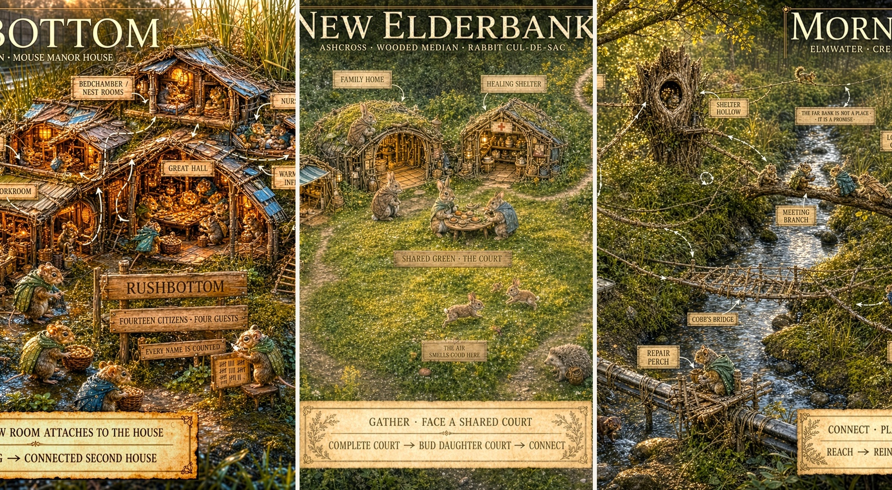
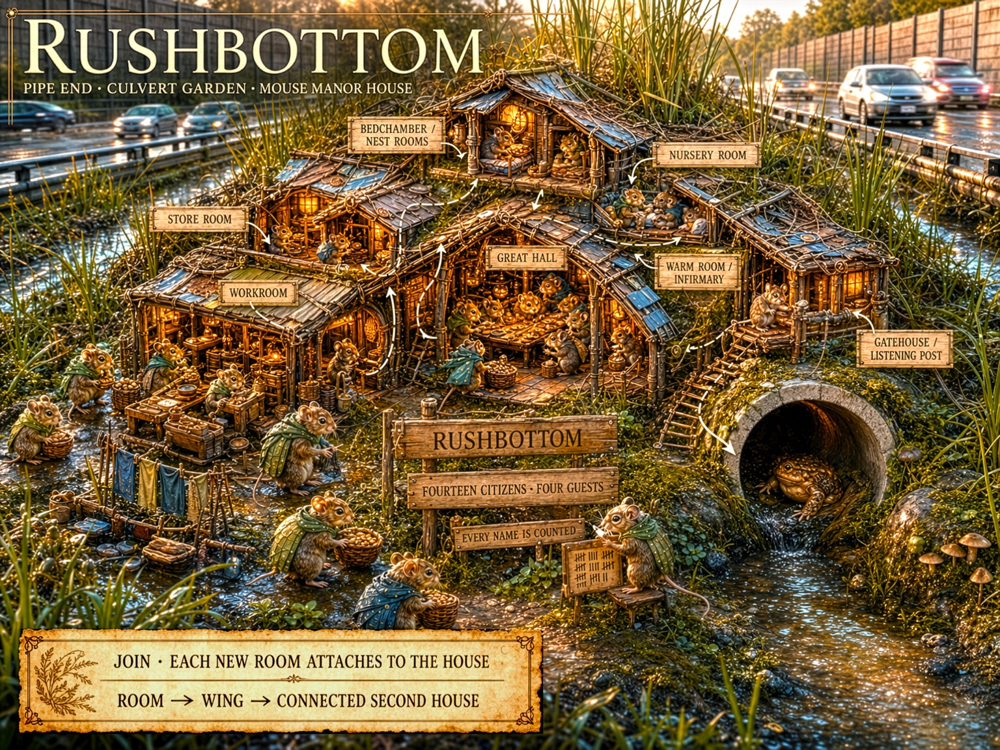
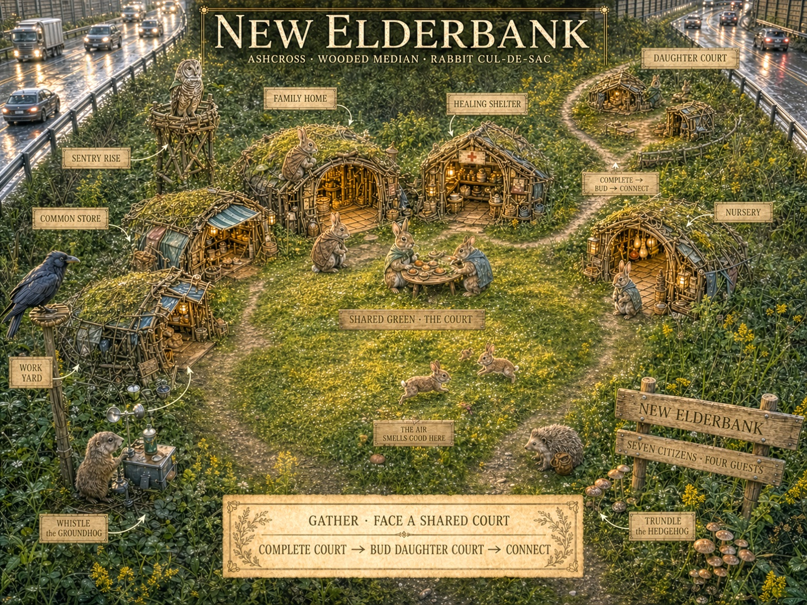
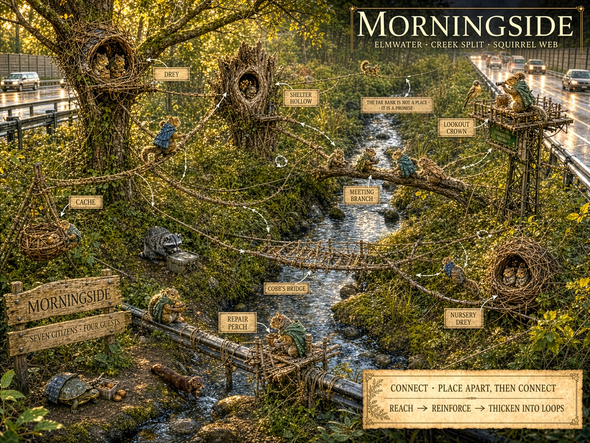

<!--@0¶1-->
**MEDIAN**

<!--@0¶2-->
**SYSTEM SPECIFICATION**

<!--@0¶3-->
**ECOLOGICAL INFLUENCES**

<!--@0¶4-->
**CORE SPECIES / ROADSIDE HABITAT / SPATIAL TRANSLATION**

<!--@0¶5-->

<!--@0¶6-->
*Concept plate: Mouse Manor House, Rabbit Cul-de-Sac, and Squirrel Web shown as three civilizational interpretations of the same roadside habitat.*

<!--@0¶7-->
<table>
<tbody>
<tr class="odd">
<td><strong>CANONICAL PREMISE 
<em>Ecology supplies bodily priors, not laws. MEDIAN cultures translate those priors into architecture, movement, risk, and domestic meaning while gameplay visibility remains sovereign.</em></strong></td>
</tr>
</tbody>
</table>

<!--@0¶8-->
| **Document field**  | **Specification**                           |
| ------------------- | ------------------------------------------- |
| Document version    | 1.0                                         |
| Target architecture | MEDIAN Concept Sourcebook / Species Systems |
| Module              | Core Species Ecology / Environmental Design |
| Primary species     | Mouse, Rabbit, Squirrel                     |
| Status              | Canon-adjacent influence specification      |

<!--@1-->
# 0\. Interpretation Summary

<!--@1¶1-->
This document extracts useful design principles from a supplied ecological field report concerning small mammals in roadside and fragmented habitats. It is not a scientific literature review and does not elevate every claim in that report into MEDIAN canon. Its purpose is to identify where real animal bodies and habitat preferences can sharpen an already fictional civilization system.

<!--@1¶2-->
<table>
<tbody>
<tr class="odd">
<td><strong>TRANSLATION TEST 
<em>The standard is not: Would real animals literally construct this? The standard is: Does the invented civilization exaggerate a real species understanding of safety, movement, and inhabitable space?</em></strong></td>
</tr>
</tbody>
</table>

<!--@1¶3-->
| **Earlier shorthand**                   | **Refined influence**                                                                                                       | **MEDIAN consequence**                                                                                     |
| --------------------------------------- | --------------------------------------------------------------------------------------------------------------------------- | ---------------------------------------------------------------------------------------------------------- |
| Mouse as underground species            | Mouse as above-ground but under, within, against, and continuously enclosed by things.                                      | Strengthens JOIN without hiding the colony below the game board.                                           |
| Rabbit as deep warren builder           | Rabbit as surface-court civilization contained by dense cover and short burst routes to refuge.                             | Retains GATHER and the Cul-de-Sac while separating cottontail inspiration from European rabbit literalism. |
| Squirrel as treehouse species           | Squirrel as a distributed topology of anchors, routes, alternate refuges, and scatter-caches.                               | Strengthens CONNECT and makes the network itself the civilization.                                         |
| Road as empty border                    | Road edge as simultaneous resource frontier, lethal exposure, noise field, drainage system, and human-material interface.   | Creates an ecological risk-yield gradient across the median.                                               |
| Ecological realism as visual constraint | Ecology informs implied spatial relations; the strategic camera may remove walls, roofs, brush, and foliage for legibility. | Protects satisfying colony gameplay and concept-art readability.                                           |

<!--@1.1-->
## Contents

<!--@1.1¶1-->
| **Sections 1-9**                                                                  | **Sections 10-18**                                                  |
| --------------------------------------------------------------------------------- | ------------------------------------------------------------------- |
| 1\. Executive Summary and Canonical Scope                                         | 10\. Cross-Register Applications: DWELL, TRAVEL, RISK, MEET, EMBODY |
| 2\. Evidence Hierarchy and Translation Method                                     | 11\. Home Readiness and Species-Specific Encounter Manifestations   |
| 3\. Shared Ecology of Highway Medians and Roadside Fragments                      | 12\. Resource Gradients, Water, Seasons, Predators, and Sound       |
| 4\. Core Species Comparison and Perceptual Geometry                               | 13\. Visual Representation Doctrine and the No-Underground Rule     |
| 5\. Mouse Influences: Enclosure, Edge Contact, and the Micro-Lattice              | 14\. Canonization Rules, Softened Claims, and Open Questions        |
| 6\. Rabbit Influences: Concealed Surface Courts and Burst Refuge                  | 15\. Concept Art Evaluation: Rushbottom Mouse Manor House           |
| 7\. Squirrel Influences: Elevated Anchors, Redundant Routes, and Scatter Topology | 16\. Concept Art Evaluation: New Elderbank Rabbit Cul-de-Sac        |
| 8\. Ecological Foundations of JOIN, GATHER, and CONNECT                           | 17\. Concept Art Evaluation: Morningside Squirrel Web               |
| 9\. Human Infrastructure as Species-Relative Topology                             | 18\. Final Canon Takeaways and Acceptance Tests                     |

<!--@2-->
# 1\. Executive Summary and Canonical Scope

<!--@2¶1-->
MEDIAN takes place in transportation corridors that are simultaneously habitat, barrier, refuge, resource frontier, and recurring source of catastrophe. The three Core species do not merely occupy different elevations. Their bodies organize space differently. Mouse seeks uninterrupted contact and enclosure. Rabbit seeks shared surface ground held close to concealment. Squirrel seeks reachable anchors and alternate routes.

<!--@2¶2-->
These ecological influences reinforce the established spatial placement verbs without dictating zoological literalism. JOIN, GATHER, and CONNECT remain civilizational principles. Ecology explains why those principles feel native to each species and supplies material for environmental art, traversal, Colony Load, Encounter manifestations, and EMBODY experiences.

<!--@2¶3-->
<table>
<tbody>
<tr class="odd">
<td><strong>PERCEPTUAL GEOMETRY 
<em>Mouse asks: What can I remain in contact with? Rabbit asks: How quickly can I disappear? Squirrel asks: What can I reach from here?</em></strong></td>
</tr>
</tbody>
</table>

<!--@2.1-->
## System purposes

<!--@2.1¶1-->
  - > Give each Core species a distinct bodily definition of safe and unsafe space.

<!--@2.1¶2-->
  - > Ground fictional architecture in recognizable roadside materials and habitat processes.

<!--@2.1¶3-->
  - > Create one map that functions as three different topologies depending on species perception.

<!--@2.1¶4-->
  - > Generate species-specific Dwell Loads, Away traversal styles, Risk identities, Encounter consequences, and EMBODY pleasures.

<!--@2.1¶5-->
  - > Protect visual readability by separating diegetic shelter from what the privileged strategic camera reveals.

<!--@2.1¶6-->
  - > Identify ecological claims that are useful as inspiration but should not be published as scientific fact without direct sourcing.

<!--@2.2-->
## Scope boundary

<!--@2.2¶1-->
This specification does not determine animal taxonomy, population simulation, breeding behavior, or documentary-accurate social organization. MEDIAN Citizens possess language, institutions, construction traditions, moral agency, and cross-species relationships. Natural behavior supplies a substrate from which culture has developed; it does not replace culture.

<!--@3-->
# 2\. Evidence Hierarchy and Translation Method

<!--@3¶1-->
Every ecological idea entering MEDIAN should be tagged by how it is being used. This prevents evocative extrapolation from hardening into false natural-history claims and protects the game from becoming captive to realism that does not serve play.

<!--@3¶2-->
| **Category**         | **Definition**                                                                                     | **Permitted use**                                                                    |
| -------------------- | -------------------------------------------------------------------------------------------------- | ------------------------------------------------------------------------------------ |
| Ecological influence | A broad, credible behavioral or habitat tendency used as inspiration.                              | May support canon language when stated qualitatively and without brittle precision.  |
| Design inference     | A gameplay conclusion drawn from one or more ecological tendencies.                                | May become mechanical canon if it is internally coherent and legible.                |
| Cultural elaboration | A fictional institution or architecture that develops from a bodily tendency.                      | Full MEDIAN canon; should be described as civilization, not natural animal behavior. |
| Gameplay convention  | A representational rule that departs from literal visibility or physical behavior for playability. | Full interface canon; explicitly non-diegetic where useful.                          |
| Unverified claim     | A precise number, absolute statement, or confident explanation not independently sourced.          | May inspire brainstorming but must not appear as factual sourcebook authority.       |

<!--@3¶3-->
|                                                                                                                                                   |
| ------------------------------------------------------------------------------------------------------------------------------------------------- |
| **Observe bodily tendency -\> Identify spatial meaning -\> Translate into culture -\> Express through mechanics -\> Check readability and heart** |

<!--@3.1-->
## Five translation questions

<!--@3.1¶1-->
> **1. Safety:** What environmental relationship allows the species to relax or recover?
> 
> **2. Movement:** What routes feel naturally legible, and what surfaces feel like voids?
> 
> **3. Domesticity:** How would a civilization turn those bodily preferences into homes, Practices, and institutions?
> 
> **4. Failure:** What does loss of that environmental relationship look like during MEET?
> 
> **5. Pleasure:** What movement or sensory experience becomes enjoyable only once Home has made it safe?

<!--@3.1¶2-->
<table>
<tbody>
<tr class="odd">
<td><strong>APPLICATION RULE 
<em>Ecology may constrain the fiction only where the constraint improves distinctiveness, causality, or emotional credibility. Gameplay visibility and the established species fantasy remain sovereign.</em></strong></td>
</tr>
</tbody>
</table>

<!--@4-->
# 3\. Shared Ecology of Highway Medians and Roadside Fragments

<!--@4¶1-->
Roadside fragments are paradoxical landscapes. The carriageway is a powerful barrier and mortality source, yet the verge and median may contain dense grasses, seed traps, flowering weeds, drainage water, discarded material, reduced human foot traffic, and structures that function as shelter or route anchors. The same edge can be rich, polluted, concealed, noisy, unstable, and lethal.

<!--@3.1#2-->
## 3.1 The island-sanctuary paradox

<!--@3.1#2¶1-->
| **Landscape function**      | **Benefit**                                                         | **Hazard**                                                    | **MEDIAN use**                                                   |
| --------------------------- | ------------------------------------------------------------------- | ------------------------------------------------------------- | ---------------------------------------------------------------- |
| Median interior             | Relative continuity, familiar paths, defensible domestic territory. | Finite area, resource ceiling, flood or maintenance exposure. | Sovereign Home territory and the stable center of DWELL.         |
| Vegetated margin            | Flowers, seeds, insects, bramble, litter catches, concealment.      | Mowing, runoff, predators, traffic turbulence, human access.  | High-yield but intermittently unsafe Practice and resource zone. |
| Shoulder and curb           | Salvage, food debris, strong edges, drainage structures.            | Extreme vehicle proximity, contamination, sudden disturbance. | Raid, staging, warning, and short-duration resource territory.   |
| Carriageway                 | Possible access to another habitat island.                          | Broad open exposure, noise, vibration, speed, mortality.      | The defining RISK threshold and founding barrier.                |
| Overhead / built structures | Poles, rails, signs, wires, walls, girders, pipes.                  | Wind, maintenance, electrical or human disturbance.           | Species-relative routes and anchoring opportunities.             |

<!--@3.1#2¶2-->
<table>
<tbody>
<tr class="odd">
<td><strong>EDGE-EFFECT DOCTRINE 
<em>The road edge should never be only a hazard boundary. It is the place where danger, forage, salvage, cover, signal, runoff, and human infrastructure become inseparable.</em></strong></td>
</tr>
</tbody>
</table>

<!--@3.2-->
## 3.2 Infrastructure as naturalized terrain

<!--@3.2¶1-->
MEDIAN animals do not divide the world into natural and artificial features. They read material by affordance. A culvert may be a flood channel, refuge, road, border, and foundation. A guardrail may be wall, tactile run, shade line, perch chain, or social boundary depending on the observer.

<!--@3.3-->
## 3.3 Noise as climate and signal

<!--@3.3¶1-->
The continuous highway hum functions like weather: always present, broadly adapted to, and rarely meaningful by itself. Sudden discontinuities - horn blast, tire failure, impact, mower start, machinery vibration, or abrupt silence - become signals that Watchkeepers interpret. MEET should often arise not because noise exists, but because a meaningful change within the noise has gone unnoticed or demands response.

<!--@5-->
# 4\. Core Species Comparison and Perceptual Geometry

<!--@5¶1-->
| **Dimension**            | **Mouse**                                                              | **Rabbit**                                                                            | **Squirrel**                                                                  |
| ------------------------ | ---------------------------------------------------------------------- | ------------------------------------------------------------------------------------- | ----------------------------------------------------------------------------- |
| Primary lived layer      | Litter, debris, culvert edge, wall base, joined rooms.                 | Ground surface inside brush, grass, deadfall, and court clearings.                    | Trunk, branch, post, sign, cable, bridge, and elevated node.                  |
| Safety relationship      | Continuous tactile enclosure and edge contact.                         | Immediate access to concealment and several burst routes.                             | Reachable vertical refuge and alternate connected paths.                      |
| Spatial verb             | JOIN                                                                   | GATHER                                                                                | CONNECT                                                                       |
| Civilizational image     | Manor House / accumulated inhabited body.                              | Cul-de-Sac / court within a protective thicket envelope.                              | Web / distributed anchors linked into loops.                                  |
| Road response tendency   | Avoid open asphalt; seek edge, tube, cover, and staged refuge.         | Freeze, then explosive burst toward cover; open ground is tolerable only near refuge. | Accelerate toward a known landing or vertical anchor; gap geometry dominates. |
| Storage tendency         | Compartmentalized interior caches and dry rooms.                       | Household stores plus shared reserve near the court.                                  | Distributed scatter-caches across the Web.                                    |
| Primary failure geometry | Breach, damp, severed enclosure, invasion of internal runs.            | Exposed court, lost cover, blocked escape lane, displaced household.                  | Isolated node, broken span, failed anchor, correlated cache loss.             |
| EMBODY pleasure          | Warm interiors, small-object handling, edge-running, intimate density. | Bounding, social play, concealment-to-clearing movement, basking.                     | Bridge running, vertical flow, balance, route choice, high repose.            |

<!--@5¶2-->
<table>
<tbody>
<tr class="odd">
<td><strong>MAP MULTIPLICITY 
<em>The same ten feet of ground can be a Rabbit sprint, a Mouse void, and a Squirrel problem of where the next climbable anchor stands.</em></strong></td>
</tr>
</tbody>
</table>

<!--@6-->
# 5\. Mouse Influences: Enclosure, Edge Contact, and the Micro-Lattice

<!--@6¶1-->
The useful Mouse model is a small North American field or white-footed mouse type rather than a single taxonomic commitment. The design value lies in micro-scale movement, dense use of litter and debris, covered runways, dry nesting pockets, edge-following behavior, and the ability to turn discarded human material into a continuous domestic world.

<!--@5.1-->
## 5.1 Bodily premise

<!--@5.1¶1-->
<table>
<tbody>
<tr class="odd">
<td><strong>MOUSE ECOLOGICAL SENTENCE 
<em>A Mouse route is safe when the body never loses the edge.</em></strong></td>
</tr>
</tbody>
</table>

<!--@5.1¶2-->
  - > **Thigmotactic legibility:** Mouse movement prefers walls, bases, logs, pipes, packed litter, narrow passages, and surfaces that provide continuous contact.

<!--@5.1¶3-->
  - > **Micro-habitat density:** A small area can contain many distinct pockets, caches, rooms, and covered runs at Mouse scale.

<!--@5.1¶4-->
  - > **Thermal and moisture sensitivity:** Dryness, insulation, crowding, and protected warm chambers are central domestic concerns.

<!--@5.1¶5-->
  - > **Road aversion:** Broad paved surfaces are powerful barriers because they remove cover, contact, concealment, and route texture.

<!--@5.1¶6-->
  - > **Opportunistic architecture:** Cans, bark slabs, tarps, pipe fragments, curb seams, guardrail bases, and root masses become fortress-scale structures.

<!--@5.2-->
## 5.2 Cultural translation: the Surface Manor

<!--@5.2¶1-->
The Mouse civilization remains fully visible above ground, but its phenomenology is interior. Mouse lives under, inside, behind, beneath, and against things. Rooms accumulate into an inhabited body connected by covered passages, shared walls, overlapping foundations, eaves, root runs, pipe galleries, and edge-bound lanes.

<!--@5.2¶2-->
| **Natural inspiration**       | **Cultural elaboration**                                          | **Mechanical expression**                                                                      |
| ----------------------------- | ----------------------------------------------------------------- | ---------------------------------------------------------------------------------------------- |
| Woven nests and dry pockets   | Bedchambers, nurseries, warm rooms, guest rooms.                  | Residential Places JOIN the Manor and contribute to shelter Load.                              |
| Covered runways               | Galleries, stairs, wall lanes, pipe passages, relay corridors.    | A Place counts as JOINED through protected bodily continuity, not only literal grid adjacency. |
| Small caches                  | Pantries, store rooms, household cupboards, emergency pockets.    | Storage can be internally compartmentalized without becoming Squirrel-style scatter topology.  |
| Communal cold-weather nesting | Great halls, winter huddle rooms, shared hearth spaces.           | Seasonal Care and heating burdens become visibly social.                                       |
| Debris and infrastructure use | Culvert estates, tarp roofs, guardrail foundations, can chambers. | Human remnants are the Manor skeleton rather than decorative salvage.                          |

<!--@5.3-->
## 5.3 Mouse across the Registers

<!--@5.3¶1-->
| **Register** | **Ecological influence**                                                                                                                  |
| ------------ | ----------------------------------------------------------------------------------------------------------------------------------------- |
| DWELL        | JOIN extends uninterrupted protected interiority; exposed interfaces and damp low rooms increase Building and Care Load.                  |
| TRAVEL       | Mouse favors culverts, curb edges, guardrail bases, litter lines, drainage seams, and short covered hops.                                 |
| RISK         | Open-lane movement is a crisis of sensory legibility. Preparation may create temporary edges, waypoints, tubes, or shadow routes.         |
| MEET         | Threats invade or sever the interior system: flood enters a gallery, a snake reaches an oversized opening, grass cutting reveals a route. |
| EMBODY       | Small work, wall-running, warm-pipe routes, handling buttons or seeds, listening to rain, and moving through dense domestic life.         |

<!--@7-->
# 6\. Rabbit Influences: Concealed Surface Courts and Burst Refuge

<!--@7¶1-->
The most consequential ecological correction concerns Rabbit. If the inspiration is a North American cottontail, the civilization should not be explained as a natural extension of deep communal warrens. Cottontail influence instead suggests shallow surface forms, dense low cover, feeding areas near refuge, freezing, and explosive movement between protective pockets.

<!--@6.1-->
## 6.1 Bodily premise

<!--@6.1¶1-->
<table>
<tbody>
<tr class="odd">
<td><strong>RABBIT ECOLOGICAL SENTENCE 
<em>A Rabbit home is open on the inside and invisible from the outside.</em></strong></td>
</tr>
</tbody>
</table>

<!--@6.1¶2-->
  - > **Cover dependence:** Safety comes from dense brush, bramble, grass, deadfall, and low overhang rather than thick constructed walls.

<!--@6.1¶3-->
  - > **Surface domesticity:** Resting and household Places remain at ground level, culturally elaborating shallow forms and concealed pockets.

<!--@6.1¶4-->
  - > **Burst geometry:** Open ground is measured in explosive bounds to the next concealment, not in continuous comfortable travel.

<!--@6.1¶5-->
  - > **Freeze response:** Cryptic stillness can be as important as speed when danger is uncertain or cover has been reached.

<!--@6.1¶6-->
  - > **Edge feeding:** Forage-rich open patches matter because they stand immediately beside protective vegetation.

<!--@6.2-->
## 6.2 Cultural translation: the Thicket Court

<!--@6.2¶1-->
The Rabbit Cul-de-Sac remains canon. Ecology refines its envelope. A court is a communal clearing carved within or backed by dense cover. Household Places face shared ground while remaining one or two bursts from concealment. A daughter court buds when the first social center becomes too large to remain intimate and safely bounded.

<!--@6.2¶2-->
| **Court requirement** | **Diegetic meaning**                                             | **Gameplay consequence**                                                        |
| --------------------- | ---------------------------------------------------------------- | ------------------------------------------------------------------------------- |
| Mutual orientation    | Households recognize the same social center.                     | GATHER alignment supports Care, warning transmission, and communal Practice.    |
| Cover proximity       | No essential activity lies far from brush, roof, or dive pocket. | Large exposed courts create Load and increase raptor or weather vulnerability.  |
| Escape plurality      | Each sector has more than one route out of pressure.             | Blocked lanes become meaningful MEET stakes; dead ends weaken alignment.        |
| Recognizable scale    | Residents remain neighbors rather than anonymous population.     | Full courts bud daughter courts instead of increasing indefinitely in density.  |
| Surface visibility    | The player can read the court, homes, and citizens from above.   | The strategic camera may thin or remove the concealing canopy non-diegetically. |

<!--@6.3-->
## 6.3 Rabbit across the Registers

<!--@6.3¶1-->
| **Register** | **Ecological influence**                                                                                                                                 |
| ------------ | -------------------------------------------------------------------------------------------------------------------------------------------------------- |
| DWELL        | GATHER creates small inward-facing courts with nearby concealment, multiple lanes, and visible social centers.                                           |
| TRAVEL       | Rabbit moves from cover island to cover island and values brush edges, low grass corridors, and rest pockets.                                            |
| RISK         | The characteristic rhythm is stillness -\> commitment -\> explosive bound -\> concealment, with evasive redirection when necessary.                      |
| MEET         | Threats expose the court or remove its refuge: mowing opens a sightline, winter dieback strips cover, an exit lane collapses, a raptor learns the green. |
| EMBODY       | Court bounding, social chase, grass-flopping, basking, brush-pocket games, grooming, and watching neighbors cross shared ground.                         |

<!--@8-->
# 7\. Squirrel Influences: Elevated Anchors, Redundant Routes, and Scatter Topology

<!--@8¶1-->
The ecological report most directly confirms the established Squirrel Web. Squirrel safety is organized around vertical access, route continuity, precise gaps, multiple nest sites, distributed stores, and the ability to treat human structures as substitute canopy. The civilization is not a group of tree houses connected by decoration. The connected route system is the civic body.

<!--@7.1-->
## 7.1 Bodily premise

<!--@7.1¶1-->
<table>
<tbody>
<tr class="odd">
<td><strong>SQUIRREL ECOLOGICAL SENTENCE 
<em>A Squirrel home is every place from which another way home remains reachable.</em></strong></td>
</tr>
</tbody>
</table>

<!--@7.1¶2-->
  - > **Vertical refuge:** Ground use is common, but safety is strongly shaped by the availability of trunks, posts, walls, branches, cables, and climbable escape.

<!--@7.1¶3-->
  - > **Gap calculation:** Open intervals are understood as trajectories between known anchors rather than as empty areas to wander.

<!--@7.1¶4-->
  - > **Multiple refuges:** A citizen or household may use a primary hollow, external drey, seasonal refuge, and emergency perch rather than one exclusive home.

<!--@7.1¶5-->
  - > **Scatter storage:** Many small memorized caches create resilience, route traffic, and risk of loss or forgetting.

<!--@7.1¶6-->
  - > **Infrastructure opportunism:** Signs, guardrails, sound walls, fence tops, utility lines, overpass members, and broken trees become artificial canopy.

<!--@7.2-->
## 7.2 Cultural translation: the Web

<!--@7.2¶1-->
| **Natural inspiration**    | **Cultural elaboration**                                                    | **Mechanical expression**                                                                      |
| -------------------------- | --------------------------------------------------------------------------- | ---------------------------------------------------------------------------------------------- |
| Tree hollows and dreys     | Primary refuge, nursery drey, guest drey, seasonal and emergency nodes.     | Housing security is distributed; displacement can be absorbed if spare nodes and routes exist. |
| Branch and trunk travel    | Bridges, runs, trunk arterials, lookout crowns, meeting branches.           | CONNECT requires credible physical paths and rewards alternate routes.                         |
| Scatter-hoarding           | Named cache points, route stores, emergency reserves, remembered ownership. | Storage is dispersed; concentration is efficient but culturally and strategically brittle.     |
| Canopy gap response        | Route engineering, landing platforms, intermediate perches, wind braces.    | Long unsupported spans raise Load and Encounter risk.                                          |
| Human structures as canopy | Sign towers, cable roads, pipe perches, wall seams, girder routes.          | The skyline becomes a second terrain map distinct from ground vegetation.                      |

<!--@7.3-->
## 7.3 Squirrel across the Registers

<!--@7.3¶1-->
| **Register** | **Ecological influence**                                                                                                                   |
| ------------ | ------------------------------------------------------------------------------------------------------------------------------------------ |
| DWELL        | CONNECT places nodes apart, establishes a first route, then reinforces the Web through alternate paths, caches, and refuges.               |
| TRAVEL       | Squirrel reads the skyline: climbable supports, branch chains, fence lines, cables, and safe descent points.                               |
| RISK         | The characteristic action is vector commitment: accelerate toward a landing or vertical anchor and avoid lethal hesitation in an open gap. |
| MEET         | Threats partition the network: wind loosens an anchor, maintenance removes a line, one-route nodes become isolated, caches are cut off.    |
| EMBODY       | Bridge running, trunk descent, route choice, high wind play, cache retrieval, parallel racing, and contemplative perches.                  |

<!--@9-->
# 8\. Ecological Foundations of JOIN, GATHER, and CONNECT

<!--@9¶1-->
The placement verbs should remain cultural instructions rather than zoological reflexes. Ecology provides the reason each culture finds its verb emotionally and physically satisfying.

<!--@9¶2-->
| **Species** | **Verb** | **Ecological substrate**                              | **Placement validity test**                                                           | **Failure test**                                                       |
| ----------- | -------- | ----------------------------------------------------- | ------------------------------------------------------------------------------------- | ---------------------------------------------------------------------- |
| Mouse       | JOIN     | Edge contact, enclosure, dense micro-habitat.         | Can a Mouse reach this Place through continuous protected bodily space?               | Does a breach, damp interval, or exposed gap sever the inhabited body? |
| Rabbit      | GATHER   | Shared surface life held close to concealment.        | Does this Place face a recognizable court and remain near more than one refuge route? | Does the court become exposed, oversized, isolated, or trapped?        |
| Squirrel    | CONNECT  | Vertical anchors, gap trajectories, multiple refuges. | Does the node possess a credible route to active Web space, preferably more than one? | Can one broken span isolate home, stores, or nursery?                  |

<!--@9¶3-->
<table>
<tbody>
<tr class="odd">
<td><strong>VISIBLE SAFETY TRIAD 
<em>Mouse is enclosed. Rabbit is concealed. Squirrel is elevated.</em></strong></td>
</tr>
</tbody>
</table>

<!--@8.1-->
## 8.1 Expansion rhythms

<!--@8.1¶1-->
| **Mouse**                                 | **Rabbit**                                                       | **Squirrel**                                                                       |
| ----------------------------------------- | ---------------------------------------------------------------- | ---------------------------------------------------------------------------------- |
| ROOM -\> WING -\> CONNECTED SECOND HOUSE  | COMPLETE COURT -\> BUD DAUGHTER COURT -\> CONNECT                | REACH -\> REINFORCE -\> THICKEN INTO LOOPS                                         |
| Expansion thickens an inhabited envelope. | Expansion creates another social center inside protective cover. | Expansion establishes distance, then turns a fragile strand into a resilient mesh. |

<!--@10-->
# 9\. Human Infrastructure as Species-Relative Topology

<!--@10¶1-->
A single roadside object should support different readings depending on species scale and body. This is one of the most valuable environmental-design consequences of the ecology work: the map does not need three separate biomes to support three distinct civilizations.

<!--@10¶2-->
| **Human / natural feature** | **Mouse reading**                                           | **Rabbit reading**                                           | **Squirrel reading**                                    |
| --------------------------- | ----------------------------------------------------------- | ------------------------------------------------------------ | ------------------------------------------------------- |
| Guardrail                   | Covered base run, wall edge, chamber support, salvage seam. | Partial screen, brush anchor, exposed boundary.              | Low anchor chain, balance line, jump sequence.          |
| Culvert                     | Highway, flood threat, winter refuge, Manor foundation.     | Severe-weather shelter, escape mouth, dangerous deep pocket. | Low fallback route or crossing understructure.          |
| Sound wall                  | Continuous edge corridor, cavity source, moisture line.     | Protective border that may also become a trap.               | Climbable plane, seam route, elevated anchor field.     |
| Sign support                | Enclosed base, metal shelter, material source.              | Exposed obstacle and possible shade edge.                    | Tower, lookout crown, bridge anchor, regional landmark. |
| Tarp or sheet debris        | Roof, wall, connected room, dry layer.                      | Dense cover and wind-sensitive canopy.                       | Drey material, sail-like hazard, route screen.          |
| Bramble                     | Covered micro-run, seed trap, wall texture.                 | Primary shelter envelope, forage edge, social boundary.      | Low secondary route and food source.                    |
| Pipe                        | Interior road, room chain, drainage risk.                   | Refuge mouth or hard boundary.                               | Perch, low route, bridge foundation.                    |
| Utility cable               | Distant ceiling or inaccessible signal line.                | Overhead exposure cue.                                       | Regional sky-road and gap bypass.                       |
| Fallen branch               | Roof edge, tactile corridor.                                | Brush cover, lane divider, form shelter.                     | Natural bridge, landing, route junction.                |

<!--@10¶3-->
<table>
<tbody>
<tr class="odd">
<td><strong>TERRAIN DOCTRINE 
<em>Mouse reads the base edges. Rabbit reads the cover patches. Squirrel reads the skyline.</em></strong></td>
</tr>
</tbody>
</table>

<!--@11-->
# 10\. Cross-Register Applications: DWELL, TRAVEL, RISK, MEET, EMBODY

<!--@11¶1-->
Ecological influence is most valuable when it survives the transition between registers. The player should recognize the same body and spatial identity whether arranging a colony, traversing a corridor, facing traffic, resolving a storm, or enjoying Home through EMBODY.

<!--@11¶2-->
| **Register** | **System question**                  | **Mouse answer**                                       | **Rabbit answer**                                      | **Squirrel answer**                                  |
| ------------ | ------------------------------------ | ------------------------------------------------------ | ------------------------------------------------------ | ---------------------------------------------------- |
| DWELL        | What arrangement feels like home?    | One protected accumulated interior body.               | A small court of neighbors inside concealment.         | A redundant Web of separated reachable nodes.        |
| TRAVEL       | What path is naturally legible?      | Edge, tube, litter roof, culvert, wall base.           | Cover island, brush lane, short open bound.            | Branch chain, post line, cable, climbable anchor.    |
| RISK         | What bodily action defines survival? | Create or find tactile structure across the void.      | Freeze, commit, burst, redirect, disappear.            | Solve the vector, accelerate, reach vertical escape. |
| MEET         | How does pressure become situated?   | Breach or invasion of internal continuity.             | Loss of cover, route, or social refuge.                | Partition, anchor failure, or isolated node.         |
| EMBODY       | What does safety make pleasurable?   | Warm density, small work, interior scamper, listening. | Bounding, social play, repose in open-yet-safe ground. | Bridge flow, balance, height, route memory, wind.    |

<!--@11¶3-->
<table>
<tbody>
<tr class="odd">
<td><strong>REGISTER CONTINUITY 
<em>Away exposes the body to the environmental problem. Home turns the same bodily relationship into architecture, routine, and pleasure.</em></strong></td>
</tr>
</tbody>
</table>

<!--@12-->
# 11\. Home Readiness and Species-Specific Encounter Manifestations

<!--@12¶1-->
The Home Loop tracks Role Capacity and colony-wide Conditions abstractly. Ecological influence determines what a deficiency looks like when the Encounter Register opens it into a particular Place, route, court, or household. The same Builder shortfall should not threaten all species in the same visual language.

<!--@12¶2-->
| **Role shortfall** | **Mouse manifestation**                                               | **Rabbit manifestation**                                                | **Squirrel manifestation**                                         |
| ------------------ | --------------------------------------------------------------------- | ----------------------------------------------------------------------- | ------------------------------------------------------------------ |
| Builder            | Wet gallery, lifted roof layer, severed joined passage, shifted slab. | Opened brush canopy, slumped shelter, blocked court lane, exposed form. | Loose anchor, broken span, swaying platform, one-route node.       |
| Caretaker          | Damp nest, contaminated cache, overcrowded warm room.                 | Displaced household, poorly lined shelter, exposed shared stores.       | Unready spare drey, inaccessible refuge, badly distributed stores. |
| Watchkeeper        | Snake or water enters internal runs before warning.                   | Predator reaches the court edge or citizens spread too far into forage. | Route threat is discovered after a node has become isolated.       |
| Gardener / Forager | Seed traps and local stores fail to meet dense demand.                | Safe forage close to cover is exhausted or cut off.                     | Cache network thins in one Reach and travel burden rises.          |
| Leader             | Room claims, circulation disputes, and crowding fracture the Manor.   | Court factions disagree over shared ground or evacuation priority.      | Remote nodes stop coordinating and hoard local capacity.           |
| Healer             | Illness moves through dense rooms or damp bedding.                    | An injured Citizen cannot reach protected repose.                       | A wounded Citizen is stranded beyond a failed route.               |

<!--@12¶3-->
These manifestations should remain content-selection grammar rather than separate species economies. Underlying Conditions may still be Structural Condition, Stores, Cohesion, Exposure, and Citizen injury. Ecology changes where the threat appears, why it is credible, and what the player feels they are saving.

<!--@13-->
# 12\. Resource Gradients, Water, Seasons, Predators, and Sound

<!--@12.1-->
## 12.1 Resource gradient

<!--@12.1¶1-->
| **Band**             | **Typical yield**                                                    | **Typical pressure**                                            | **Species emphasis**                                                |
| -------------------- | -------------------------------------------------------------------- | --------------------------------------------------------------- | ------------------------------------------------------------------- |
| Interior Home        | Reliable but finite sustenance, cultivated Places, protected stores. | Crowding, seasonal exhaustion, domestic Load.                   | Mouse density, Rabbit court life, Squirrel local nodes.             |
| Outer Margin         | Flowers, seeds, insects, bramble fruit, windblown litter.            | Mowing, runoff, raptors, traffic turbulence, sudden human work. | Rabbit forage-cover edge, Mouse litter lines, Squirrel low caches.  |
| Shoulder / Road Edge | Human food debris, rare salvage, drainage catches.                   | Vehicle proximity, contamination, exposure, rapid disturbance.  | Mouse edge runs, Rabbit emergency bounds, Squirrel posts and signs. |
| Overhead Layer       | Seed heads, nests, signs, cables, branches, wind-caught objects.     | Wind, raptors, maintenance, fall and isolation risk.            | Primarily Squirrel; occasional guest-species access.                |

<!--@12.2-->
## 12.2 Water and drainage

<!--@12.2¶1-->
  - > **Mouse:** Culverts and pipes are high-value continuity systems whose usefulness is inseparable from flood risk, damp storage, and seasonal refuge.

<!--@12.2¶2-->
  - > **Rabbit:** Surface courts depend on dry forms, cover integrity, and escape lanes; deep reclaimed refuges may become traps during runoff.

<!--@12.2¶3-->
  - > **Squirrel:** Water is principally a gap and anchor problem, but rising flow can remove low routes, pipe perches, or access to ground caches.

<!--@12.3-->
## 12.3 Seasonal transformation

<!--@12.3¶1-->
Season should alter topology rather than only resource totals. Summer foliage can conceal Rabbit courts, supply Mouse roof material, and thicken Squirrel route cover. Winter dieback may expose courts and routes while making cavities, warm rooms, durable stores, and alternate refuges more valuable. Storms should test the material relationships each species relies upon rather than apply generic weather damage.

<!--@12.4-->
## 12.4 Predators and human maintenance

<!--@12.4¶1-->
Predator pressure is species-relative. Raptors exploit Rabbit visibility and Squirrel exposure; snakes exploit Mouse openings and internal continuity; terrestrial predators exploit court exits, low routes, and scent. Human maintenance - mowing, drainage clearing, sign repair, litter removal, snowplowing, brush cutting - can transform topology more radically than predation by removing the very feature a civilization reads as safety.

<!--@12.5-->
## 12.5 Acoustic signal model

<!--@12.5¶1-->
| **Sound state**        | **Interpretation**                                                           | **Possible system use**                                                      |
| ---------------------- | ---------------------------------------------------------------------------- | ---------------------------------------------------------------------------- |
| Continuous traffic hum | Environmental baseline; rarely a discrete signal.                            | Ambient sound bed and ordinary Exposure context.                             |
| Sudden spike           | Horn, impact, engine brake, tire failure, thunder, machinery start.          | Watchkeeper signal, Encounter trigger, immediate flee or readiness response. |
| Pattern change         | Congestion, lane closure, reduced traffic, maintenance convoy.               | Forecast information for Crossing and edge activity.                         |
| Unexpected silence     | Potential closure, nighttime lull, weather interruption, human intervention. | Ambiguous warning: lower traffic opportunity or unfamiliar danger.           |

<!--@14-->
# 13\. Visual Representation Doctrine and the No-Underground Rule

<!--@14¶1-->
MEDIAN requires operationally visible civilizations. No Core civilization may disappear underground, and the player must be able to read Rooms, Places, citizens, routes, court relationships, work, storage, and household life. This requirement overrides literal concealment wherever the two conflict.

<!--@14¶2-->
<table>
<tbody>
<tr class="odd">
<td><strong>STRATEGIC TRANSPARENCY 
<em>Open to camera is not open to world.</em></strong></td>
</tr>
</tbody>
</table>

<!--@13.1-->
## 13.1 Gameplay exposure versus diegetic exposure

<!--@13.1¶1-->
| **Concept**                | **Definition**                                                                                     | **Example**                                                                                                      |
| -------------------------- | -------------------------------------------------------------------------------------------------- | ---------------------------------------------------------------------------------------------------------------- |
| Gameplay exposure          | The camera reveals structures and inhabitants so the player can operate and care about the colony. | Mouse fourth walls vanish; Rabbit canopy thins; Squirrel foliage separates to reveal routes.                     |
| Diegetic exposure          | The actual vulnerability of a Place to weather, predators, sightlines, and intrusion.              | A graphically open Mouse nursery remains sealed in-world; a visible Rabbit court remains concealed from outside. |
| Privileged camera          | The player sees through or around materials unavailable to inhabitants and threats.                | Isometric roofs fade, brush becomes transparent, route overlaps are clarified.                                   |
| Representational shorthand | The art displays relationships rather than physically complete construction.                       | A connected room reads as joined even when its near wall is omitted.                                             |

<!--@13.2-->
## 13.2 Species visibility rules

<!--@13.2¶1-->
| **Species** | **Canonical visual rule**                                                                                                                                                                                                            |
| ----------- | ------------------------------------------------------------------------------------------------------------------------------------------------------------------------------------------------------------------------------------ |
| Mouse       | Mouse colonies use a permanent architectural cutaway. Near walls, roof planes, screens, and concealing material may be omitted wherever necessary to reveal Places, citizens, and JOIN relationships. Their absence is non-diegetic. |
| Rabbit      | Rabbit courts are presented from within or through a strategically thinned canopy. The player must read the shared green and facing relationships even when the colony would be difficult to perceive from outside.                  |
| Squirrel    | Foliage and depth may be simplified to expose anchors, bridges, loops, and onward routes. Important nodes remain visibly connected even when natural leaves would obscure them.                                                      |

<!--@13.3-->
## 13.3 Above-ground safety triad

<!--@13.3¶1-->
| **Mouse**                                                                                                 | **Rabbit**                                                                                  | **Squirrel**                                                                            |
| --------------------------------------------------------------------------------------------------------- | ------------------------------------------------------------------------------------------- | --------------------------------------------------------------------------------------- |
| Above ground but phenomenologically interior: under roofs, within debris, inside culverts, against edges. | Above ground but concealed: within brush, beneath living canopies, around secret clearings. | Above the ground plane: on trunks, signs, walls, bridges, branches, and layered routes. |

<!--@13.3¶2-->
<table>
<tbody>
<tr class="odd">
<td><strong>UNIVERSAL ART DOCTRINE 
<em>Colony art privileges operational legibility over literal visibility. Inhabitants and threats do not share the player camera.</em></strong></td>
</tr>
</tbody>
</table>

<!--@15-->
# 14\. Canonization Rules, Softened Claims, and Open Questions

<!--@15¶1-->
The supplied ecology report contains both useful general tendencies and claims that are too exact, absolute, geographically mixed, or narratively extrapolated to publish as fact. The appropriate response is not to discard the ideas, but to label their design status honestly.

<!--@15¶2-->
| **Report claim or tendency**                               | **Specification treatment**                                                                                                           |
| ---------------------------------------------------------- | ------------------------------------------------------------------------------------------------------------------------------------- |
| Apodemus / Peromyscus treated as one Mouse model           | Do not canonize the mixed taxonomy. Use a northeastern North American field / white-footed mouse inspiration at a broad level.        |
| Exact home-range acreages                                  | Use only the qualitative ordering: Mouse smallest and densest, Rabbit localized around cover, Squirrel broadest and route-dependent.  |
| Roads are absolute barriers to mice                        | Soften to powerful behavioral and population barriers, especially where broad, open, and lacking cover or crossing structure.         |
| Squirrels are strictly arboreal                            | Reject the absolute. Squirrels use the ground but organize refuge and escape around vertical access.                                  |
| Squirrels glide                                            | Reject for ordinary tree squirrels. Use leap, climb, balance, and vector commitment.                                                  |
| Every Rabbit form has two constructed opposing portals     | Treat as a useful Rabbit cultural rule derived from dependence on rapid escape, not a universal natural-history fact.                 |
| Mouse has formal latrine and specialized room architecture | Treat as cultural elaboration of nests, caches, covered runs, and dense domestic compartmentalization.                                |
| Mouse nest is exactly 20-30 degrees warmer                 | Do not canonize the number without direct evidence. Retain the qualitative emphasis on insulation and body heat.                      |
| Cavity equals winter home; drey equals summer home         | Use as a design tendency: cavities are hardened premium refuges; dreys are flexible external nodes.                                   |
| Rabbit social hierarchy maps directly to colony politics   | Do not import natural social structure literally. MEDIAN culture, citizenship, and institutions remain fictional and morally legible. |

<!--@15.1-->
## Open design questions

<!--@15.1¶1-->
  - > How much species specificity should be attached to the Core species names, versus preserving broad fairy-tale legibility?

<!--@15.1¶2-->
  - > Which ecological tendencies should alter numerical Load, and which should remain encounter content or visual language only?

<!--@15.1¶3-->
  - > How visibly should Rabbit cover be represented before strategic transparency begins to weaken the concept of concealment?

<!--@15.1¶4-->
  - > How many Squirrel refuges and caches are needed before redundancy becomes legible without becoming UI clutter?

<!--@15.1¶5-->
  - > Which environmental processes are forecastable through Watchkeepers, and which should remain genuine surprise?

<!--@16-->
# 15\. Concept Art Evaluation: Rushbottom Mouse Manor House

<!--@16¶1-->

<!--@16¶2-->
*Rushbottom: Pipe End, Culvert Garden, Mouse Manor House. The concept art uses a permanent cutaway to reveal the joined room system.*

<!--@16¶3-->
<table>
<tbody>
<tr class="odd">
<td><strong>RUSHBOTTOM ASSESSMENT 
<em>Verdict: spatial canon exceptional; ecological influence very strong once strategic transparency is treated as non-diegetic.</em></strong></td>
</tr>
</tbody>
</table>

<!--@15.1#2-->
## 15.1 What the art confirms

<!--@15.1#2¶1-->
  - > **Continuous inhabited mass:** Bedchamber, nursery, store, workroom, Great Hall, warm room, and gatehouse read as one accumulated body rather than a village of detached cottages.

<!--@15.1#2¶2-->
  - > **JOIN legibility:** Shared roofs, touching walls, layered foundations, stairs, and room-to-room adjacency make the placement verb immediately visible.

<!--@15.1#2¶3-->
  - > **Infrastructure opportunism:** The culvert, drainage garden, metal surfaces, reeds, and roadside material are structural elements of the Manor rather than scenery.

<!--@15.1#2¶4-->
  - > **Functional density:** Many citizens occupy distinct but neighboring Places, supporting the image of Mouse as the dense domestic backbone.

<!--@15.1#2¶5-->
  - > **Compartmentalized culture:** Natural nest and cache tendencies have become explicit rooms, workshops, care spaces, and a civic hall.

<!--@15.2-->
## 15.2 Ecological tensions that remain useful

<!--@15.2¶1-->
  - > **Water pressure:** Rushbottom is visibly damp and flood-adjacent. The answer is not relocation but architecture obsessed with raised floors, dry stores, warm rooms, drainage, and flood readiness.

<!--@15.2¶2-->
  - > **Enclosure interfaces:** Breaches, lifted roof layers, widened openings, and damp connections should be characteristic Mouse Encounter stakes.

<!--@15.2¶3-->
  - > **Covered circulation:** The art need not draw every screen or passage roof, but the rules should understand stairs, galleries, and lanes as protected in-world where JOIN requires it.

<!--@15.3-->
## 15.3 Accepted gameplay convention

<!--@15.3¶1-->
The exposed fourth walls are necessary and correct. They do not represent open rooms. The image operates like a theatrical set, dollhouse, or isometric building cutaway. Walls, roof planes, woven screens, and coverings are omitted for the player while remaining present diegetically. Ecological critique must assess implied continuity, dryness, route protection, and room placement - not whether the player can see the interior.

<!--@15.3¶2-->
<table>
<tbody>
<tr class="odd">
<td><strong>ART DIRECTION CONCLUSION 
<em>Rushbottom should not become less open to the player. The sourcebook should simply state that the Manor is more enclosed to the world than the camera depicts.</em></strong></td>
</tr>
</tbody>
</table>

<!--@15.4-->
## 15.4 Art-direction and content hooks

<!--@15.4¶1-->
| **Preserve visibly**                                           | **Imply diegetically**                                                     | **Useful MEET / EMBODY hooks**                                             |
| -------------------------------------------------------------- | -------------------------------------------------------------------------- | -------------------------------------------------------------------------- |
| One accumulated mass with readable Rooms.                      | Missing near walls, screens, roof planes, and sealed passages.             | Flash flood enters the culvert garden; Mouse citizens race to lift stores. |
| Culvert, reeds, water, and human scrap as the estate skeleton. | Raised floors, drainage habits, moisture barriers, and warm-dry gradients. | A lifted roof layer threatens several joined rooms at once.                |
| Citizens visibly occupying domestic and civic Places.          | Covered circulation along eaves, walls, pipes, and narrow galleries.       | EMBODY follows a warm-pipe run, pantry carry, or rain-listening moment.    |
| JOIN arrows and adjacency readable at a glance.                | Interior continuity beyond the cutaway plane.                              | A gatehouse opening becomes too wide and admits an internal threat.        |

<!--@17-->
# 16\. Concept Art Evaluation: New Elderbank Rabbit Cul-de-Sac

<!--@17¶1-->

<!--@17¶2-->
*New Elderbank: Ashcross, Wooded Median, Rabbit Cul-de-Sac. Inward-facing Places define a shared court and bud a daughter court.*

<!--@17¶3-->
<table>
<tbody>
<tr class="odd">
<td><strong>NEW ELDERBANK ASSESSMENT 
<em>Verdict: GATHER grammar exceptional; ecological influence moderate in literal appearance but readily reconciled through the privileged camera and a diegetic thicket envelope.</em></strong></td>
</tr>
</tbody>
</table>

<!--@16.1-->
## 16.1 What the art confirms

<!--@16.1¶1-->
  - > **Shared social ground:** The central green is unmistakably the settlement organ. Homes, nursery, care, work, and conversation face inward.

<!--@16.1¶2-->
  - > **Neighborhood scale:** The colony reads as a community of neighbors rather than one building or an anonymous field of huts.

<!--@16.1¶3-->
  - > **Daughter-court growth:** The upper court clearly demonstrates complete -\> bud -\> connect and prevents the main green from expanding indefinitely.

<!--@16.1¶4-->
  - > **Surface architecture:** Low turf-and-woven Places are compatible with a cottontail-inspired civilization that elaborates forms and brush shelters rather than digging a deep warren.

<!--@16.1¶5-->
  - > **Citizen life:** Kits, meals, guests, work, and the sentry make GATHER emotionally legible as repeated encounter across common space.

<!--@16.2-->
## 16.2 Ecological tension and its correct interpretation

<!--@16.2¶1-->
The court appears broad and exposed because the player must see its social geometry. Diegetically, New Elderbank should be understood as a clearing within dense cover. Brush, grass, living roof, and low canopy may be visually thinned or removed above the strategic board. From outside and from ground level beyond its perimeter, the settlement can remain difficult to perceive.

<!--@16.2¶2-->
  - > **Cover relationship:** Household Places should remain backed into or continuous with the perimeter cover, even if the art opens that perimeter for readability.

<!--@16.2¶3-->
  - > **Burst distance:** The green should remain small enough that important positions are only a few bounds from refuge or a low concealment island.

<!--@16.2¶4-->
  - > **Escape plurality:** Each court sector should possess more than one covered lane, and blocked exits should become meaningful Encounter stakes.

<!--@16.2¶5-->
  - > **Raptor sightlines:** The strategic view does not equal a predator view. The camera can suppress canopy while the simulation still tracks court exposure and Watch readiness.

<!--@16.3-->
## 16.3 Art direction conclusion

<!--@16.3¶1-->
New Elderbank does not need to be visually buried in realistic brush. The game would lose the very GATHER relationships it needs the player to enjoy. The correct doctrine is that the visible court is a strategically revealed interior clearing. Environmental cues - perimeter bramble, overhanging roofs, short refuge lanes, and compressed scale - can suggest concealment without sacrificing the playable board.

<!--@16.3¶2-->
<table>
<tbody>
<tr class="odd">
<td><strong>RABBIT VISUAL PRINCIPLE 
<em>The Rabbit settlement is open to its own neighbors, not open to the world.</em></strong></td>
</tr>
</tbody>
</table>

<!--@16.4-->
## 16.4 Art-direction and content hooks

<!--@16.4¶1-->
| **Preserve visibly**                                          | **Imply diegetically**                                                 | **Useful MEET / EMBODY hooks**                                              |
| ------------------------------------------------------------- | ---------------------------------------------------------------------- | --------------------------------------------------------------------------- |
| A clear shared green and inward-facing Places.                | A dense perimeter thicket, low canopy, and concealed exterior profile. | Brush cutting opens a new raptor sightline into the court.                  |
| Kits, meals, work, guests, and repeated neighbor contact.     | Short burst distance from any major activity to a refuge pocket.       | A blocked lane forces the colony to choose which court sector to protect.   |
| The daughter court as the expansion rhythm.                   | Several covered lanes and more than one exit from each sector.         | EMBODY offers court bounding, social chase, basking, or a quiet grass flop. |
| Low woven and turf architecture rather than masonry cottages. | Living roofs and brush backing that visually merge homes with cover.   | Winter dieback exposes a once-safe family Place.                            |

<!--@18-->
# 17\. Concept Art Evaluation: Morningside Squirrel Web

<!--@18¶1-->

<!--@18¶2-->
*Morningside: Elmwater, Creek Split, Squirrel Web. Distributed nodes become a settlement through bridges, branches, loops, and alternate routes.*

<!--@18¶3-->
<table>
<tbody>
<tr class="odd">
<td><strong>MORNINGSIDE ASSESSMENT 
<em>Verdict: spatial canon and ecological influence both exceptional. Morningside is the most directly confirmed of the three concept plates.</em></strong></td>
</tr>
</tbody>
</table>

<!--@17.1-->
## 17.1 What the art confirms

<!--@17.1¶1-->
  - > **Distributed civilization:** Drey, hollow, nursery, cache, lookout, meeting branch, bridge, and repair perch remain separate; no central building contains the town.

<!--@17.1¶2-->
  - > **Connectivity as civic substance:** Bridges and lines dominate the composition. The settlement exists because the nodes remain mutually reachable.

<!--@17.1¶3-->
  - > **Route redundancy:** High, middle, and low paths, parallel crossings, and return loops communicate resilience rather than one decorative rope.

<!--@17.1¶4-->
  - > **Multiple refuges:** The external drey and shelter hollow support the idea that Squirrel housing is a portfolio of possible homes.

<!--@17.1¶5-->
  - > **Existing terrain as anchor:** Trees, broken trunk, pipe, roadside supports, and natural branches are incorporated instead of replaced.

<!--@17.1¶6-->
  - > **Ground-height relation:** Citizens can use low perches and ground areas while safety remains organized around rapid access to elevated structure.

<!--@17.2-->
## 17.2 Opportunities to strengthen the ecological influence

<!--@17.2¶1-->
  - > **Scatter more caches:** Several minor stores across different nodes would make distributed storage as visually important as distributed housing.

<!--@17.2¶2-->
  - > **Diversify route material:** Use more living branches, fence tops, cables, wall seams, vines, and found spans alongside built ropeways so the Web feels discovered as well as engineered.

<!--@17.2¶3-->
  - > **Increase vertical hierarchy:** A clearer high refuge, middle civic band, trunk arterial, and low service layer would make the Web feel even more three-dimensional.

<!--@17.2¶4-->
  - > **Shelter the nursery:** The nursery drey should visibly possess short redundant routes or else be intentionally identified as a current colony vulnerability.

<!--@17.3-->
## 17.3 EMBODY implication

<!--@17.3¶1-->
Morningside almost designs the flagship EMBODY experience by itself. Running Cobb's Bridge, choosing between parallel routes, feeling ordinary sway, passing a meeting branch, and arriving at a high overlook would convert CONNECT from diagram into bodily joy. The route is safe not because it is motionless, but because the colony has made motion trustworthy.

<!--@17.3¶2-->
<table>
<tbody>
<tr class="odd">
<td><strong>SQUIRREL DRAMATURGY 
<em>In RISK, the squirrel crosses because it must. In EMBODY, the squirrel runs the bridge because it can.</em></strong></td>
</tr>
</tbody>
</table>

<!--@17.4-->
## 17.4 Art-direction and content hooks

<!--@17.4¶1-->
| **Preserve visibly**                                                   | **Strengthen where useful**                                                     | **Useful MEET / EMBODY hooks**                                                      |
| ---------------------------------------------------------------------- | ------------------------------------------------------------------------------- | ----------------------------------------------------------------------------------- |
| Nodes remain separated and routes dominate the composition.            | Add small scatter-caches across several Reaches.                                | Heavy wind loosens one anchor and threatens to partition the Web.                   |
| Loops, alternate crossings, and onward routes are readable.            | Mix built ropes with branches, cables, fence tops, and found spans.             | A maintenance crew removes an infrastructure route during an Away absence.          |
| Hollow, drey, nursery, lookout, and repair perch remain distinct.      | Clarify high refuge, middle civic band, trunk arterial, and low service routes. | EMBODY runs Cobb's Bridge, follows a parallel route, or rests at the Lookout Crown. |
| Ground use remains possible without making the colony ground-centered. | Give the nursery visibly redundant short routes or mark it as a vulnerability.  | A cache remembered by one Citizen becomes the reserve that saves another Reach.     |

<!--@19-->
# 18\. Final Canon Takeaways and Acceptance Tests

<!--@19¶1-->
The ecology work does not replace the established species canon. It explains why that canon is persuasive and supplies a disciplined way to elaborate it. The final test is always whether the ecological influence creates a more distinctive, legible, heartfelt game relationship.

<!--@19¶2-->
| **Species** | **Canonical sentence**                                                        | **Home identity**                                                                            |
| ----------- | ----------------------------------------------------------------------------- | -------------------------------------------------------------------------------------------- |
| Mouse       | A Mouse route is safe when the body never loses the edge.                     | JOIN creates an enclosed, visible, accumulated Manor whose cutaway is non-diegetic.          |
| Rabbit      | A Rabbit home is open on the inside and invisible from the outside.           | GATHER creates recognizable surface courts within a strategically revealed thicket envelope. |
| Squirrel    | A Squirrel home is every place from which another way home remains reachable. | CONNECT creates an elevated, redundant Web of anchors, refuges, routes, and caches.          |

<!--@19.1-->
## Acceptance tests

<!--@19.1¶1-->
**Species silhouette test:** An uninhabited colony remains identifiable as Mouse, Rabbit, or Squirrel from its spatial organization alone.

<!--@19.1¶2-->
**Shared-terrain test:** The same roadside feature presents meaningfully different affordances to all three species.

<!--@19.1¶3-->
**Home/Away continuity test:** A species preference visible in DWELL reappears in TRAVEL, RISK, MEET, and EMBODY without becoming a different fantasy.

<!--@19.1¶4-->
**Encounter test:** A shared Role shortfall manifests through species-specific physical stakes while returning to the same compact colony Conditions.

<!--@19.1¶5-->
**Visibility test:** Rooms, courts, routes, and citizens remain satisfying to read and operate even where literal ecology would conceal them.

<!--@19.1¶6-->
**Diegesis test:** The sourcebook distinguishes what the player camera reveals from what weather, predators, and inhabitants perceive.

<!--@19.1¶7-->
**Non-literalism test:** No ecological claim is imported merely because it is natural; it must strengthen play, identity, or emotional credibility.

<!--@19.1¶8-->
**Heart test:** The final translation helps the player understand what each species experiences as home, danger, and bodily delight.

<!--@19.2-->
## Final authoring quick-reference

<!--@19.2¶1-->
| **Species** | **Show clearly**                                                                | **Assume beyond the camera**                                                    | **Do not drift toward**                                                                |
| ----------- | ------------------------------------------------------------------------------- | ------------------------------------------------------------------------------- | -------------------------------------------------------------------------------------- |
| Mouse       | Joined Rooms, dense occupancy, edge-bound circulation, dry and warm hierarchy.  | Sealed fourth walls, covered passages, screens, and continuous enclosure.       | Detached cottage village, casual open plazas, or hidden underground play.              |
| Rabbit      | Shared court, facing homes, daughter-court rhythm, visible neighbor life.       | Perimeter thicket, low canopy, short refuge distance, plural escape lanes.      | Exposed lawn suburb, deep natural warren, or anonymous high-density sprawl.            |
| Squirrel    | Separated nodes, loops, alternate routes, vertical anchors, distributed refuge. | Foliage depth, route continuation, remembered caches, ordinary vertical escape. | One central treehouse, decorative bridges without stakes, or centralized pantry logic. |

<!--@19.2¶2-->
<table>
<tbody>
<tr class="odd">
<td><strong>FINAL SPECIFICATION STATEMENT 
<em>Ecology makes the three civilizations feel inevitable without making them literal. The art makes them visible without making them exposed.</em></strong></td>
</tr>
</tbody>
</table>
