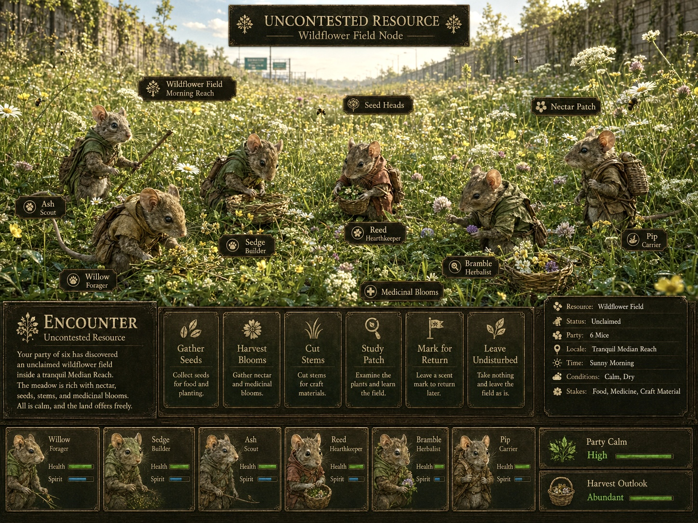
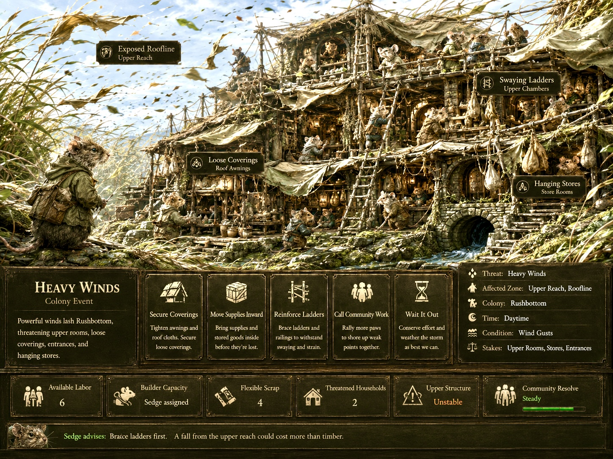

<!--@0¶1-->
**MEDIAN**

<!--@0¶2-->
**SYSTEM SPECIFICATION**

<!--@0¶3-->
**THE EMBODIMENT REGISTER**

<!--@0¶4-->
**EMBODY / FIFTH CANON REGISTER**

<!--@0¶5-->

<!--@0¶6-->
*Concept plate: a Squirrel Web whose routes, platforms, watch lines, and domestic spaces may be experienced at lived scale through EMBODY.*

<!--@0¶7-->
<table>
<tbody>
<tr class="odd">
<td>
<strong>CANONICAL PREMISE</strong>

<em>Dwell proves the colony is safe. EMBODY proves that safety means something.</em>
</td>
</tr>
</tbody>
</table>

<!--@0¶8-->
| **Document Version**    | 2.0                       | July 2026    |
| ----------------------- | ------------------------- | ------------ |
| **Target Architecture** | MEDIAN Concept Sourcebook | System Canon |

<!--@1-->
# **0. Revision Summary**

<!--@1¶1-->
*What changed from the original Playful Register proposal*

<!--@1¶2-->
| **Area**                | **Revision**                                                                                                                                          |
| ----------------------- | ----------------------------------------------------------------------------------------------------------------------------------------------------- |
| Canonical name          | Playful Register is replaced by the Embodiment Register. Play is one content family; embodiment is the governing idea.                                |
| Availability            | EMBODY is a globally available Register within Home Mode whenever the colony maintains Quiet Equilibrium. It is not unlocked per citizen or per Role. |
| Home-only rule          | EMBODY never appears Away, including during uncontested resources, camps, calm Field segments, or low-threat Encounters.                              |
| Experience architecture | Two primary forms are recognized: Practice Embodiment and Presence Embodiment. Both are guided and bounded rather than free-roam.                     |
| Recovery doctrine       | Exposure naturally ebbs through sanctuary. EMBODY may portray that ebb but does not accelerate it. Acute Tharn is not cleared through play.           |
| Narrative consolidation | The former Webisode function is folded into EMBODY and Campaign Memory. Webisodes cease to be a separate Register or mandatory text event.            |
| Register topology       | MEET remains the universal situational-choice Register at Home and Away. EMBODY is the positive Home-only Register of lived safety.                   |

<!--@1.1-->
## **Contents**

<!--@1.1¶1-->
  - 1\. Executive Summary and Canonical Definition

<!--@1.1¶2-->
  - 2\. Architectural Placement in the Five-Register Canon

<!--@1.1¶3-->
  - 3\. Foundational Design Principles

<!--@1.1¶4-->
  - 4\. Access Conditions and Global Home Availability

<!--@1.1¶5-->
  - 5\. Core Experience Architecture: Practice and Presence

<!--@1.1¶6-->
  - 6\. EMBODY Mode Families

<!--@1.1¶7-->
  - 7\. Species Spatial Identity in EMBODY

<!--@1.1¶8-->
  - 8\. Flagship Experience: Run a Bridge with a Squirrel

<!--@1.1¶9-->
  - 9\. Relationship to Readiness, Exposure, and Tharn

<!--@1.1¶10-->
  - 10\. Campaign Memory and the Former Webisode Function

<!--@1.1¶11-->
  - 11\. Boundary with the Encounter Register

<!--@1.1¶12-->
  - 12\. Interaction and Dramaturgy Standards

<!--@1.1¶13-->
  - 13\. Authoring Schema and Example Experience Cards

<!--@1.1¶14-->
  - 14\. Canon Rules, Non-Goals, and Acceptance Tests

<!--@2-->
# **1. Executive Summary and Canonical Definition**

<!--@2¶1-->
The Embodiment Register (EMBODY) is MEDIAN’s fifth canon Register and its principal positive destination. It is an optional, Home-only mode in which the player temporarily descends from colony-scale stewardship into the lived physical scale of an available Citizen. Through bounded moments of activity, motion, repose, relationship, and sensory attention, EMBODY lets the player feel the sanctuary that Dwell has made materially real.

<!--@2¶2-->
EMBODY is not a general close-camera mode, an Away traversal layer, a trauma-clearing minigame, or an additional production channel. It is the form of play made possible when the colony is running well enough that animal life is briefly freed from instrumental urgency.

<!--@2¶3-->
<table>
<tbody>
<tr class="odd">
<td>
<strong>CANONICAL SPECIFICATION</strong>

<em>EMBODY is a globally available Home Register unlocked by Quiet Equilibrium. It allows the player to participate in or accompany bounded moments of animal activity, repose, play, relationship, and sensory grace through any present and available Citizen. It is non-punitive, contains no required failure state, grants no exclusive economic output, and never appears Away.</em>
</td>
</tr>
</tbody>
</table>

<!--@2.1-->
## **System purpose**

<!--@2.1¶1-->
  - Convert Sanctuary from an abstract success condition into a tactile, sensory experience.

<!--@2.1¶2-->
  - Expose Citizens as friends and living beings rather than as Role headcounts or expedition units.

<!--@2.1¶3-->
  - Translate JOIN, GATHER, and CONNECT from overhead spatial grammar into bodily experience.

<!--@2.1¶4-->
  - Reward competent Dwell by creating time and permission for non-instrumental play, not by dispensing another currency.

<!--@2.1¶5-->
  - Carry forward the strongest functions of Webisodes: brevity, character exposure, shared memory, and intimate domestic texture.

<!--@2.1¶6-->
  - Provide MEDIAN with a Register whose dominant affect is aliveness rather than management, distance, danger, or adjudication.

<!--@3-->
# **2. Architectural Placement in the Five-Register Canon**

<!--@3¶1-->
| **Register** | **Verb** | **Availability** | **Visual paradigm**                                        | **Core relation**                               |
| ------------ | -------- | ---------------- | ---------------------------------------------------------- | ----------------------------------------------- |
| Colony       | DWELL    | Home             | Elevated isometric / sectional colony view                 | Arrange and sustain collective life.            |
| Field        | TRAVEL   | Away             | 2.5D track, route, or terrain progression                  | Carry life through extended space.              |
| Crossing     | RISK     | Away             | Immediate forward or spatial evasion view                  | Preserve life inside acute movement danger.     |
| Encounter    | MEET     | Home + Away      | Staged situational tableau with constrained choices        | Answer a bounded circumstance.                  |
| Embodiment   | EMBODY   | Home only        | Intimate third-person, guided motion, or sensory cinematic | Experience life freed from immediate necessity. |

<!--@3.1-->
## **Register topology**

<!--@3.1¶1-->
The five Registers are not a single linear sequence. DWELL and EMBODY are Home relations. TRAVEL and RISK are Away relations. MEET is cross-modal: a Colony may meet heavy winds, a party may meet a stranger, and an expedition may meet an uncontested resource. EMBODY is deliberately asymmetric. It belongs only to the safety of Home.

<!--@3.1¶2-->
|                                |       |            |       |                 |       |                       |       |                  |
| ------------------------------ | ----- | ---------- | ----- | --------------- | ----- | --------------------- | ----- | ---------------- |
| **AWAY: Travel / Risk / Meet** | **→** | **Return** | **→** | **HOME: Dwell** | **→** | **Quiet Equilibrium** | **→** | **HOME: Embody** |

<!--@3.2-->
## **Dramaturgical cycle**

<!--@3.2¶1-->
Away creates Exposure and gives Sanctuary dramatic necessity. Dwell establishes the material and social conditions of safety. EMBODY makes those conditions perceptible at animal scale. Campaign Memory preserves selected moments and lets them alter later characterization.

<!--@3.2¶2-->
<table>
<tbody>
<tr class="odd">
<td>
<strong>CYCLE STATEMENT</strong>

<em>Danger makes sanctuary necessary. Dwell makes sanctuary functional. EMBODY makes sanctuary felt. Memory makes sanctuary personal.</em>
</td>
</tr>
</tbody>
</table>

<!--@4-->
# **3. Foundational Design Principles**

<!--@4.1-->
### **Sanctuary is the mechanic**

<!--@4.1¶1-->
EMBODY exists because the colony is safe, not merely because no enemy is currently visible. Temporary calm Away does not qualify.

<!--@4.2-->
### **Global permission, individual entry**

<!--@4.2¶1-->
The colony unlocks EMBODY globally. The player enters through a specific available Citizen or inhabited Place.

<!--@4.3-->
### **Guided, not free-roam**

<!--@4.3¶1-->
Each experience has an authored spatial pocket, a limited verb set, a beginning, a sensory turn, and a natural exit.

<!--@4.4-->
### **Non-instrumental value**

<!--@4.4¶1-->
Participation does not create exclusive food, materials, healing speed, or statistical advantage. The experience is valuable because the Citizen’s life is valuable.

<!--@4.5-->
### **No forced optimization**

<!--@4.5¶1-->
There is no requirement to repeat EMBODY for every Citizen. It must not become a daily recovery chore or a superior way to process routine work.

<!--@4.6-->
### **Co-agency**

<!--@4.6¶1-->
The player supplies attention and limited motion. The Citizen retains expressive ownership: posture, reaction, temperament, and exact social response.

<!--@4.7-->
### **Species embodiment**

<!--@4.7¶1-->
The same colony geometry that matters in DWELL must produce a distinct physical fantasy in EMBODY.

<!--@4.8-->
### **Memory by significance**

<!--@4.8¶1-->
A session may enter Campaign Memory when it contains a distinctive Citizen, Place, relationship, recent event, or sensory conjunction. Most sessions may remain ephemeral.

<!--@5-->
# **4. Access Conditions and Global Home Availability**

<!--@5.1-->
## **Global availability rule**

<!--@5.1¶1-->
EMBODY is a globally available Register within Home Mode. It is not keyed to a selected Citizen’s Role Margin, personal recovery meter, or special unlock. The colony’s current state determines whether embodiment is possible at all; the selected Citizen determines which experiences are available.

<!--@5.1¶2-->
| **Gate**        | **Requirement**                                                                                                                                                 |
| --------------- | --------------------------------------------------------------------------------------------------------------------------------------------------------------- |
| Colony state    | Quiet Equilibrium is active. Routine life is functioning and no acute failure has seized the Home loop.                                                         |
| Encounter state | No unresolved Colony Encounter currently demands adjudication.                                                                                                  |
| Citizen state   | The selected Citizen is present, conscious, and available rather than Away, incapacitated, or committed to an emergency.                                        |
| Place state     | The selected Practice Place, route, court, hearth, watch point, or domestic pocket is safe and usable.                                                          |
| Role logic      | Role assignment represents a Citizen’s share of the day’s civic commitment, not continuous labor imprisonment. A Gardener may still have an embodied afternoon. |

<!--@5.2-->
## **State ladder**

<!--@5.2¶1-->
| **Home state**    | **EMBODY consequence**                                                                                                                                     |
| ----------------- | ---------------------------------------------------------------------------------------------------------------------------------------------------------- |
| Quiet Equilibrium | Full EMBODY availability across present and available Citizens.                                                                                            |
| Strained          | EMBODY is normally suspended. A deliberately authored grace moment may occur only if the system specifies that ordinary life still has a protected pocket. |
| Crisis            | EMBODY unavailable. The player must resolve the active MEET situation or restore Home stability.                                                           |

<!--@5.2¶2-->
<table>
<tbody>
<tr class="odd">
<td>
<strong>INTERFACE PROMISE</strong>

<em>The colony is at peace. You may now inhabit it.</em>
</td>
</tr>
</tbody>
</table>

<!--@6-->
# **5. Core Experience Architecture: Practice and Presence**

<!--@6¶1-->
EMBODY contains two primary forms. They are not separate Registers; they are two ways of relating to a Citizen within the same Home-only mode. Individual experiences may sit between them.

<!--@6¶2-->
| **Form**            | **Player relation**                         | **Typical agency**                                                                                                        | **Dominant affect**                                         |
| ------------------- | ------------------------------------------- | ------------------------------------------------------------------------------------------------------------------------- | ----------------------------------------------------------- |
| Practice Embodiment | Participate in what the Citizen is doing.   | Limited direct control inside a small activity: running, gathering, carrying, arranging, grooming, or playful movement.   | Kinetic, tactile, rhythmic, lightly goal-shaped.            |
| Presence Embodiment | Attend to what the Citizen is experiencing. | Guided accompaniment, light camera agency, head movement, posture choices, sensory focus, or a mostly cinematic sequence. | Contemplative, relational, graceful, emotionally observant. |

<!--@6.1-->
## **Practice Embodiment**

<!--@6.1¶1-->
Practice experiences give the player a small vocabulary of movement inside a bounded activity. A Gardener may knock raspberries into leaf sacks; a Mouse may carry a button through joined pantry rooms; a Squirrel may run a familiar bridge circuit. The objective supplies shape, not economic superiority. The Dwell simulation has already adjudicated the day’s ordinary work.

<!--@6.2-->
## **Presence Embodiment**

<!--@6.2¶1-->
Presence experiences make the Citizen the principal actor. The player may turn Bramble’s head toward the river, settle into a warm patch, listen toward rain, or follow a prompted movement. The Citizen chooses the exact pose, pace, and response. The pleasure is similar to watching a beloved animal run, rest, or become absorbed in the world.

<!--@6.3-->
## **Continuum rule**

<!--@6.3¶1-->
Practice and Presence may blend. A Squirrel may run to a distant perch and then sit in evening wind. A Rabbit may complete a playful circuit and flop beside a friend. A Mouse may carry a small object through the Manor and then pause to listen to rain against the human wall.

<!--@7-->
# **6. EMBODY Mode Families**

<!--@7¶1-->
| **Mode family**       | **Core affect**                                          | **Examples**                                                                        |
| --------------------- | -------------------------------------------------------- | ----------------------------------------------------------------------------------- |
| Flow Traversal        | Movement pleasure, confidence, rhythm, balance.          | Squirrel bridge run; Rabbit court bound; Mouse shelf-and-passage scamper.           |
| Small Work            | Ordinary practice felt through tiny tactile actions.     | Knock berries into sacks; sort seeds; carry pantry objects; adjust nest lining.     |
| Sensory Repose        | Stillness, warmth, listening, breathing, relief.         | Watch the river; bask against brick; listen to rain from shelter.                   |
| Social Play           | Teasing, chasing, imitation, mutual delight.             | Rabbit chase; Mouse tunnel tag; Squirrel follow-run; remembered hedgehog imitation. |
| Comfort and Care      | Safety enacted through closeness and tending.            | Grooming; shared meal; settling beside a recovering friend; nest rest.              |
| Observation and Watch | Belonging expressed through familiar attention to place. | Perch at a route junction; sit at a Rabbit edge; hear colony sounds through a wall. |
| Weather Enjoyment     | A former hazard experienced as pleasure under sanctuary. | Safe breeze on a high line; after-rain clover; warm stone; snow testing.            |

<!--@7.1-->
### **Flow Traversal**

<!--@7.1¶1-->
Flow is safe exhilaration, not a platforming ordeal. Momentum, sway, footfall rhythm, balance animation, route memory, and small branch choices are welcome. Falling deaths, harsh retry loops, and score pressure are not.

<!--@7.2-->
### **Small Work**

<!--@7.2¶1-->
Small Work lets the player experience labor already represented globally in Dwell. It may create a cosmetic arrangement or a remembered detail, but it cannot become a mandatory manual method for earning superior output.

<!--@7.3-->
### **Sensory Repose**

<!--@7.3¶1-->
Repose is a first-class form of play. Light camera control, head turns, attention shifts, posture changes, and waiting are enough when the scene’s sensory construction is strong.

<!--@7.4-->
### **Social Play**

<!--@7.4¶1-->
The player controls one point of entry into the relationship. Other Citizens retain autonomous timing and reaction. Affection, laughter, imitation, or pursuit must feel offered rather than commanded.

<!--@7.5-->
### **Comfort and Care**

<!--@7.5¶1-->
Care scenes may portray the colony’s recovery work and the trust that safety allows. They do not replace the Healer, Caretaker, or recovery systems.

<!--@7.6-->
### **Observation and Watch**

<!--@7.6¶1-->
A watch point may be peaceful when the Home is secure. The emphasis is familiarity and belonging, not target detection or threat-scanning gameplay.

<!--@7.7-->
### **Weather Enjoyment**

<!--@7.7¶1-->
Weather enjoyment dramatizes sanctuary by reversing the meaning of external conditions. Rain that creates Exposure Away may become sound, smell, and shelter at Home.

<!--@8-->
# **7. Species Spatial Identity in EMBODY**

<!--@8¶1-->
DWELL establishes species identity as a spatial grammar. EMBODY converts that grammar into proprioception. The player should understand the species from how Home feels under the body, not only from architecture viewed overhead.

<!--@8¶2-->
| **Species** | **Verb** | **Lived promise**                                                                   | **Embodied verbs**                                                                                                                     |
| ----------- | -------- | ----------------------------------------------------------------------------------- | -------------------------------------------------------------------------------------------------------------------------------------- |
| Mouse       | JOIN     | Protected continuity, accumulated interior, shared walls, warmth, passage intimacy. | Squeeze through fitted routes; climb domestic layers; move from cool tunnels into warm rooms; hear neighbors through joined walls.     |
| Rabbit      | GATHER   | Mutual visibility, shared ground, neighborhood scale, sun and protective edge.      | Bound across a court; pass familiar neighbors; leap low mounds; groom; play in open ground; flop into rest.                            |
| Squirrel    | CONNECT  | Reachability, vertical confidence, sway, redundancy, alternate ways home.           | Run rope bridges; balance with the tail; choose a familiar route; cross platforms; pause at a high junction; look back across the Web. |

<!--@8.1-->
## **Mouse — protected continuity**

<!--@8.1¶1-->
The Mouse fantasy is not simply “small indoor platforming.” It is the bodily certainty that every passage belongs to one inhabited body. A route may cross shelves, cans, pipes, root gaps, and stitched coverings, but it remains enclosed by accumulated domestic history.

<!--@8.2-->
## **Rabbit — shared social ground**

<!--@8.2¶1-->
The Rabbit fantasy is social openness held inside safety. Movement crosses a court where entrances face inward and neighbors remain perceptible. Speed, sunlight, grooming, pursuit, and rest all occur against the knowledge that the common ground belongs to everyone present.

<!--@8.3-->
## **Squirrel — maintained reachability**

<!--@8.3¶1-->
The Squirrel fantasy is confidence across separation. A rope bridge is not merely infrastructure. It is a route known by the feet, tail, and body; a promise that distance has been made inhabitable. Alternate lines, platforms, caches, and perches turn the Web into experienced geography.

<!--@9-->
# **8. Flagship Experience: Run a Bridge with a Squirrel**

<!--@9¶1-->
<table>
<tbody>
<tr class="odd">
<td>
<strong>FLAGSHIP STATEMENT</strong>

<em>In Crossing, a bridge is survival. In EMBODY, a bridge can become confidence, rhythm, pleasure, and grace.</em>
</td>
</tr>
</tbody>
</table>

<!--@9¶2-->
| **Element**    | **Specification**                                                                                                                             |
| -------------- | --------------------------------------------------------------------------------------------------------------------------------------------- |
| Entry          | Select an available Squirrel or a stable bridge/run node while EMBODY is globally available.                                                  |
| Spatial pocket | A bounded route of two to four connected elements: launch platform, swaying bridge, branch or support, and arrival perch.                     |
| Player verbs   | Accelerate, ease pace, lean or balance, choose one minor branch, look toward route details, and settle at the endpoint.                       |
| Citizen agency | Tail balance, foot placement, reaction to sway, small vocalizations, and exact arrival pose remain character-authored.                        |
| Failure model  | No lethal fall and no punishing restart. A mistake produces a wobble, slower recovery, a safer gait, or a less graceful finish.               |
| Dramatic beat  | Departure → rhythm and sway → one sensory or social variation → confident arrival → brief repose.                                             |
| System result  | No exclusive material reward. The run may qualify for Campaign Memory if tied to a Citizen, relationship, recent event, or distinctive Place. |

<!--@9.1-->
## **Canonical variants**

<!--@9.1¶1-->
| **Variant**   | **Dramaturgical use**                                                                                                                      |
| ------------- | ------------------------------------------------------------------------------------------------------------------------------------------ |
| Pure Run      | A short, satisfying circuit whose reward is bodily rhythm and arrival.                                                                     |
| Follow Run    | Run after or alongside another Citizen while preserving their autonomous pace and reactions.                                               |
| Evening Check | Run outward to a distant perch, attend to the world, then return as light changes.                                                         |
| Wind Run      | A safe breeze adds rope sway, leaf motion, lantern movement, and richer tail balance.                                                      |
| Relay Run     | Carry a harmless social object — a flower, note ribbon, council token, or gifted nut — without converting the scene into production labor. |

<!--@10-->
# **9. Relationship to Readiness, Exposure, and Tharn**

<!--@10.1-->
## **Quiet Equilibrium is permission, not currency**

<!--@10.1¶1-->
Dwell creates a plateau in which routine needs, ordinary upkeep, and current pressures are adequately handled. EMBODY becomes globally available because the colony has produced surplus attention and safety. The player is not paid with EMBODY points; the colony has simply become inhabitable at intimate scale.

<!--@10.2-->
## **Exposure**

<!--@10.2¶1-->
Exposure is the accumulating burden of danger, distance, weather, vigilance, and uncertainty in Away play. It naturally ebbs after return because shelter, food, familiar company, routine, and time without threat are materially present. EMBODY may show that ebb — loosened posture, a stopped ear twitch, willingness to play — but does not accelerate it beyond the Home recovery already adjudicated.

<!--@10.3-->
## **Tharn**

<!--@10.3¶1-->
Tharn is a categorical acute condition, not merely a high Exposure value. It represents paralysis, shutdown, or a failure of response under overwhelming danger. Tharn requires rescue, protection, care, time, and any specific recovery procedure defined elsewhere. Running a bridge, basking, or completing a domestic task cannot clear it.

<!--@10.3¶2-->
| **Condition**           | **EMBODY relationship**                                                                                                                                         |
| ----------------------- | --------------------------------------------------------------------------------------------------------------------------------------------------------------- |
| High Exposure, no Tharn | Return Home; Exposure ebbs through sanctuary. EMBODY may portray relaxation or restored confidence.                                                             |
| Active Tharn            | Citizen is unavailable for ordinary EMBODY. Care and recovery systems resolve the acute state.                                                                  |
| Later recovery stage    | A specially authored Presence experience may portray the Citizen cautiously re-entering ordinary life after Tharn has been medically and systemically resolved. |

<!--@11-->
# **10. Campaign Memory and the Former Webisode Function**

<!--@11¶1-->
Webisodes were originally conceived to make Home Mode worth visiting, expose Citizen character, and turn campaign history into intimate domestic narrative. EMBODY now performs the first two functions more directly. The strongest narrative properties of Webisodes survive as the Campaign Memory layer.

<!--@11¶2-->
| **Webisode property retained** | **Use inside EMBODY / Campaign Memory**                                                                              |
| ------------------------------ | -------------------------------------------------------------------------------------------------------------------- |
| Brevity                        | Experiences are compact. Dialogue and prose remain disciplined; the sensory scene carries most of the storytelling.  |
| Campaign history               | Recent Expeditions, Colony Encounters, wounds, recoveries, seasonal changes, and Place history may shape the moment. |
| Named relationships            | Citizens remember, imitate, help, avoid, tease, misunderstand, or sit with one another.                              |
| Zero-stat emotional value      | The scene does not need a buff to justify itself.                                                                    |
| Specificity                    | Distinct objects, habits, gestures, and locations replace generic “Citizen relaxes” text.                            |

<!--@11.1-->
## **Memory pipeline**

<!--@11.1¶1-->
|                    |       |                      |       |                         |       |                        |       |                              |
| ------------------ | ----- | -------------------- | ----- | ----------------------- | ----- | ---------------------- | ----- | ---------------------------- |
| **Recent history** | **→** | **EMBODY selection** | **→** | **Guided lived moment** | **→** | **Significance check** | **→** | **Optional Campaign Memory** |

<!--@11.1¶2-->
A memory is recorded only when the experience contains a meaningful conjunction: a particular Citizen, a specific Place, a named peer, a recent event, an unusual season, a recovery milestone, or a repeated habit. Most EMBODY sessions may remain unlogged. Ephemerality is permitted.

<!--@11.2-->
## **Example**

<!--@11.2¶1-->
EMBODY scene: Twig and Bramble finish the raspberry activity. Twig repeats the exaggerated hedgehog walk from a recent Encounter; Bramble’s body animation loosens into laughter and he spills the last berries.

<!--@11.2¶2-->
<table>
<tbody>
<tr class="odd">
<td>
<strong>CAMPAIGN MEMORY</strong>

<em>Twig did the hedgehog walk again after the harvest. Bramble laughed hard enough to spill the last of the raspberries.</em>
</td>
</tr>
</tbody>
</table>

<!--@12-->
# **11. Boundary with the Encounter Register**

<!--@12¶1-->
MEET is the universal staged-choice Register for bounded situations at Home and Away. Heavy winds are something the colony meets. A stranger, predator, blocked route, or uncontested resource is something an expedition meets. EMBODY is categorically different: it is the Home relation in which action is freed from immediate necessity.

<!--@12¶2-->

<!--@12¶3-->
*Boundary case: an uncontested resource is calm but remains an Away Encounter. The party is still evaluating extraction, carrying capacity, return, and consequence.*

<!--@12¶4-->
| **Situation**                                 | **Register**                  | **Reason**                                                                                                          |
| --------------------------------------------- | ----------------------------- | ------------------------------------------------------------------------------------------------------------------- |
| Uncontested wildflower field                  | MEET / Away                   | Calm does not equal sanctuary. The party is abroad, exposed, time-bound, and making consequential resource choices. |
| Heavy winds at the colony                     | MEET / Home                   | A bounded situation demands sacrifice or acceptance of consequences.                                                |
| Twig knocking berries at Home                 | EMBODY / Home                 | The day’s Garden practice is experienced without creating superior output.                                          |
| Bramble watching the river                    | EMBODY / Home                 | The player attends to non-instrumental presence.                                                                    |
| Animated harvest after choosing “Gather” Away | Encounter resolution vignette | A close camera or gentle animation does not change the Register when it resolves an Away choice.                    |

<!--@12¶5-->

<!--@12¶6-->
*MEET at Home: the Encounter Register stages acute choice. EMBODY begins only after the colony has returned to quiet equilibrium.*

<!--@12¶7-->
<table>
<tbody>
<tr class="odd">
<td>
<strong>NEGATIVE CANON RULE</strong>

<em>The Embodiment Register cannot be invoked during an Expedition, including at uncontested resources, secure camps, calm Field segments, or apparently hazard-free Encounters.</em>
</td>
</tr>
</tbody>
</table>

<!--@13-->
# **12. Interaction and Dramaturgy Standards**

<!--@13¶1-->
| **Standard**      | **Requirement**                                                                                                                                      |
| ----------------- | ---------------------------------------------------------------------------------------------------------------------------------------------------- |
| Bounded arc       | Every experience has an arrival, a sensory or relational development, and a natural release. It is not an empty sandbox.                             |
| Limited verbs     | Controls are selected for the moment: run, hop, gather, nudge, balance, turn the head, settle, listen, approach, or wait.                            |
| No hard failure   | Mistakes create texture — wobble, pause, slower pace, rearrangement — rather than death, severe punishment, or repeated retry.                       |
| No score pressure | A gentle completion shape is allowed, but leaderboards, mastery grades, and economically optimal performance are outside the Register’s purpose.     |
| Co-agency         | The Citizen owns expression. The player guides attention or motion but does not force exact emotion or social compliance.                            |
| Sensory priority  | Scale, material, sound, warmth, wind, smell implication, body posture, and nearby life carry more meaning than explanatory UI.                       |
| Home continuity   | The experience must visibly derive from the colony the player built: its Places, routes, relationships, weather protection, and accumulated history. |
| Graceful exit     | The player may leave without penalty. The scene also has a natural ending beat so completion feels authored rather than abruptly cancelled.          |

<!--@13.1-->
## **Recommended temporal scale**

<!--@13.1¶1-->
Most EMBODY experiences should be brief enough to remain a chosen domestic interlude and long enough to develop rhythm or attention. A useful conceptual range is roughly forty-five seconds to three minutes, with some Presence moments allowed to remain open until the player chooses to leave. This is an authoring rhythm, not a production constraint.

<!--@13.2-->
## **Player–Citizen relationship**

<!--@13.2¶1-->
<table>
<tbody>
<tr class="odd">
<td>
<strong>CO-AGENCY TEST</strong>

<em>The desired feeling is “I am accompanying my friend through a lived moment,” not “I have taken possession of a unit’s controls.”</em>
</td>
</tr>
</tbody>
</table>

<!--@14-->
# **13. Authoring Schema and Example Experience Cards**

<!--@14.1-->
## **Experience authoring schema**

<!--@14.1¶1-->
| **Field**                | **Authoring requirement**                                                             |
| ------------------------ | ------------------------------------------------------------------------------------- |
| Experience ID / title    | Short canonical name.                                                                 |
| Form                     | Practice, Presence, or hybrid.                                                        |
| Mode family              | Flow, Small Work, Repose, Social Play, Care, Observation, or Weather.                 |
| Entry anchor             | Citizen, Place, route node, court, hearth, or other Home selection.                   |
| Availability             | Global Quiet Equilibrium plus Citizen and Place availability.                         |
| Species grammar          | How JOIN, GATHER, or CONNECT determines the lived space.                              |
| Player verbs             | The exact limited inputs available.                                                   |
| Citizen-owned expression | Animations, temperament, reactions, and social autonomy outside direct command.       |
| Authored beats           | Arrival, development, variation, release.                                             |
| Sensory palette          | Sound, weather, light, material, scale, and body sensation.                           |
| History hooks            | Recent Encounters, Away return, Place history, relationship, season, wound, or habit. |
| Mechanical exclusions    | No exclusive output, no Tharn cure, no mandatory buff, no failure tax.                |
| Memory eligibility       | Conditions under which an optional Campaign Memory is written.                        |

<!--@14.2-->
## **Example Card A — HIGH LINE RUN**

<!--@14.2¶1-->
| **Field**          | **Specification**                                                                                      |
| ------------------ | ------------------------------------------------------------------------------------------------------ |
| Citizen / Place    | Any available Squirrel at a stable two-route junction.                                                 |
| Form / Family      | Practice → Presence hybrid / Flow Traversal.                                                           |
| Player verbs       | Run, ease pace, lean, choose one branch, turn attention, settle.                                       |
| Beats              | Launch platform → swaying bridge → passing pennant or friend → arrival perch → evening look-back.      |
| Citizen expression | Tail balance, confidence, vocalization, and endpoint posture depend on temperament and recent history. |
| Memory hook        | First run after a frightening Crossing, a new bridge opening, or a habitual meeting at the far perch.  |

<!--@14.3-->
## **Example Card B — TWIG IN THE RASPBERRIES**

<!--@14.3¶1-->
| **Field**       | **Specification**                                                                                                |
| --------------- | ---------------------------------------------------------------------------------------------------------------- |
| Citizen / Place | Twig or another available Gardener at a Home resource bush.                                                      |
| Form / Family   | Practice / Small Work, potentially Social Play.                                                                  |
| Player verbs    | Move under branches, bump ripe fruit, nudge berries toward sacks, turn toward a nearby Citizen.                  |
| Beats           | Enter the bush → three berry clusters → small interruption or joke → final sack → rest under leaves.             |
| Mechanical rule | The day’s Garden output is already adjudicated. Performance does not increase food production.                   |
| Memory hook     | A recent Encounter joke, a rival sack arrangement, a first harvest of the season, or a Citizen’s repeated habit. |

<!--@14.4-->
## **Example Card C — BRAMBLE AT THE RIVER**

<!--@14.4¶1-->
| **Field**         | **Specification**                                                                                               |
| ----------------- | --------------------------------------------------------------------------------------------------------------- |
| Citizen / Place   | Bramble or another available Citizen at a safe Home overlook.                                                   |
| Form / Family     | Presence / Sensory Repose and Observation.                                                                      |
| Player verbs      | Turn the head, attend to sound, shift posture, look toward a passing Citizen, settle.                           |
| Beats             | Arrival → water and traffic focus → small social or environmental change → bodily release → optional exit.      |
| Recovery relation | May portray Exposure ebb already occurring through sanctuary. It does not accelerate recovery or clear Tharn.   |
| Memory hook       | Return from a difficult Expedition, a gifted berry, a familiar companion’s passing, or a seasonal river change. |

<!--@15-->
# **14. Canon Rules, Non-Goals, and Acceptance Tests**

<!--@15.1-->
## **Canonical rules**

<!--@15.1¶1-->
1.  EMBODY is the fifth canon Register and is named the Embodiment Register.

<!--@15.1¶2-->
2.  EMBODY is globally available within Home Mode when Quiet Equilibrium is active.

<!--@15.1¶3-->
3.  The player enters EMBODY through any present, available Citizen or suitable inhabited Place.

<!--@15.1¶4-->
4.  EMBODY is Home-only and never appears during an Expedition.

<!--@15.1¶5-->
5.  Practice and Presence are the two primary experience forms.

<!--@15.1¶6-->
6.  Experiences are bounded, guided, and authored rather than unrestricted free-roam.

<!--@15.1¶7-->
7.  Participation provides no exclusive economic output and no required statistical advantage.

<!--@15.1¶8-->
8.  Exposure ebbs through sanctuary; EMBODY portrays but does not accelerate that process.

<!--@15.1¶9-->
9.  Tharn is an acute condition and cannot be cleared through EMBODY.

<!--@15.1¶10-->
10. MEET remains the universal situational-choice Register at Home and Away.

<!--@15.1¶11-->
11. Campaign Memory absorbs the strongest Webisode functions; Webisodes are not a separate Register.

<!--@15.1¶12-->
12. Species placement verbs must become physically legible inside EMBODY.

<!--@15.2-->
## **Non-goals**

<!--@15.2¶1-->
  - A general-purpose third-person exploration mode available everywhere.

<!--@15.2¶2-->
  - A daily care chore required to optimize recovery or colony output.

<!--@15.2¶3-->
  - An arcade score layer, platforming punishment loop, or competitive mastery track.

<!--@15.2¶4-->
  - A replacement for Colony Roles, healing, readiness, resource production, or Encounter adjudication.

<!--@15.2¶5-->
  - A means of forcing Citizens to perform emotions, affection, or social responses on demand.

<!--@15.2¶6-->
  - A promise that every quiet moment must generate prose or become permanent history.

<!--@15.3-->
## **Acceptance tests**

<!--@15.3¶1-->
| **Test**            | **Question**                                                                                                                        |
| ------------------- | ----------------------------------------------------------------------------------------------------------------------------------- |
| Register identity   | Does the experience change the player’s core verb from stewardship or adjudication to lived physical presence?                      |
| Home contract       | Could this scene occur only because the colony has made safety materially real? If it could occur unchanged Away, revise it.        |
| Non-instrumentality | Would an optimizing player feel compelled to repeat it for superior output, recovery, or progression? If yes, remove the advantage. |
| Citizen autonomy    | Does the Citizen retain expressive ownership rather than behaving as an empty avatar?                                               |
| Species legibility  | Does the experience make JOIN, GATHER, or CONNECT perceptible through the body?                                                     |
| Bounded dramaturgy  | Does the scene possess a beginning, development, and release rather than an undirected roam space?                                  |
| Memory discipline   | Is the moment distinctive enough to record, or is it better allowed to remain ephemeral?                                            |
| Register boundary   | Is there any unresolved consequential choice? If so, it may belong to MEET rather than EMBODY.                                      |

<!--@15.3¶2-->
<table>
<tbody>
<tr class="odd">
<td>
<strong>FINAL SYSTEM STATEMENT</strong>

<em>The other Registers explain how small lives are organized, carried, endangered, and confronted. EMBODY explains why preserving those lives is worth doing.</em>
</td>
</tr>
</tbody>
</table>

<!--@15.3¶3-->
**END OF SPECIFICATION • THE EMBODIMENT REGISTER • VERSION 2.0**
