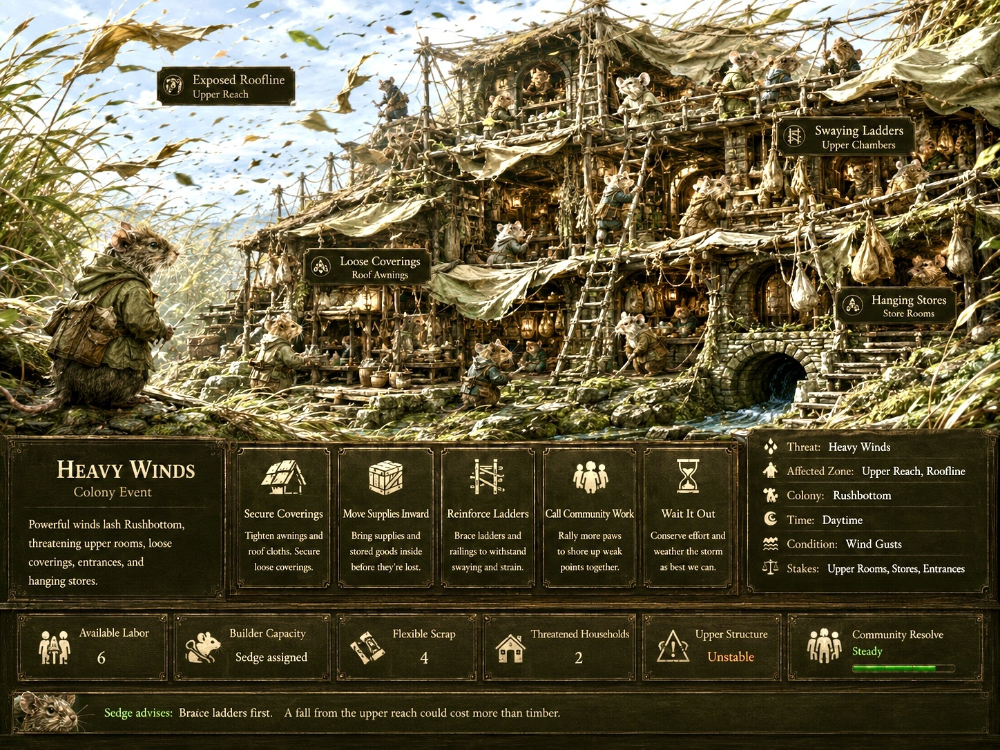

<!--@0¶1-->
**MEDIAN**

<!--@0¶2-->
**SYSTEM SPECIFICATION**

<!--@0¶3-->
**HOME MODE, COLONY, AND DWELL**

<!--@0¶4-->
**DWELL / COLONY MODE / HYBRID READINESS ENGINE**

<!--@0¶5-->

<!--@0¶6-->
*Concept plate: a functioning Squirrel Web, where civic Roles, material Places, route topology, and ordinary life coexist as one colony-scale system.*

<!--@0¶7-->
<table>
<tbody>
<tr class="odd">
<td><strong>CANONICAL PREMISE 
<em>At Home, the crunch subject is the Colony. Citizens contribute in equal, individually apportioned shares; good stewardship creates a stable home that can run well, make room for ambition, and permit ordinary life to be experienced.</em></strong></td>
</tr>
</tbody>
</table>

<!--@0¶8-->
| **Document field**  | **Specification**                               |
| ------------------- | ----------------------------------------------- |
| Document version    | 1.0                                             |
| Game-system target  | Home Mode, Colony, and DWELL Specification 0.4.7                          |
| Target architecture | MEDIAN Concept Sourcebook / System Architecture |
| Module              | Colony Register (DWELL) / Home Mode             |
| Status              | Canon working specification                     |

<!--@1-->
# 0\. Revision Summary

<!--@1¶1-->
What changed from the conventional production-grid model and from the earliest 0.4.7 draft

<!--@1¶2-->
| **Prior model**         | **Reworked model**           | **System consequence**                                                                                                                           |
| ----------------------- | ---------------------------- | ------------------------------------------------------------------------------------------------------------------------------------------------ |
| RTS production grid     | Colony posture               | Buildings no longer operate primarily as stand-alone factories. Places support Practices; Citizens occupy Roles; the colony succeeds as a whole. |
| Worker optimization     | Equal civic shares           | Each assigned Citizen contributes one unit of Role Capacity at Home. Personal aptitudes belong to Away Mode, not domestic productivity ranking.  |
| Continuous entropy      | Achievable equilibrium       | Adequate coverage can fully absorb routine load. The colony is allowed to become genuinely stable rather than merely decay more slowly.          |
| Local repair clicking   | Global condition             | Diffuse wear, flood strain, loosened lashings, and ordinary upkeep are compressed into colony-scale Conditions.                                  |
| Passive debuffs         | Latent vulnerability         | Role shortfalls create deficiencies and exposure. They do not automatically inflict daily punishment in every affected category.                 |
| Generic random events   | Weakness-shaped MEET         | A hidden Role ledger controls shortfall-Encounter pressure. The two most relevant weak points determine how a Colony Encounter manifests.        |
| Five-button event board | Three-choice transaction     | A Home Encounter normally offers two different spends protecting different stakes, or a refusal that suffers the compound result.                |
| Flavor text as reward   | Quiet Equilibrium and EMBODY | Competent Dwell produces mental and calendar space. EMBODY becomes globally available at Home for any present, available Citizen.                |

<!--@1.1-->
## Contents

<!--@1.1¶1-->
| **Sections 1-9**                                                    | **Sections 10-18**                                       |
| ------------------------------------------------------------------- | -------------------------------------------------------- |
| 1\. Executive Summary and Canonical Definition                      | 10\. Colony Encounters as the Transaction of Shortfall   |
| 2\. Register Architecture and the Home/Away Simulation Split        | 11\. Global Conditions and Structural Abstraction        |
| 3\. Foundational Design Principles                                  | 12\. Sustenance, Stores, Supplies, and the Seasonal Loop |
| 4\. Core Ontology: Citizens, Roles, Practices, Places, and Projects | 13\. Growth, Projects, and Voluntary Disruption          |
| 5\. Species Spatial Placement Identities                            | 14\. Quiet Equilibrium, Successful Stillness, and EMBODY |
| 6\. Role Architecture and Global Capacity                           | 15\. Citizen Identity and Campaign Memory at Home        |
| 7\. Daily Economy, Citizen-Days, and Dawn Adjudication              | 16\. Information Architecture and Player Legibility      |
| 8\. The Hybrid Readiness Engine                                     | 17\. Balancing Safeguards and Edge Cases                 |
| 9\. The Hidden Deficiency Ledger: Big and Small Weakness            | 18\. Canon Rules, Non-Goals, and Acceptance Tests        |

<!--@2-->
# 1\. Executive Summary and Canonical Definition

<!--@2¶1-->
The Home Loop is the operating architecture of the Colony Register (DWELL). It replaces the familiar base-builder model of isolated production buildings, service radii, worker throughput, and continuous attrition with a colony-scale stewardship system organized around Places, Practices, Roles, Readiness, and situated Encounters.

<!--@2¶2-->
The player is not asked to maximize a factory. The player is asked to establish a home that is materially sound, seasonally prepared, socially coherent, and capable of continuing ordinary life while selected Citizens travel into danger. The desired success state is not perpetual acceleration. It is a functioning colony with enough margin to remain stable, pursue chosen ambitions, and permit the player to notice the Citizens who inhabit it.

<!--@2¶3-->
<table>
<tbody>
<tr class="odd">
<td><strong>CANONICAL DEFINITION 
<em>The player's task is not to prevent perpetual collapse. It is to establish and periodically restore the conditions under which ordinary life can occur.</em></strong></td>
</tr>
</tbody>
</table>

<!--@2.1-->
## System purpose

<!--@2.1¶1-->
  - > Create a mechanically credible domestic life whose success can be understood and achieved.

<!--@2.1¶2-->
  - > Make low population meaningful: every assigned headcount is a visible civic commitment and an Away opportunity cost.

<!--@2.1¶3-->
  - > Express species identity through settlement topology rather than through decorative building skins or generic bonuses.

<!--@2.1¶4-->
  - > Allow routine competence to suppress crises without requiring constant player attention.

<!--@2.1¶5-->
  - > Convert abstract shortfalls into specific, memorable situations through the Encounter Register (MEET).

<!--@2.1¶6-->
  - > Provide Quiet Equilibrium as the enabling condition for EMBODY, Campaign Memory, voluntary Projects, and emotional linger time.

<!--@2.2-->
## Canonical system statement

<!--@2.2¶1-->
|                                                                                                                                                                                                                                                                              |
| ---------------------------------------------------------------------------------------------------------------------------------------------------------------------------------------------------------------------------------------------------------------------------- |
| ***Citizens hold Roles. Roles sustain Practices. Practices inhabit Places. Places create Load according to species spatial logic. Capacity meeting Load produces Readiness; unresolved deficiency becomes vulnerability; MEET turns vulnerability into a situated choice.*** |

<!--@3-->
# 2\. Register Architecture and the Home/Away Simulation Split

<!--@3¶1-->
MEDIAN uses different scales of mechanical attention in Home and Away play. This is not a difference between anonymous and named Citizens. It is a difference in the subject being resolved.

<!--@3¶2-->
| **Dimension**    | **Home Mode - DWELL**                                                        | **Away Modes - TRAVEL / RISK / MEET**                                                 |
| ---------------- | ---------------------------------------------------------------------------- | ------------------------------------------------------------------------------------- |
| Crunch subject   | The Colony                                                                   | The individual Citizen or expedition party                                            |
| Primary question | How much civic capacity is committed to each responsibility?                 | Which particular Citizen can survive, solve, carry, notice, or endure this situation? |
| Citizen unit     | One equal, individually apportioned Role share                               | Personal abilities, gear, conditions, history, and exposure                           |
| Growth target    | Places, Practices, reserves, margins, population, and colony tier            | Citizen capability, equipment, wounds, distinctions, relationships, and experience    |
| Primary risk     | A weakened colony posture caused by absence, expansion, season, or shortfall | Hazard, injury, Exposure, Tharn, loss, or individual reward                           |
| Success affect   | Stability, confidence, and room to inhabit                                   | Return, survival, discovery, and transformed Citizens                                 |

<!--@3¶3-->
<table>
<tbody>
<tr class="odd">
<td><strong>SCALE DOCTRINE 
<em>At Home, a Citizen is an individually accounted-for unit of commitment. Away, a Citizen is an individually resolved unit of capability.</em></strong></td>
</tr>
</tbody>
</table>

<!--@3.1-->
## Register topology

<!--@3.1¶1-->
| **Register** | **Verb** | **Primary availability** | **Home Loop relationship**                                                                              |
| ------------ | -------- | ------------------------ | ------------------------------------------------------------------------------------------------------- |
| Colony       | DWELL    | Home                     | Maintains Roles, Places, Projects, Conditions, and Readiness.                                           |
| Field        | TRAVEL   | Away                     | Carries Citizens through distance and environmental drag.                                               |
| Crossing     | RISK     | Away                     | Resolves immediate spatial panic and traffic-scale hazard.                                              |
| Encounter    | MEET     | Home and Away            | Stages any bounded consequential situation: storm, collapse, stranger, predator, discovery, or dispute. |
| Embodiment   | EMBODY   | Home only                | Makes successful sanctuary perceptible through guided Citizen-scale experience.                         |

<!--@3.1¶2-->
|                                                                                                                                                          |
| -------------------------------------------------------------------------------------------------------------------------------------------------------- |
| **DWELL establishes order -\> Citizens leave -\> AWAY creates exposure -\> Citizens return -\> DWELL restores equilibrium -\> EMBODY makes safety felt** |

<!--@4-->
# 3\. Foundational Design Principles

<!--@4¶1-->
**The colony is the Home crunch subject.** Domestic calculations operate globally. Individual names remain attached to assignments, absence, advice, memory, and availability without becoming productivity multipliers.

<!--@4¶2-->
**A stable colony can actually be stable.** Adequate Capacity fully covers routine Load. The system does not manufacture daily chores merely to preserve engagement.

<!--@4¶3-->
**Competence creates quiet.** The reward for sound stewardship is a broad plateau of safety in which Projects, observation, EMBODY, and ordinary Citizen life can occur.

<!--@4¶4-->
**Global abstraction is a strength.** Diffuse structural wear, care work, storage attention, and watchfulness are colony postures. They need not be simulated as hundreds of tiny local tasks.

<!--@4¶5-->
**Important consequences become local.** When an abstract vulnerability matters enough to become a story, MEET places it in a specific zone, Place, household, route, or relationship.

<!--@4¶6-->
**Shortfall is vulnerability, not automatic punishment.** Insufficient coverage raises the likelihood and stakes of a fitting Colony Encounter instead of applying a constant stack of unrelated debuffs.

<!--@4¶7-->
**Spatial identity is mechanical identity.** JOIN, GATHER, and CONNECT alter Load, resilience, failure geometry, and lived experience.

<!--@4¶8-->
**Home survives; Away enables advancement.** Local ecology and ordinary Practices support continued life. Exceptional materials, knowledge, access, and growth arrive through Expeditions.

<!--@4¶9-->
**Player attention is a protected resource.** The interface should settle at Dawn, explain what changed, and then grant permission to linger without real-time deterioration.

<!--@4¶10-->
<table>
<tbody>
<tr class="odd">
<td><strong>DESIGN DESTINATION 
<em>Good Home play produces successful stillness.</em></strong></td>
</tr>
</tbody>
</table>

<!--@5-->
# 4\. Core Ontology: Citizens, Roles, Practices, Places, and Projects

<!--@5¶1-->
| **Term**  | **Canonical meaning**                                                                                                                        | **What it is not**                                                |
| --------- | -------------------------------------------------------------------------------------------------------------------------------------------- | ----------------------------------------------------------------- |
| Citizen   | A named member of the colony who contributes one equal Home share, occupies a current Role, may travel Away, and carries individual history. | A variable-output worker token or permanent profession.           |
| Role      | A share of current civic responsibility: Builder, Caretaker, Watchkeeper, and so forth.                                                      | A character class, aptitude score, or lifelong career.            |
| Practice  | The repeated communal activity sustained by a Role: upkeep, cultivation, warning, teaching, care, fabrication.                               | A hidden production recipe detached from daily life.              |
| Place     | The built or claimed environment in which a Practice becomes materially possible and socially legible.                                       | A stand-alone factory whose primary purpose is output per minute. |
| Project   | A deliberate, time-bounded undertaking measured in Citizen-Days: construction, expansion, repair, preparation, or memorial work.             | An endless passive queue that must remain full.                   |
| Condition | A global colony state such as Structural Condition, Stores, Cohesion, or seasonal preparedness.                                              | A separate health bar on every wall, ladder, pantry, and burrow.  |

<!--@5¶2-->
|                   |              |          |              |              |              |           |
| ----------------- | ------------ | -------- | ------------ | ------------ | ------------ | --------- |
| **Named Citizen** | **occupies** | **Role** | **sustains** | **Practice** | **inhabits** | **Place** |

<!--@5.1-->
## Role assignment

<!--@5.1¶1-->
Role assignment is fluid and colony-scaled. Reassigning a Citizen changes the colony's posture; it is not a respec operation. A Citizen assigned as a Builder contributes one Builder Capacity regardless of personality, Away statistics, or prior assignment. The player sees exactly which Citizens make up the total, preserving individual apportionment without turning Home into a personnel-ranking puzzle.

<!--@5.1¶2-->
<table>
<tbody>
<tr class="odd">
<td><strong>IDENTITY BOUNDARY 
<em>Home gives Citizens history. Away gives Citizens progression.</em></strong></td>
</tr>
</tbody>
</table>

<!--@5.2-->
## Standing Practice and active Project

<!--@5.2¶1-->
A Role normally sustains an ongoing Practice. Positive margin may be redirected into a Project. For example, Builder Capacity first covers the colony's routine Building Load; any remaining margin can accelerate a construction Project or prepare for forecast pressure. The system does not describe ordinary life as Citizens being "idle" when no queue is active.

<!--@6-->
# 5\. Species Spatial Placement Identities

<!--@6¶1-->
Species identity is embedded directly into land use. A well-designed settlement should remain identifiable when uninhabited. Placement alignment is represented primarily by how layout changes relevant Load, route resilience, warning, care, and failure propagation - not by a generic universal percentage pasted onto every system.

<!--@6¶2-->
| **Species** | **Placement verb** | **Settlement image** | **Placement instinct**                                                                                                                      | **Primary systemic consequence**                                                                                                      |
| ----------- | ------------------ | -------------------- | ------------------------------------------------------------------------------------------------------------------------------------------- | ------------------------------------------------------------------------------------------------------------------------------------- |
| Mouse       | JOIN               | Manor House          | New Places belong to one protected inhabited system through shared walls, foundations, doorways, enclosed passages, or short covered links. | Continuity reduces enclosure and circulation Load, but a poorly joined failure can propagate through adjacent rooms.                  |
| Rabbit      | GATHER             | Court / Cul-de-Sac   | Burrows and Places orient toward shared negative space: green, hearth, meeting court, or working yard.                                      | Coherent courts reduce Care and Coordination Load; oversized or fragmented courts lose mutual visibility and neighbor-scale intimacy. |
| Squirrel    | CONNECT            | Web                  | Separated nodes are linked by credible routes. Redundancy, not proximity alone, turns an outpost into colony space.                         | Alternate routes reduce Watch, provisioning, and isolation Load; one-route branches remain brittle.                                   |

<!--@6¶3-->

<!--@6¶4-->
*Concept plate: CONNECT made visible. Homes, caches, watchpoints, and civic spaces remain separate, while routes and redundant anchors form the actual Squirrel settlement.*

<!--@6.1-->
## Species translation of common functions

<!--@6.1¶1-->
| **Function** | **Mouse - JOIN**                                      | **Rabbit - GATHER**                                         | **Squirrel - CONNECT**                                        |
| ------------ | ----------------------------------------------------- | ----------------------------------------------------------- | ------------------------------------------------------------- |
| Leadership   | Central chamber, long table, or protected inner room. | Council green, elder burrow, or court-facing meeting place. | High junction or network node visible from several routes.    |
| Care         | Deep, sheltered sickroom connected to family rooms.   | Quiet infirmary burrow near but not inside court bustle.    | Recovery drey reachable by two safe routes.                   |
| Craft        | Attached workshop within the protected body.          | Workshop facing a shared working yard.                      | Work platform placed along supply and cache routes.           |
| Storage      | Deep pantry rooms within the Manor.                   | Household stores plus a communal reserve near the court.    | Distributed caches with deliberate redundancy.                |
| Teaching     | Warm interior gathering room and accumulated objects. | Circle on the common green or in a court-side chamber.      | Teaching perch or route junction where several branches meet. |

<!--@6.1¶2-->
<table>
<tbody>
<tr class="odd">
<td><strong>SPATIAL IDENTITY TEST 
<em>Mouse builds rooms. Rabbit builds neighbors. Squirrel builds connections.</em></strong></td>
</tr>
</tbody>
</table>

<!--@7-->
# 6\. Role Architecture and Global Capacity

<!--@7¶1-->
The reference Role set below supplies the Home economy. Exact labels may vary by culture or species, but the structural distinction is canonical: every Role contributes globally, each assigned Citizen contributes one equal unit, and not every Role is relevant to every Encounter family.

<!--@7¶2-->
| **Role**    | **Supporting Places**                         | **Standing Practice**                                                                    | **Active Project use**                                                      | **Eligible Encounter concerns**                               |
| ----------- | --------------------------------------------- | ---------------------------------------------------------------------------------------- | --------------------------------------------------------------------------- | ------------------------------------------------------------- |
| Builder     | Workshop, yard, joined structural spaces      | Absorbs routine Building Load and supports general upkeep.                               | Construction, reinforcement, major restoration, route or chamber expansion. | Collapse, flood damage, wind, frost heave, overextension.     |
| Caretaker   | Stores, kitchen, household commons            | Protects stores, coordinates household logistics, dependents, and ordinary preservation. | Evacuation, stock movement, preserve batches, resettlement.                 | Spoilage, displacement, crowding, household disorder.         |
| Watchkeeper | Watchpost, edge, high line, listening station | Provides warning, route oversight, and early detection.                                  | Focused watch, forecast preparation, threat survey.                         | Predator arrival, flood warning, human work, route closure.   |
| Leader      | Council Place, town center, meeting table     | Coordinates decisions, buffers social strain, and enables colony-scale action.           | Tier decisions, emergency mobilization, founding, dispute resolution.       | Panic, disagreement, uneven sacrifice, community labor.       |
| Gardener    | Garden, food plot, managed resource node      | Sustains green-season Perishable food and cultivation health.                            | Harvest, planting, soil recovery, seasonal transition.                      | Crop loss, drought, washout, poor yield, winter gap.          |
| Crafter     | Workshop, material store, tool bench          | Maintains ordinary tools and converts recovered material into useful forms.              | Gear, upgrades, structural components, expedition Supplies.                 | Tool failure, emergency bracing, material substitution.       |
| Healer      | Hospital, herb room, recovery Place           | Provides medical readiness, patient care, and recovery support.                          | Treatment, medicine preparation, triage, rehabilitation.                    | Injury, illness, cold exposure, post-Encounter recovery.      |
| Teacher     | Circle, archive, story room, shared green     | Sustains knowledge transmission, social memory, and continuity.                          | Lessons, integrating discoveries, memorial and cultural Projects.           | Newcomer integration, lost knowledge, grief, identity strain. |

<!--@7¶3-->
Secondary Practice guardrail. The earliest 0.4.7 concept assigned every Role an automatic downtime output. This specification keeps the useful idea - no one becomes a dead slot - but reframes it as ordinary Practice rather than passive production. Crafters do not create advanced Supplies from nothing; they convert salvage. Teachers do not fill an abstract beauty meter; specific Lessons, memories, and cultural Projects produce visible artifacts. Preservation belongs wherever the colony's fiction places household food knowledge, usually Caretaking, Kitchen, or herbal Practice.

<!--@8-->
# 7\. Daily Economy, Citizen-Days, and Dawn Adjudication

<!--@8.1-->
## Citizen-Days

<!--@8.1¶1-->
Projects are measured in integer Citizen-Days. A Project costing 2 Citizen-Days may be completed by one available Citizen in two game days or by two Citizens in one day. Assigned citizens are still named and visible, but the calculation does not require pathfinding each hammer strike, basket transfer, or wall patch.

<!--@8.1¶2-->
| **Project**                 | **Cost**       | **Possible staffing**                                        | **Interpretation**                                                           |
| --------------------------- | -------------- | ------------------------------------------------------------ | ---------------------------------------------------------------------------- |
| Reinforce the east roofline | 3 Citizen-Days | 1 Citizen for 3 days; 3 Citizens for 1 day; mixed allocation | A concentrated Project beyond routine upkeep.                                |
| Prepare winter pantry       | 4 Citizen-Days | 2 Caretakers for 2 days, or 1 for 4 days                     | Transforms existing stores and space; does not create food ex nihilo.        |
| Establish a far cache       | 2 Citizen-Days | 1 Crafter/Builder share for 2 days or 2 shares for 1 day     | Creates Squirrel network capability and adds future Watch/Provisioning Load. |

<!--@8.2-->
## Dawn adjudication

<!--@8.2¶1-->
> **1. Resolve citizen presence.** Apply expedition absence, injury, treatment, and temporary unavailability.
> 
> **2. Apply Role assignments.** Count one Capacity per present Citizen assigned to each Role.
> 
> **3. Calculate current Loads.** Population, Places, season, spatial alignment, active Projects, Conditions, and forecast pressure determine demand.
> 
> **4. Determine Margins.** Capacity minus Load is calculated per Role; any negative values enter the hidden Deficiency Ledger.
> 
> **5. Resolve routine economy.** Daily sustenance is consumed; perishable spoilage, preservation, recovery, and Project progress are adjudicated.
> 
> **6. Update Encounter pressure.** Deficient Role count, deficit depth, persistence, and cooldown rules update shortfall-Encounter cadence.
> 
> **7. Surface only meaningful changes.** The player receives a compact ledger, not a continuous stream of real-time maintenance alarms.

<!--@8.2¶2-->
<table>
<tbody>
<tr class="odd">
<td><strong>INTERFACE RHYTHM 
<em>Dawn is the accounting boundary. The rest of the day is allowed to feel inhabited.</em></strong></td>
</tr>
</tbody>
</table>

<!--@8.3-->
## Half-day expedition proration

<!--@8.3¶1-->
A Citizen present for half a day sets a Half-Day Flag for the relevant Role. The first half-day receives full credit; the next missing half-day clears the flag and removes one full day of contribution. The implementation remains integer-based while avoiding artificial punishment for departures and returns that straddle the daily boundary.

<!--@9-->
# 8\. The Hybrid Readiness Engine

<!--@9¶1-->
The Hybrid Readiness Engine combines visible Role margins with an obscured vulnerability director. The player can understand why the colony is thin without predicting the exact incident card or optimization formula.

<!--@9¶2-->
<table>
<tbody>
<tr class="odd">
<td><strong>REFERENCE EQUATION 
<em>Role Margin = Role Capacity - Current Role Load</em></strong></td>
</tr>
</tbody>
</table>

<!--@9¶3-->
| **Margin band**        | **Meaning**                                                   | **Routine result**                                                                        | **Player interpretation**                                        |
| ---------------------- | ------------------------------------------------------------- | ----------------------------------------------------------------------------------------- | ---------------------------------------------------------------- |
| \+2 or more - Reserve  | The Practice has meaningful slack beyond current obligations. | Routine needs are covered; Projects, preparation, or emergency substitution are possible. | This Role can absorb absence or additional pressure.             |
| \+1 - Ready            | The Practice has one useful share of spare capacity.          | Routine needs are covered with limited readiness.                                         | A forecast event may be handled silently.                        |
| 0 - Covered            | Capacity exactly meets normal Load.                           | The colony is stable but brittle in this category.                                        | Nothing is wrong, but there is no spare response.                |
| \-1 - Thin             | One share of responsibility is unsupported.                   | No automatic damage; a deficiency is recorded.                                            | A relevant incident is more likely and choices may be expensive. |
| \-2 or worse - Exposed | A deep or prolonged shortfall exists.                         | Pressure rises faster and severe manifestations become eligible.                          | The colony is knowingly operating beyond its support.            |
| N/A                    | No current contextual demand for the Role.                    | The Role does not enter the deficiency count.                                             | An empty category is not automatically a failure.                |

<!--@9¶4-->
Load is contextual, not merely unlocked. A colony without patients need not be deficient in Healers; a colony with no children, lessons, integration burden, or knowledge transition may have no active Teaching Load. Conversely, a large, exposed settlement or a major winter transition may create genuine demand in several Roles at once.

<!--@9.1-->
## Sources of Load

<!--@9.1¶1-->
| **Load source**           | **Examples**                                                                | **Species interaction**                                                                            |
| ------------------------- | --------------------------------------------------------------------------- | -------------------------------------------------------------------------------------------------- |
| Population and households | More residents, dependents, patients, stores, and social coordination.      | Rabbit court scale may reduce or increase Care and Leadership Load.                                |
| Settlement extent         | Rooms, courts, nodes, entrances, routes, and remote Places.                 | Mouse continuity, Rabbit court coherence, and Squirrel route redundancy change the cost of extent. |
| Season and forecast       | Winter, heavy rain, wind, drought, heat, migration, human maintenance.      | Species-specific shelter and movement patterns determine which Roles face pressure.                |
| Active Projects           | Construction, founding, preservation, upgrades, treatment, cultural work.   | Projects draw on positive margin or deliberately create temporary thinness.                        |
| Current Conditions        | Structural strain, spoiled stores, displacement, illness, unresolved grief. | The same global condition manifests through species-specific Places and social forms.              |
| Expedition absence        | Named Citizens temporarily stop supplying Home Capacity.                    | A party choice becomes a legible colony posture change before departure.                           |

<!--@9.1¶2-->
Places and alignment provide fine tuning; headcount provides the heavy lifting. Supporting Places may reduce specific Load, protect a Capacity from disruption, or make a response cheaper. They should not replace the need for Citizens entirely.

<!--@10-->
# 9\. The Hidden Deficiency Ledger: Big and Small Weakness

<!--@10¶1-->
Every running colony maintains an obscured ranked vulnerability profile. The player sees Role coverage and qualitative warnings; the game maintains exact ranking, persistence, relevance masks, and Encounter weights.

<!--@10¶2-->
| **Hidden value**       | **Definition**                                                              | **System use**                                                                                    |
| ---------------------- | --------------------------------------------------------------------------- | ------------------------------------------------------------------------------------------------- |
| Deficient Role Count   | Number of contextually demanded Roles with negative Margin.                 | Sets the breadth component of shortfall-Encounter pressure.                                       |
| Deficit Depth          | Sum and per-Role depth of negative Margins.                                 | Sets severity weighting and how quickly pressure accumulates.                                     |
| Persistence            | Number of consecutive Dawns a Role has remained thin or exposed.            | Breaks ties, supports escalation, and distinguishes a deliberate brief risk from chronic neglect. |
| Big Weakness           | Worst-supported Role among those relevant to the selected Encounter family. | Defines the primary threatened value or principal manifestation.                                  |
| Small Weakness         | Second-worst relevant Role.                                                 | Defines collateral stakes, complication, or the second thing the player cannot easily protect.    |
| Relative vulnerability | The least buffered eligible Role even when all Margins are nonnegative.     | Shapes unavoidable external events without increasing shortfall-generated frequency.              |

<!--@10¶3-->
<table>
<tbody>
<tr class="odd">
<td><strong>DIRECTOR RULE 
<em>Total deficiency determines how often the colony is tested by shortage-driven MEET. The Big and Small Weaknesses determine what the test is about.</em></strong></td>
</tr>
</tbody>
</table>

<!--@10.1-->
## Reference pressure calculation

<!--@10.1¶1-->
The exact tuning remains hidden and non-canonical, but the reference implementation may use: Pressure Index = Deficient Role Count + Total Deficit Depth + Persistence Modifier, subject to a cap, minimum interval, and category cooldown. The purpose of the count term is to make broad under-support matter; the depth term makes a single severe deficiency matter; persistence makes chronic thinness different from a one-day expedition gamble.

<!--@10.2-->
## Role relevance masks

<!--@10.2¶1-->
Not all Roles figure in all situations. Every Encounter family defines an eligibility mask. Heavy Winds may consider Builders, Caretakers, Watchkeepers, Leaders, and Crafters; it should not force Teacher into the event unless children, records, memorials, or social continuity are genuinely at stake. The Big and Small Weaknesses are selected only from Roles whose responsibilities can plausibly shape that situation.

<!--@10.2¶2-->
| **Encounter family** | **Likely eligible Roles**                         | **Example Big Weakness** | **Example Small Weakness** | **Manifestation**                                                              |
| -------------------- | ------------------------------------------------- | ------------------------ | -------------------------- | ------------------------------------------------------------------------------ |
| Heavy winds          | Builder, Caretaker, Watchkeeper, Leader, Crafter  | Builder                  | Caretaker                  | Roofline threatens collapse while stores and households remain exposed.        |
| Flash flood          | Watchkeeper, Builder, Caretaker, Gardener, Leader | Watchkeeper              | Builder                    | Water is discovered late and an already-soft retaining wall may fail.          |
| Winter shortage      | Gardener, Caretaker, Leader, Crafter, Healer      | Gardener                 | Caretaker                  | The harvest gap is larger than expected and stored food is poorly protected.   |
| Predator pressure    | Watchkeeper, Caretaker, Leader, Healer            | Watchkeeper              | Caretaker                  | The threat reaches inhabited space before vulnerable households are organized. |
| Newcomer strain      | Leader, Teacher, Caretaker, Healer                | Leader                   | Teacher                    | The colony lacks coordination and shared explanation for integrating arrivals. |

<!--@11-->
# 10\. Colony Encounters as the Transaction of Shortfall

<!--@11¶1-->
The Encounter Register (MEET) is MEDIAN's shared grammar for bounded consequential situations at Home and Away. In the Home Loop it is the mechanism that converts colony-scale deficiency into a specific Place, threatened value, citizen perspective, and choice. Heavy winds are a thing the colony meets, even though the encounter is staged at a more abstract remove than a face-to-face creature encounter.

<!--@11¶2-->
|                                                                                                                                                                  |
| ---------------------------------------------------------------------------------------------------------------------------------------------------------------- |
| **Role deficiency -\> Pressure accumulates -\> Fitting Home situation selected -\> Big + Small weakness applied -\> MEET offers 3 choices -\> Global aftermath** |

<!--@11.1-->
## Encounter generation order

<!--@11.1¶1-->
> **1. Determine whether an Encounter is due.** Shortfall pressure, world events, season, forecast, and cooldowns establish the opportunity.
> 
> **2. Select a diegetically fitting family.** Weather, terrain, colony geography, recent history, and current Conditions determine what can plausibly happen.
> 
> **3. Apply the relevance mask.** Only Roles that genuinely matter to this family are considered.
> 
> **4. Select Big and Small Weakness.** The two least-supported relevant Roles shape primary and collateral stakes.
> 
> **5. Translate through species topology.** JOIN, GATHER, or CONNECT determines which room, court, route, household, or node is threatened and how failure spreads.
> 
> **6. Construct the three-choice transaction.** Two distinct spends protect different values; refusing both accepts the compound result.
> 
> **7. Return consequences to colony state.** Conditions, stores, resolve, availability, Projects, or occasional individual injuries change; no redundant repair minigame is automatically created.

<!--@11.2-->
## Canonical choice grammar

<!--@11.2¶1-->
| **Choice**                              | **Player intent**                                                            | **Typical cost**                                                             | **Typical result**                                                                          |
| --------------------------------------- | ---------------------------------------------------------------------------- | ---------------------------------------------------------------------------- | ------------------------------------------------------------------------------------------- |
| Protect the primary stake               | Address the Big Weakness directly.                                           | Spend relevant material, Role reserve, Project time, or a prepared asset.    | Primary loss is prevented; collateral loss remains or is reduced.                           |
| Protect or redirect the secondary stake | Save households, stores, time, or another value by paying a different price. | Emergency labor, Resolve, interruption, evacuation, or a different resource. | Secondary value is protected while controlled damage occurs elsewhere.                      |
| Endure / spend neither                  | Preserve current resources and accept the incident.                          | No immediate spend.                                                          | The compounded consequence lands, often with greater global Condition loss or displacement. |

<!--@11.2¶2-->
<table>
<tbody>
<tr class="odd">
<td><strong>CHOICE STANDARD 
<em>The Register should ask: save this, save that, or conserve both and suffer more. It should not present five near-synonymous buttons.</em></strong></td>
</tr>
</tbody>
</table>

<!--@11.2¶3-->

<!--@11.2¶4-->
*Reference mock-up: Heavy Winds in a Mouse colony. The final Home MEET should retain the situated tableau, threatened zones, Role advice, and colony context while reducing the action panel to three sharply differentiated choices.*

<!--@11.2¶5-->
Role strength elsewhere in the colony should normally change costs, warnings, and consequences rather than add more buttons. Strong Leadership may reduce the Resolve cost of emergency labor; a stocked Workshop may lower the Scrap cost of reinforcement; sufficient Watch may provide earlier timing. The three-choice silhouette remains stable.

<!--@12-->
# 11\. Global Conditions and Structural Abstraction

<!--@12¶1-->
A colony-scale Structural Condition is not a retreat into abstraction; it is the correct resolution for Home Mode. It compresses softened earth, loosened lashings, damp insulation, shifted stones, blocked drainage, ordinary patching, and hundreds of small acts of upkeep into one legible posture.

<!--@12¶2-->
<table>
<tbody>
<tr class="odd">
<td><strong>ABSTRACTION DOCTRINE 
<em>The statistic is global because maintenance is a colony posture, not a set of individual repair orders.</em></strong></td>
</tr>
</tbody>
</table>

<!--@12¶3-->
| **Condition**        | **What it compresses**                                                                          | **How it changes**                                                             | **How it becomes fiction**                                                                    |
| -------------------- | ----------------------------------------------------------------------------------------------- | ------------------------------------------------------------------------------ | --------------------------------------------------------------------------------------------- |
| Structural Condition | Buildings, burrows, route anchors, coverings, drainage, retaining earth, access paths.          | Builder coverage, layout, Projects, weather, and Encounter outcomes.           | MEET names the threatened room, court edge, route, roofline, or node.                         |
| Stores               | Food protection, placement, spoilage, reserve accessibility, material organization.             | Caretaking, preservation, season, consumption, relocation, and loss.           | MEET names the pantry, cache, hanging stores, household reserve, or supply route.             |
| Cohesion / Resolve   | Confidence, displacement, perceived fairness, grief, coordination, and willingness to mobilize. | Leadership, Teaching, relationships, repeated sacrifice, success, and failure. | MEET identifies who disagrees, who is frightened, or which households bear the cost.          |
| Health posture       | Current patients, medical readiness, illness exposure, and recovery burden.                     | Healer Capacity, supplies, injury, season, crowding, and Exposure aftermath.   | Specific Citizens become patients; treatment remains individual where dramatically important. |

<!--@12¶4-->
Ordinary equilibrium rule. If routine Building Capacity meets routine Building Load, Structural Condition does not decline. Builders are already finding and fixing small problems. A flood or storm can add exceptional pressure or produce a MEET, but the simulation must not charge the colony a permanent daily maintenance tax merely because time passed.

<!--@12.1-->
## Ordinary strain and exceptional consequences

<!--@12.1¶1-->
| **Scale**                  | **Resolution**                                                                        | **Player burden**                                          |
| -------------------------- | ------------------------------------------------------------------------------------- | ---------------------------------------------------------- |
| Diffuse routine strain     | Absorbed through Role coverage and global Conditions.                                 | No clicking; visible only when a meaningful state changes. |
| Acute but bounded incident | Resolved through MEET and returned to global Conditions.                              | One consequential choice moment.                           |
| Transformative local loss  | A Place may become unusable, displaced, renamed, or converted into a focused Project. | Used sparingly when the Place itself has become story.     |

<!--@12.1¶2-->
Double-charge prohibition. A single Role shortfall should not simultaneously increase Encounter frequency, worsen every option, inflict automatic daily damage, and create a mandatory repair queue unless the event is deliberately severe enough to justify each layer. Usually, the Encounter transaction is the charge.

<!--@13-->
# 12\. Sustenance, Stores, Supplies, and the Seasonal Loop

<!--@13¶1-->
Sustenance is adjudicated at Dawn and exists in two forms to create a seasonal survival rhythm without turning Home into a constant starvation treadmill.

<!--@13¶2-->
| **Resource**          | **Function**                                                                     | **Generation / transformation**                                                                           | **Primary risk**                                                                    |
| --------------------- | -------------------------------------------------------------------------------- | --------------------------------------------------------------------------------------------------------- | ----------------------------------------------------------------------------------- |
| Perishable Sustenance | High-yield daily food during green seasons.                                      | Gardeners and suitable managed nodes create expected seasonal yield.                                      | Daily spoilage, washout, heat, poor storage, or expedition absence.                 |
| Durable Sustenance    | Reserve food for winter, travel gaps, and disruption.                            | Existing perishables are preserved through appropriate Caretaking, Kitchen, herbal, or cultural Practice. | Insufficient preparation, damaged stores, or consumption during prolonged pressure. |
| Flexible Scrap        | General-purpose recovered material used for Projects and emergency responses.    | Primarily brought home from Away; may be sorted or converted by Crafters.                                 | Overspending on convenience leaves no emergency reserve.                            |
| Supply Items          | Bounded expedition consumables: rope, torch, flare, patch, marker, prepared kit. | Crafters transform specific recovered materials and known Practices.                                      | Cannot be generated infinitely from quiet Home time alone.                          |
| Medical Stores        | Medicine, dressings, herbs, recovery supplies.                                   | Healers and herbal Practices prepare them from available materials.                                       | Patient load, cold season, injury clusters, or scarce ingredients.                  |

<!--@13¶3-->
<table>
<tbody>
<tr class="odd">
<td><strong>PROGRESSION BOUNDARY 
<em>The colony can survive at Home, but it cannot advance there indefinitely.</em></strong></td>
</tr>
</tbody>
</table>

<!--@13¶4-->
Home provides labor, continuity, transformation, and ordinary subsistence. Away provides exceptional matter, knowledge, access, seeds, tools, and relationships. A Crafter with no recovered material does not passively manufacture advanced expedition solutions forever. A successful Home Loop prepares for and interprets Away play; it does not replace it.

<!--@13.1-->
## Seasonal rhythm

<!--@13.1¶1-->
|                                                                                                                                 |
| ------------------------------------------------------------------------------------------------------------------------------- |
| **Green-season yield -\> Preservation Projects -\> Durable reserve -\> Winter drawdown -\> Shortfall or surplus shapes Spring** |

<!--@13.1¶2-->
A well-run colony should be capable of entering winter with a credible reserve and then coasting through ordinary days. Seasonal challenge comes from planning, unusual weather, ambition, and expedition choices - not from food numbers being tuned so tightly that every Dawn is triage.

<!--@14-->
# 13\. Growth, Projects, and Voluntary Disruption

<!--@14¶1-->
The Home Loop grows when the player chooses to make the colony more capable, more extensive, or more meaningful. Growth is not forced by exponential consumption. It is an act of ambition that temporarily spends the quiet the colony has earned.

<!--@14¶2-->
|                                                                                                                                                            |
| ---------------------------------------------------------------------------------------------------------------------------------------------------------- |
| **Stable posture -\> Available margin -\> Choose a Project -\> Accept temporary thinness -\> Complete new Place / Practice -\> Establish new equilibrium** |

<!--@14¶3-->
| **Growth action**                  | **Immediate gain**                                  | **New obligation**                                             | **Species expression**                                                                  |
| ---------------------------------- | --------------------------------------------------- | -------------------------------------------------------------- | --------------------------------------------------------------------------------------- |
| Add a Residence                    | Population capacity and a new inhabited Place.      | More Care, Stores, Watch, and structural Load.                 | Mouse joins a room; Rabbit completes or buds a court; Squirrel adds and secures a node. |
| Add a Practice Place               | New civic capability or lower existing Load.        | A Place must be maintained and socially integrated.            | Form changes by JOIN, GATHER, or CONNECT rather than by universal building kit.         |
| Extend territory                   | Access, resources, observation, or future founding. | Longer routes, more edges, warning, and supply responsibility. | Squirrel strands, Rabbit daughter courts, Mouse attached wings or protected portals.    |
| Prepare for forecast pressure      | Reduced future cost or silent success.              | Consumes positive margin and may delay other Projects.         | The exact preparation is species- and Place-specific.                                   |
| Create a memorial or civic feature | Campaign Memory becomes visible in the colony.      | Time and material without direct economic output.              | Architecture records the species' way of gathering, joining, or connecting.             |

<!--@14¶4-->
Construction Queue is retained as an implementation concept but should be presented to the player as Projects. A home undertakes "Reinforce the east wall" or "Open the daughter court," not "Building slot 2: 43 percent."

<!--@14¶5-->
<table>
<tbody>
<tr class="odd">
<td><strong>GROWTH RHYTHM 
<em>Stabilize -&gt; inhabit -&gt; desire something more -&gt; accept disruption -&gt; establish a new stability.</em></strong></td>
</tr>
</tbody>
</table>

<!--@15-->
# 14\. Quiet Equilibrium, Successful Stillness, and EMBODY

<!--@15¶1-->
Quiet Equilibrium is the broad Home success plateau in which routine obligations are covered, no acute Encounter is unresolved, and the colony is not demanding immediate posture repair. It does not require maximum surplus, perfect optimization, or universal positive margins.

<!--@15¶2-->
| **Colony state**  | **Mechanical meaning**                                                                     | **Player experience**                                                                                           |
| ----------------- | ------------------------------------------------------------------------------------------ | --------------------------------------------------------------------------------------------------------------- |
| Crisis            | An active Encounter, acute condition, or immediate failure requires resolution.            | MEET, emergency retasking, consequence management.                                                              |
| Strained          | One or more meaningful deficiencies exist, but the colony continues to function.           | Risk assessment, preparation, limited Projects; EMBODY may be unavailable until acute instability clears.       |
| Quiet Equilibrium | Routine obligations are covered closely enough that no immediate intervention is required. | Globally available EMBODY for any present and available Citizen; observation, planning, and voluntary Projects. |
| Flourishing       | Equilibrium plus reserves, positive margins, and available civic attention.                | Ambitious Projects, expansion, cultural work, generous preparation, and richer domestic expression.             |

<!--@15¶3-->
<table>
<tbody>
<tr class="odd">
<td><strong>EMOTIONAL ECONOMY 
<em>The colony is not being paid for stability. Stability is the condition under which life has time to become visible.</em></strong></td>
</tr>
</tbody>
</table>

<!--@15¶4-->
EMBODY belongs globally to Home Mode. Once Quiet Equilibrium and its requisites are maintained, the player may enter the Embodiment Register through any present, available Citizen or suitable inhabited Place. It is not unlocked by that Citizen's individual Role Margin, and it does not clear acute Tharn. Dwell proves that the colony is safe; EMBODY proves that safety means something.

<!--@15¶5-->
The former Webisode function is folded into EMBODY and Campaign Memory. Character exposure, two-sentence intimacy, domestic humor, shared history, and ordinary grace survive, but sensory and guided experience become the primary delivery mechanism. Text initiates, punctuates, or remembers the moment rather than carrying the entire Home reward by itself.

<!--@16-->
# 15\. Citizen Identity and Campaign Memory at Home

<!--@16¶1-->
Equal Home contribution does not make Citizens interchangeable as characters. It prevents the Home economy from ranking friends by domestic productivity. Identity is expressed through presence, association, history, advice, relationship, and consequence.

<!--@16¶2-->
| **Identity channel** | **Home expression**                                                                                             | **Mechanical boundary**                                                                                  |
| -------------------- | --------------------------------------------------------------------------------------------------------------- | -------------------------------------------------------------------------------------------------------- |
| Occupancy            | The UI shows which named Citizens constitute each Role total and which Places they inhabit.                     | Names do not alter Capacity value.                                                                       |
| Continuity           | Long service associates a Citizen with a Place, routine, route, household, or civic responsibility.             | Continuity may affect memory and presentation, not hidden productivity.                                  |
| Absence              | Taking a named Citizen Away removes exactly one Home share and may change margins.                              | The cost is legible headcount, not an opaque loss of 1.7 "best worker" units.                            |
| Advice               | A current Role holder may speak in a Home Encounter and interpret the threatened value.                         | Advice frames the choice; it need not reveal exact hidden odds.                                          |
| Condition            | Wounds, treatment, Away status, and incapacity affect availability.                                             | Personal states change whether the Citizen can contribute, not how efficient their normal Home share is. |
| Campaign Memory      | Encounters, Projects, Places, and EMBODY moments become shared references, jokes, grief, memorials, and habits. | Memory produces attachment and future content, not automatic economy buffs.                              |

<!--@16¶3-->
<table>
<tbody>
<tr class="odd">
<td><strong>INDIVIDUALIZATION DOCTRINE 
<em>At Home, Citizens are equal shares of unequal obligations. Away, Citizens are unequal people facing the same danger.</em></strong></td>
</tr>
</tbody>
</table>

<!--@16¶4-->
A Builder shortage may be presented through Sedge advising the colony to brace ladders first. The calculation remains Builder Capacity; the fiction is inhabited by Sedge. If Sedge leaves on an Expedition, the colony loses one Builder share, another Citizen may occupy the Role, and later Campaign Memory can preserve that Sedge was the one who knew the Upper Reach before the storm.

<!--@17-->
# 16\. Information Architecture and Player Legibility

<!--@17¶1-->
The Home UI must expose causes without revealing the director. The player should understand the colony's posture and the consequences of reassignment, while retaining uncertainty about which circumstance will become the next MEET.

<!--@17¶2-->
| **Player-visible**                                                            | **Obscured / systemic**                                   | **Reason**                                                                               |
| ----------------------------------------------------------------------------- | --------------------------------------------------------- | ---------------------------------------------------------------------------------------- |
| Named Role occupants and total Capacity                                       | Exact per-Role encounter weight                           | The player can apportion Citizens without solving the director.                          |
| Current Role Load and qualitative Margin band                                 | Exact pressure score and next trigger threshold           | The player sees thinness but cannot count down to a crisis card.                         |
| Current Conditions, Projects, resources, season, and forecasts                | Big and Small Weakness ranking                            | The player understands the world state while each colony retains emergent vulnerability. |
| Warnings such as "Structural upkeep is thin" or "Stores are lightly attended" | Tie-breaking, persistence multipliers, category cooldowns | Mystery remains causal rather than arbitrary.                                            |
| Encounter costs and broad consequence previews                                | Full random tables and exact downstream probability       | Choices are informed without becoming spreadsheet certainty.                             |

<!--@17¶3-->
Recommended daily summary: one compact Dawn ledger with meaningful changes, Role bands, Project progress, Sustenance movement, and any new warning. Once read, the interface quiets. Values should not continue degrading in real time while the player inspects a Place or enters EMBODY.

<!--@17.1-->
## Example Dawn ledger

<!--@17.1¶1-->
| **Category** | **Status**                         | **Explanation**                                                                             |
| ------------ | ---------------------------------- | ------------------------------------------------------------------------------------------- |
| Structures   | SOUND                              | 2 Builder Capacity covers 2 Building Load. No deterioration.                                |
| Stores       | THIN                               | 1 Caretaker covers 2 Store/Care Load. A deficiency has persisted for one Dawn.              |
| Watch        | READY                              | 2 Watchkeeper Capacity covers 1 Load, leaving +1 readiness.                                 |
| Sustenance   | 18 Perishable / 27 Durable         | 12 consumed; 3 preserved; 1 spoiled.                                                        |
| Projects     | Daughter Court: 4 / 6 Citizen-Days | One Builder share and one Caretaker share committed today.                                  |
| Home state   | QUIET EQUILIBRIUM AT RISK          | No crisis. Care coverage is thin; EMBODY remains available unless the strain becomes acute. |

<!--@17.1¶2-->
The exact threshold at which Strained blocks EMBODY should be a colony-wide rule, not a per-Citizen calculation. The key legibility promise is that the UI states why the mode is available or unavailable in plain language.

<!--@18-->
# 17\. Balancing Safeguards and Edge Cases

<!--@18¶1-->
| **Risk**                 | **Failure mode**                                                                                        | **Required safeguard**                                                                                         |
| ------------------------ | ------------------------------------------------------------------------------------------------------- | -------------------------------------------------------------------------------------------------------------- |
| Entropy treadmill        | Deficiency-driven Encounters arrive so often that the player can never regain attention.                | Frequency saturation, minimum intervals, recovery windows, and severity growth instead of event spam.          |
| Even-spread optimization | The safest answer is one Citizen in every Role regardless of colony identity.                           | Contextual Loads, Role relevance masks, Place support, and legitimate specialization.                          |
| Chronic repetition       | The same Builder shortage produces the same collapse every few days.                                    | Category cooldowns, manifestation memory, species variants, escalation, and alternate secondary stakes.        |
| Opaque punishment        | An Encounter feels unrelated to visible colony posture.                                                 | Visible Margin warnings, forecast context, Role advice, and post-event explanation.                            |
| Double charging          | One deficiency is penalized through frequency, severity, passive decay, and repair cost simultaneously. | Treat MEET as the normal transaction; add extra layers only for deliberately major events.                     |
| Role irrelevance         | Narrow Roles can be ignored because they enter too few Encounter families.                              | Ensure each Role has recurring routine Load and meaningful situation families without forcing false relevance. |
| Unlocked-role tax        | Unlocking a new Role automatically creates a deficiency.                                                | N/A state until contextual demand actually exists.                                                             |
| Mandatory minigames      | Manual domestic play is more profitable than abstraction.                                               | EMBODY and presentation never provide exclusive economic yield.                                                |
| Roster ranking           | Home aptitude creates obvious "best" Citizens and weak assignments.                                     | One Citizen equals one Home Capacity; personal stats remain Away-facing.                                       |
| Small-colony collapse    | One absence causes unrecoverable spirals at the earliest population scale.                              | Gentle Loads, substitution, short windows, and consequences scaled to colony tier.                             |

<!--@18¶2-->
Tie handling. If two Roles share the same deficiency, persistence may break the tie; if still tied, recent manifestation history should favor variety. If only one relevant weakness exists, the Small Weakness may be the least buffered eligible Role, a current Condition, or an environmental complication rather than an invented unrelated deficiency.

<!--@18¶3-->
Expedition gamble. Before departure, the player receives a clear delta: "Removing Moss reduces Watch Margin from +1 to 0" or "Taking Sedge creates Building Margin -1 until return." Nothing must happen while they are away. The player accepted a risk, not a guaranteed tax. If a fitting pressure arrives, the Register makes that thinness concrete.

<!--@19-->
# 18\. Canon Rules, Non-Goals, and Acceptance Tests

<!--@19.1-->
## Canonical rules

<!--@19.1¶1-->
> **1.** Home Mode resolves the Colony; Away Mode resolves individual Citizens.
> 
> **2.** Every present Citizen assigned to a Role contributes one equal unit of Home Capacity.
> 
> **3.** Roles are current civic responsibilities, not character classes or aptitude tracks.
> 
> **4.** Places support Practices and alter contextual Load; they are not primarily stand-alone production factories.
> 
> **5.** JOIN, GATHER, and CONNECT determine species spatial alignment, Load, resilience, and failure geometry.
> 
> **6.** Adequate Capacity can fully cover routine Load. The colony can run well without continuous deterioration.
> 
> **7.** Projects use integer Citizen-Days and represent chosen ambition, restoration, preparation, or civic meaning.
> 
> **8.** Negative Role Margins enter an obscured Deficiency Ledger; not every empty Role is contextually deficient.
> 
> **9.** Deficient Role count and deficit depth set the frequency pressure for shortage-driven Colony Encounters.
> 
> **10.** The Big and Small relevant Weaknesses determine the primary and collateral manifestation of a Home Encounter.
> 
> **11.** Home MEET normally offers two distinct spends and one refusal with a compounded consequence.
> 
> **12.** Global Conditions absorb diffuse consequences; specific Place Projects are reserved for transformative local outcomes.
> 
> **13.** Quiet Equilibrium makes EMBODY globally available at Home for any present and available Citizen.
> 
> **14.** Campaign Memory preserves meaningful domestic and Away history without becoming a mandatory buff economy.

<!--@19.2-->
## Non-goals

<!--@19.2¶1-->
  - > An Age of Empires-style production optimization layer with service radii and worker throughput percentages.

<!--@19.2¶2-->
  - > A full-time fight against arbitrary decay, hunger, or condition leakage.

<!--@19.2¶3-->
  - > Individual Home aptitude ratings, hidden career multipliers, or "best worker" roster sorting.

<!--@19.2¶4-->
  - > A separate local repair order for every damaged wall, ladder, room, burrow, or route.

<!--@19.2¶5-->
  - > An event screen with many near-duplicate choices or one obviously correct answer.

<!--@19.2¶6-->
  - > A simulation in which every Role must be staffed at all times regardless of context.

<!--@19.2¶7-->
  - > A Home economy that creates unlimited advanced progression without Away materials and discoveries.

<!--@19.2¶8-->
  - > An emotional-content meter that turns friendship, memory, or EMBODY into another optimized currency.

<!--@19.3-->
## Acceptance tests

<!--@19.3¶1-->
| **Test**               | **Passing condition**                                                                                                                  |
| ---------------------- | -------------------------------------------------------------------------------------------------------------------------------------- |
| Stable plateau         | A sensibly arranged colony with covered routine Loads can pass multiple ordinary Dawns without degradation or compulsory action.       |
| Legible absence        | Before an Expedition, the player can understand exactly which Role share leaves and how margins change.                                |
| Equal Home value       | Swapping two healthy present Citizens in the same Role does not alter Capacity.                                                        |
| Species distinction    | The same population and functions produce visibly and mechanically different Mouse, Rabbit, and Squirrel settlements.                  |
| Silent success         | Forecast pressure can be absorbed by readiness without opening MEET, and the player receives a brief diegetic confirmation.            |
| Weakness manifestation | The same Heavy Winds family presents different stakes under Builder/Caretaker versus Watchkeeper/Leader weakness profiles.             |
| Three-choice clarity   | A Home Encounter presents two materially different spends and a meaningful refusal, with understandable consequence previews.          |
| No double charge       | Resolving an Encounter normally completes the shortfall transaction without automatically spawning a second mandatory repair minigame. |
| Recovery possibility   | A strained colony has clear, achievable routes back to Quiet Equilibrium and is not trapped in escalating event spam.                  |
| EMBODY reward          | When Quiet Equilibrium is restored, EMBODY becomes globally available at Home without checking individual Role margins.                |
| Campaign continuity    | Named Citizens, Places, Projects, and Encounters can be referenced later as shared history even though Home output remains global.     |
| Advancement boundary   | Home sustains and transforms; significant new capabilities still depend on Away discovery, salvage, knowledge, or relationships.       |

<!--@19.3¶2-->
<table>
<tbody>
<tr class="odd">
<td><strong>FINAL SYSTEM STATEMENT 
<em>The Home Loop succeeds when the colony is mechanically credible, strategically legible, capable of genuine equilibrium, and emotionally spacious enough that the player can care about the small lives the system protects.</em></strong></td>
</tr>
</tbody>
</table>
